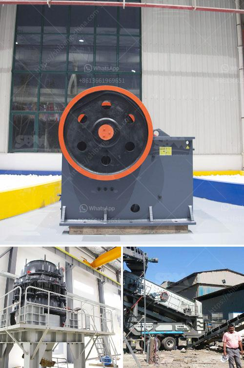

<h3>كسارة التعدين في تنزانيا</h3>
تُعتبر تنزانيا من الدول الأفريقية الغنية بالثروات المعدنية، حيث تحتضن عددًا من المناطق التعدينية الهامة. ومن بين الصناعات المعدنية المهمة في تنزانيا تعدين الذهب، حيث تعد كسارات التعدين من الأجهزة الرئيسية المستخدمة في عملية استخراج المعدن الذهب.

تعتبر كسارات التعدين في تنزانيا عبارة عن آلات كبيرة الحجم والقوة تستخدم لكسر الصخور الكبيرة الموجودة في مناجم الذهب. تتألف كسارات التعدين من عدة أجزاء رئيسية، بما في ذلك الفك الثابت والفك المتحرك والصفيحة القابلة للتبديل، وهي تعتمد على قوة الضغط والصدمة لتكسير الصخور وفصل الذهب عنها.

تلعب كسارات التعدين دورًا حاسمًا في عملية استخراج الذهب، حيث يتم تكسير الصخور المحتوية على الذهب بواسطة هذه الكسارات للحصول على كميات من الصخور المكسورة تحتوي على جزيئات الذهب. يتم تحميل هذه الصخور المكسورة في شاحنات ثم يتم نقلها إلى معامل تعدين الذهب الأخرى لاستخراج الذهب منها.

تعتبر صناعة كسارات التعدين في تنزانيا من الصناعات الحيوية التي توفر فرص عمل للسكان المحليين وتساهم في تعزيز اقتصاد البلاد. كما أنها تُعَد مصدرًا هامًا للعملة الصعبة من خلال تصدير الذهب المستخرج إلى الأسواق العالمية. تساهم تلك الصناعة أيضًا في تحسين ظروف المعيشة وتطوير البنية التحتية في المناطق التي يتم فيها تعدين الذهب.

ورغم الفوائد التي توفرها تلك الصناعة، يتوجب الاهتمام بجوانب السلامة والبيئة أثناء استخدام كسارات التعدين. يجب على الشركات المعدنية العمل بما يتفق مع المعايير البيئية العالمية واتباع ممارسات تعدين مستدامة للحفاظ على البيئة المحيطة وصحة العمال.

باختصار، تلعب كسارات التعدين في تنزانيا دورًا حاسمًا في عملية استخراج الذهب، حيث تقوم بتكسير الصخور المحتوية على الذهب وفصله عنها. توفر هذه الصناعة فرص عمل وتعزز الاقتصاد المحلي، ولكن من الضروري توخي الحذر والالتزام بمعايير السلامة والبيئة.
<h3>Contact us</h3><ul><li><strong>Whatsapp:&nbsp;<a href="https://wa.me/8613661969651">+8613661969651</a></strong></li><li><a href="https://swt.shibang-china.com/?git&amp;zhl&amp;كسارة التعدين في تنزانيا"><strong>Online Service(chat now)</strong></a></li></ul><h3>Related</h3><ul><li><a href='تجهيزات تعدين الفحم للبيع في ألمانيا.md'>تجهيزات تعدين الفحم للبيع في ألمانيا</a></li><li><a href='سعر كسارة مخروط محمولة من تركيا.md'>سعر كسارة مخروط محمولة من تركيا</a></li><li><a href='معدات فحص الرمال للبيع في جنوب أفريقيا.md'>معدات فحص الرمال للبيع في جنوب أفريقيا</a></li><li><a href='آلة فحص الرمل في ماليزيا.md'>آلة فحص الرمل في ماليزيا</a></li><li><a href='كيفية إعداد شركة محجر حجر.md'>كيفية إعداد شركة محجر حجر</a></li></ul>