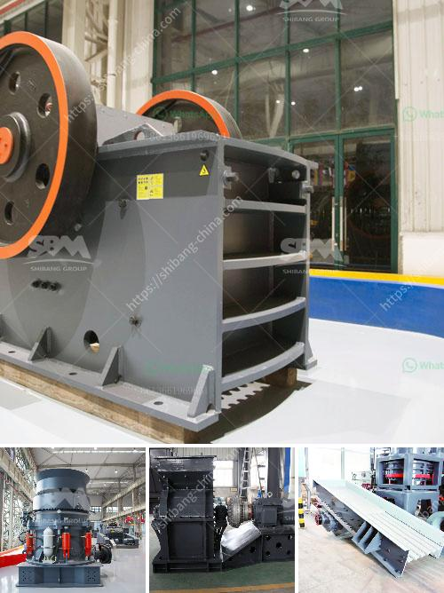

<h3>كسارة الجبس الحجر الجيري</h3>
تعتبر كسارة الجبس والحجر الجيري من الأدوات المهمة في صناعة البناء والإنشاءات. تستخدم هذه الكسارة لسحق وتكسير الجبس والحجر الجيري إلى قُطع صغيرة مناسبة للاستخدام في العديد من التطبيقات المختلفة.

تتكون كسارة الجبس والحجر الجيري من عدة أجزاء مهمة تضمن عملية التكسير الفعالة. تشمل هذه الأجزاء الفك المتحرك والفك الثابت، وصفيحة الفك، والبطانة الداخلية، والتكيف الهيدروليكي، إضافةً إلى محرك الكسارة والنظام الهيدروليكي. تتحرك الفكوك ذهابًا وعودةً لتكسير الجبس أو الحجر الجيري بينهما، في حين أن التكيف الهيدروليكي يسمح بضبط حجم وشكل القُطع المكسورة وفقًا لاحتياجات المشروع.

تستخدم كسارة الجبس والحجر الجيري في صناعة البناء لعدة أغراض. قد يتم استخدام الجبس المكسور لإنتاج مواد البناء مثل الجص والأسمنت. بالإضافة إلى ذلك، يمكن استخدام الجبس المكسور في صناعة الأسمنت لتحسين صلابته ومتانته. أما الحجر الجيري المكسور، فقد يُستخدم لإنتاج الرمل الاصطناعي والزيوت اللاصقة والأسمدة.

تعتبر كسارة الجبس والحجر الجيري آلات قوية ومتطورة، مما يجعلها فعالة في الإنتاج وتوفير الوقت والجهد للعملاء. بالإضافة إلى ذلك، فإن استخدام هذه الكسارة يساهم في الحفاظ على البيئة، حيث يتم تكسير وإعادة تدوير المواد الطبيعية بدلاً من الاعتماد على استخراجها من البيئة.

باختصار، تلعب كسارة الجبس والحجر الجيري دورًا حاسمًا في عملية صناعة البناء والإنشاءات. تساعد هذه الكسارة في سحق وتكسير الجبس والحجر الجيري إلى قُطع صغيرة قابلة للاستخدام في صناعة المواد الإنشائية والأسمنت والزيوت اللاصقة والأسمدة. كما تساهم في الحفاظ على البيئة من خلال إعادة تدوير المواد الطبيعية بدلاً من استخراجها من البيئة. إن استخدام هذه الكسارات المتطورة يوفر الوقت والجهد للعملاء ويساهم في تعزيز الإنتاجية والكفاءة في صناعة البناء.
<h3>Contact us</h3><ul><li><strong>Whatsapp:&nbsp;<a href="https://wa.me/8613661969651">+8613661969651</a></strong></li><li><a href="https://swt.shibang-china.com/?git&amp;zhl&amp;كسارة الجبس الحجر الجيري"><strong>Online Service(chat now)</strong></a></li></ul><h3>Related</h3><ul><li><a href='مصنع كسارة الحجر القديمة للبيع.md'>مصنع كسارة الحجر القديمة للبيع</a></li><li><a href='تقرير مشروع تعدين الكاولين الصغير.md'>تقرير مشروع تعدين الكاولين الصغير</a></li><li><a href='بيع آلة مطحنة الأسطوانة.md'>بيع آلة مطحنة الأسطوانة</a></li><li><a href='مسحوق الطين لصنع غانيشا.md'>مسحوق الطين لصنع غانيشا</a></li><li><a href='كسارة حجر في الهند.md'>كسارة حجر في الهند</a></li></ul>