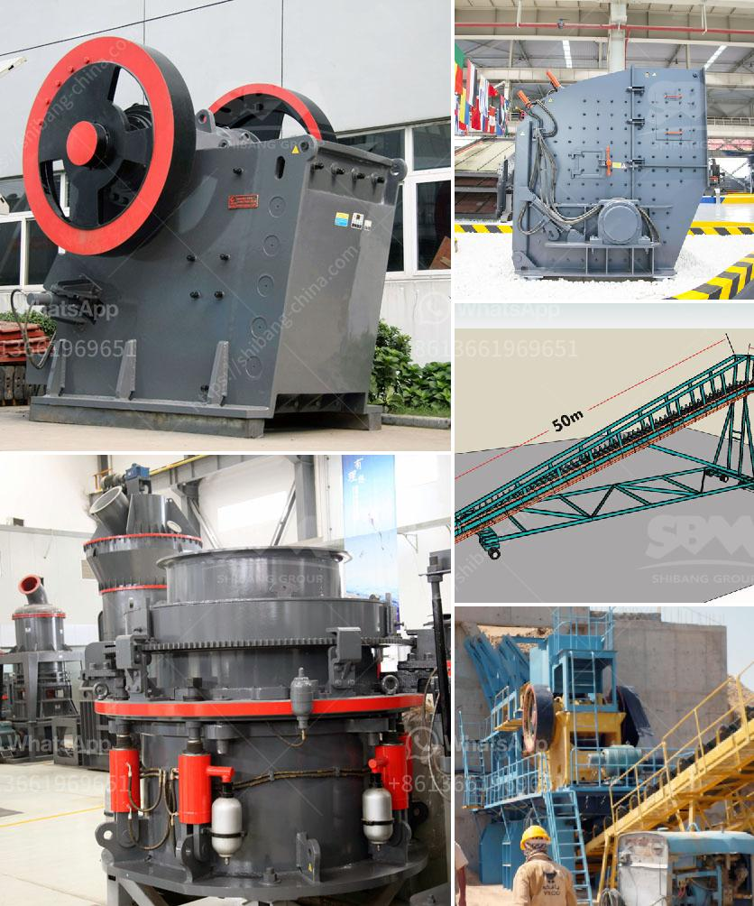

<h3>كسارة الجرانيت المحمولة</h3>
تعتبر كسارة الجرانيت المحمولة أداة مهمة في صناعة التعدين والبناء، حيث يتم استخدامها لكسر الجرانيت إلى قطع صغيرة ومناسبة للاستخدام في البناء وتعبيد الطرق. تم تصميمها بحجم محمول لتسهيل عملية النقل والتنقل بين المواقع المختلفة وتسهيل عملية سحق الجرانيت بطريقة سريعة وفعالة.

يتميز هذا النوع من الكسارات بقدرتها على سحق الجرانيت بسرعة وباستخدام تقنيات حديثة. تحتوي الكسارة على فكين قويين تتحرك بطريقة متقاطعة، مما يسهل عملية سحق الجرانيت بسهولة وفعالية. كما أنها تحتوي على مجموعة من الأسطوانات الهيدروليكية لتعديل حجم الجرانيت المكسور وفقا لاحتياجات المستخدم.

تمتاز الكسارة المحمولة بحجمها الصغير وتصميمها المدمج، مما يمكن المستخدمين من نقلها بسهولة بين مواقع العمل المختلفة. هذه الميزة توفر الوقت والجهد المهدر في نقل الجرانيت الكبير إلى موقع الكسارة الثابتة.

بالإضافة إلى ذلك، تعتبر الكسارة المحمولة أداة مثالية للعمل في المناطق النائية التي يصعب الوصول إليها بسبب الطبيعة غير المستوية للأرضية. تمنح الكسارة المحمولة المرونة والقدرة على العمل بفعالية في أي مكان وفي أي وقت.

تتميز الكسارة المحمولة بكفاءتها عالية واستهلاك الطاقة المنخفض، مما يساهم في تقليل تكلفة التشغيل وزيادة الإنتاجية. يتم تشغيل الكسارة بواسطة محرك ديزل قوي يعمل بكفاءة عالية ويستهلك الوقود بشكل فعال.

باختصار، تعد كسارة الجرانيت المحمولة أداة حيوية في صناعة التعدين والبناء، فهي توفر وسيلة سهلة وسريعة لسحق الجرانيت بفعالية. تصميمها المحمول يجعلها مثالية للعمل في المواقع النائية وتسهل عملية النقل بين المواقع المختلفة. لذا، ينصح بشدة باستخدام كسارة الجرانيت المحمولة في أعمال البناء والتعدين لتحقيق أقصى قدر من الكفاءة والإنتاجية.
<h3>Contact us</h3><ul><li><strong>Whatsapp:&nbsp;<a href="https://wa.me/8613661969651">+8613661969651</a></strong></li><li><a href="https://swt.shibang-china.com/?git&amp;zhl&amp;كسارة الجرانيت المحمولة"><strong>Online Service(chat now)</strong></a></li></ul><h3>Related</h3><ul><li><a href='مصنع كسارة البنتونيت.md'>مصنع كسارة البنتونيت</a></li><li><a href='كسارة الحجر للبيع.md'>كسارة الحجر للبيع</a></li><li><a href='تطبيق محطة الكسارة.md'>تطبيق محطة الكسارة</a></li><li><a href='إنتاج خط الإنتاج لكسارة الطوب.md'>إنتاج خط الإنتاج لكسارة الطوب</a></li><li><a href='سعة آلة الكسارة 5 أطنان في الساعة.md'>سعة آلة الكسارة 5 أطنان في الساعة</a></li></ul>