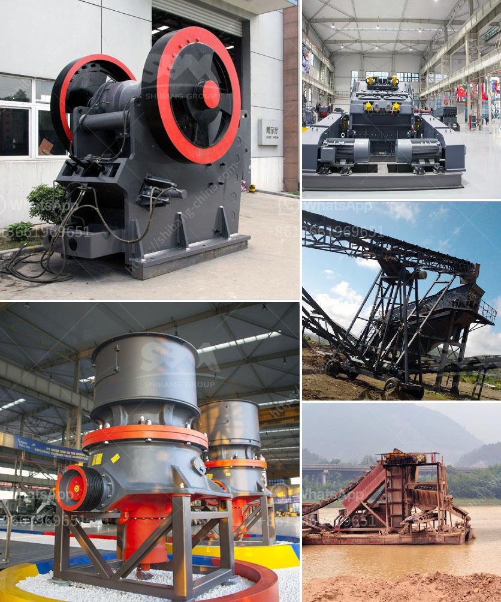

<h3>كسارة الحجر 100 طن للبيع</h3>
تعتبر كسارة الحجر من الآلات الضرورية في صناعة البناء والتشييد، حيث تستخدم لسحق الصخور والأحجار الكبيرة لتحويلها إلى حجارة صغيرة الحجم، وتصبح جاهزة للاستخدام في البناء والتشييد. ومن بين الكسارات المستخدمة في هذا المجال تأتي كسارة الحجر 100 طن.

كسارة الحجر 100 طن هي معدة قوية وفعالة تستخدم لسحق الصخور الكبيرة بكميات كبيرة. تعتبر هذه الكسارة مثالية للاستخدام في مشاريع البنية التحتية الكبرى مثل الطرق والجسور ومشاريع البناء الأخرى التي تتطلب كميات كبيرة من الحجارة المسحوقة بحجم صغير.

إضافة إلى ذلك، تتميز كسارة الحجر 100 طن بقدرتها على سحق الصخور بكفاءة عالية، مما يوفر الوقت والجهد في عملية الإنتاج. تعمل الكسارة بواسطة محرك كهربائي قوي يدفع الفك المتحرك إلى الأمام والخلف لسحق الصخور وتجميعها في حاويات.

تأتي كسارة الحجر 100 طن بعدة ميزات ومواصفات تجعلها مناسبة للاستخدام الصناعي. تتميز هذه الكسارة بقدرتها على سحق الحجارة ذات الصلابة العالية مثل الجرانيت والبازلت بكفاءة. تتوفر الكسارة بعدة أحجام وقدرات مختلفة لتلبية متطلبات كل مشروع. تعتبر الكسارة سهلة التشغيل والصيانة، مما يوفر استخدامًا طويل الأمد وتكلفة صيانة منخفضة.

تتوفر كسارة الحجر 100 طن للبيع بأسعار تتراوح بين 200-400 ألف دولار. تعتبر هذه الأسعار مناسبة جدًا في ضوء القدرات العالية التي تتمتع بها الكسارة وفعاليتها في عملية السحق. تعتبر هذه الكسارة استثمارًا جيدًا لأصحاب المشاريع الكبيرة الذين يحتاجون إلى كميات كبيرة من الحجارة المسحوقة لاستخدامها في مشاريع البناء والتشييد.

باختصار، كسارة الحجر 100 طن تأتي بقدرة عالية وكفاءة في سحق الصخور الكبيرة. توفر هذه الكسارة الوقت والجهد في عملية السحق وتوفر حجارة جاهزة للاستخدام في مشاريع البناء والتشييد. تتوفر بعدة ميزات ومواصفات تجعلها مناسبة لمختلف الاحتياجات الصناعية. وبأسعار تتراوح بين 200-400 ألف دولار، تعتبر هذه الكسارة اختيارًا مناسبًا لأصحاب المشاريع الكبيرة في صناعة البناء والتشييد.
<h3>Contact us</h3><ul><li><strong>Whatsapp:&nbsp;<a href="https://wa.me/8613661969651">+8613661969651</a></strong></li><li><a href="https://swt.shibang-china.com/?git&amp;zhl&amp;كسارة الحجر 100 طن للبيع"><strong>Online Service(chat now)</strong></a></li></ul><h3>Related</h3><ul><li><a href='سير ناقل لسعر كسارة الحجر.md'>سير ناقل لسعر كسارة الحجر</a></li><li><a href='آلة طحن الكالسايت للبيع.md'>آلة طحن الكالسايت للبيع</a></li><li><a href='كسارة الحجر المحجر.md'>كسارة الحجر المحجر</a></li><li><a href='كسارات تأثير ثانوية.md'>كسارات تأثير ثانوية</a></li><li><a href='كسارة الحجر وأسعارها.md'>كسارة الحجر وأسعارها</a></li></ul>