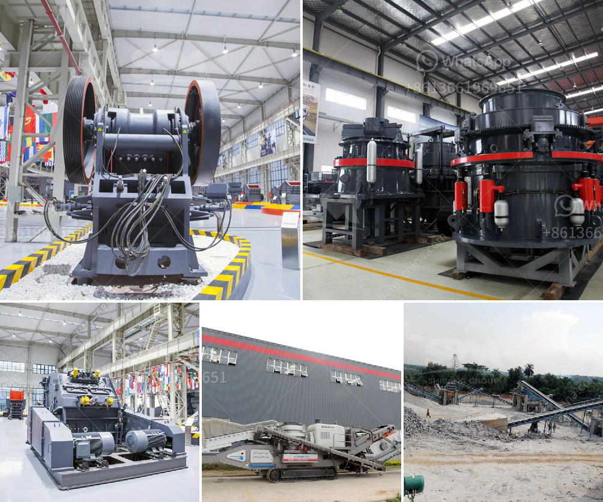

<h3>كسارة الحجر Kyc</h3>
تعتبر كسارة الحجر Kyc من الأدوات الهامة في صناعة البناء والتشييد، حيث تستخدم لسحق الحجارة الكبيرة إلى أحجام أصغر تستخدم في مواد البناء مثل الإسمنت والخرسانة. تم تصميم كسارة الحجر Kyc لتكون قوية وفعالة في عمليات السحق.

تتميز كسارة الحجر Kyc بوجود نظام سحق قوي يستخدم في شتى أنواع الصخور والمواد الصلبة الأخرى. وتتميز أيضًا بكونها قابلة للتحريك والنقل بسهولة، مما يجعلها مثالية للاستخدام في المواقع المؤقتة أو النقل من موقع إلى آخر.

كما تتميز كسارة الحجر Kyc بوجود نظام تكسير دقيق يمكنه إنتاج الحصى والرمل بأحجام مختلفة وفقًا لاحتياجات المستخدم. هذا يسمح بإعادة استخدام المواد وتقليل الهدر.

توفر كسارة الحجر Kyc أيضًا آلية تشحيم تلقائية للحد من التآكل وضمان عمر أطول للأداة. كما أنها مزودة بنظام أمان متقدم يساعد على حماية المشغلين وضمان عملية تشغيل آمنة وفعالة.

بالإضافة إلى ذلك، تم تصميم كسارة الحجارة Kyc لتكون موفرة للطاقة وصديقة للبيئة. تعتمد على تكنولوجيا حديثة لتقليل استهلاك الطاقة وانبعاثات الغازات الضارة.

في الختام، تعتبر كسارة الحجر Kyc أداة مهمة في صناعة البناء والتشييد. توفر كفاءة عالية في عمليات السحق وقابلية للتحرك والنقل، وتعتبر صديقة للبيئة ومؤمنة. استخدام هذه الأداة يساهم في تحسين عمليات البناء والتشييد وتقليل الهدر والتلوث.
<h3>Contact us</h3><ul><li><strong>Whatsapp:&nbsp;<a href="https://wa.me/8613661969651">+8613661969651</a></strong></li><li><a href="https://swt.shibang-china.com/?git&amp;zhl&amp;كسارة الحجر Kyc"><strong>Online Service(chat now)</strong></a></li></ul><h3>Related</h3><ul><li><a href='مصنع تكسير الصخور المتنقل في نيجيريا.md'>مصنع تكسير الصخور المتنقل في نيجيريا</a></li><li><a href='كسارة الحجر الجيري المتنقلة.md'>كسارة الحجر الجيري المتنقلة</a></li><li><a href='عملية سحق الكسارة.md'>عملية سحق الكسارة</a></li><li><a href='سعر آلة طاحونة الهامر.md'>سعر آلة طاحونة الهامر</a></li><li><a href='سعر كسارة الحجر في باكستان.md'>سعر كسارة الحجر في باكستان</a></li></ul>