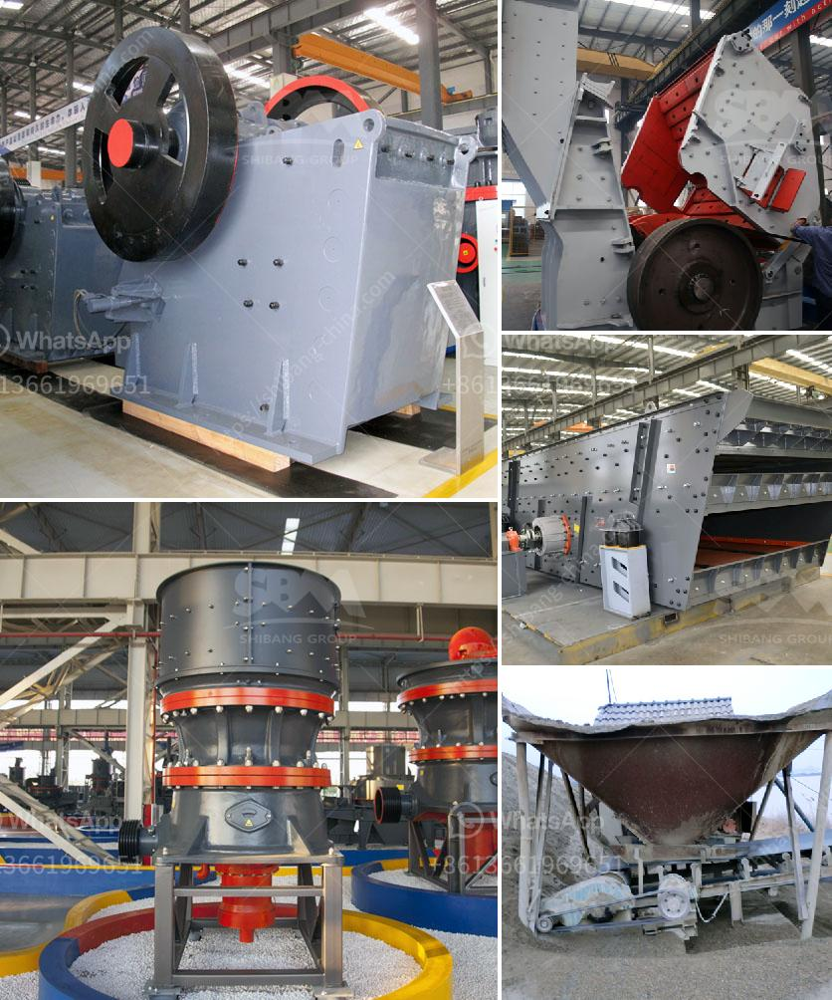

<h3>كسارة الحجر الجرانيت الهند</h3>
تعتبر كسارة الحجر الجرانيت في الهند واحدة من أبرز الصناعات التي أسهمت في تطور القطاع الإنشائي في البلاد. يتم استخدام الحجر الجرانيت في العديد من التطبيقات الإنشائية، مثل بناء المباني والجسور والطرق، وأيضًا في صناعة الأثاث والديكور الداخلي.

يعتبر الحجر الجرانيت مادة مثالية للاستخدام في البناء بسبب متانته وصلابته العالية. إنه مادة صلبة وغير قابلة للتآكل، مما يجعلها مثالية للاستخدام في المباني والهياكل الكبيرة التي تحتاج إلى تحمل الضغوط والظروف الجوية القاسية.

تمتلك الهند مصادر كبيرة من الجرانيت، وخصوصًا ولايات راجاستان وتاميل نادو وكيرالا. هذه المصادر الوفيرة جنباً إلى جنب مع التكنولوجيا المتقدمة والمعدات المتطورة، جعلت من الهند واحدة من أهم الدول المنتجة للجرانيت في العالم.

تتميز كسارات الحجر الجرانيت في الهند بجودة الإنتاج العالية، حيث يتم استخدام أحدث التقنيات لاستخراج وتجهيز الحجر. يتم التحكم بعناية في جودة المنتج من خلال فحص المواد الخام ومراقبة عملية الإنتاج. يتم قطع الجرانيت وتحضيره وطحنه وتلميعه للحصول على الشكل واللمعان المطلوب.

تعد صناعة الجرانيت في الهند قطاعًا مهمًا للاقتصاد الوطني، حيث أنها توفر فرص عمل للعديد من العمال والفنيين. كما تعتبر صادرات الجرانيت المصدر الرئيسي للعملة الصعبة في البلاد.

قد يؤدي الطلب المتزايد على الجرانيت في العالم إلى زيادة إنتاج الجرانيت في الهند في المستقبل. تعتبر الجرانيت من المواد المفضلة في صناعة البناء، بسبب متانتها وجمالها، وبالتالي قد يتطلب الاقتصاد العالمي مزيدًا من الجرانيت في السنوات القادمة.

قصة نجاح كسارة الحجر الجرانيت في الهند واحدة قد تلهم العديد من البلدان الأخرى. تعد الهند مثالًا رائعًا على استثمار الموارد الطبيعية وتحويلها إلى صناعة مستدامة ومدخرة للاقتصاد الوطني وتوفير فرص عمل للمواطنين.
<h3>Contact us</h3><ul><li><strong>Whatsapp:&nbsp;<a href="https://wa.me/8613661969651">+8613661969651</a></strong></li><li><a href="https://swt.shibang-china.com/?git&amp;zhl&amp;كسارة الحجر الجرانيت الهند"><strong>Online Service(chat now)</strong></a></li></ul><h3>Related</h3><ul><li><a href='سعر النحاس.md'>سعر النحاس</a></li><li><a href='مطحنة الكرة للبيع.md'>مطحنة الكرة للبيع</a></li><li><a href='تصميم مصنع الإسمنت بتنسيق PDF.md'>تصميم مصنع الإسمنت بتنسيق PDF</a></li><li><a href='آلة طحن الجبس المصنع.md'>آلة طحن الجبس المصنع</a></li><li><a href='مصنع معالجة الذهب آلة كسارة الحجر التركية.md'>مصنع معالجة الذهب آلة كسارة الحجر التركية</a></li></ul>