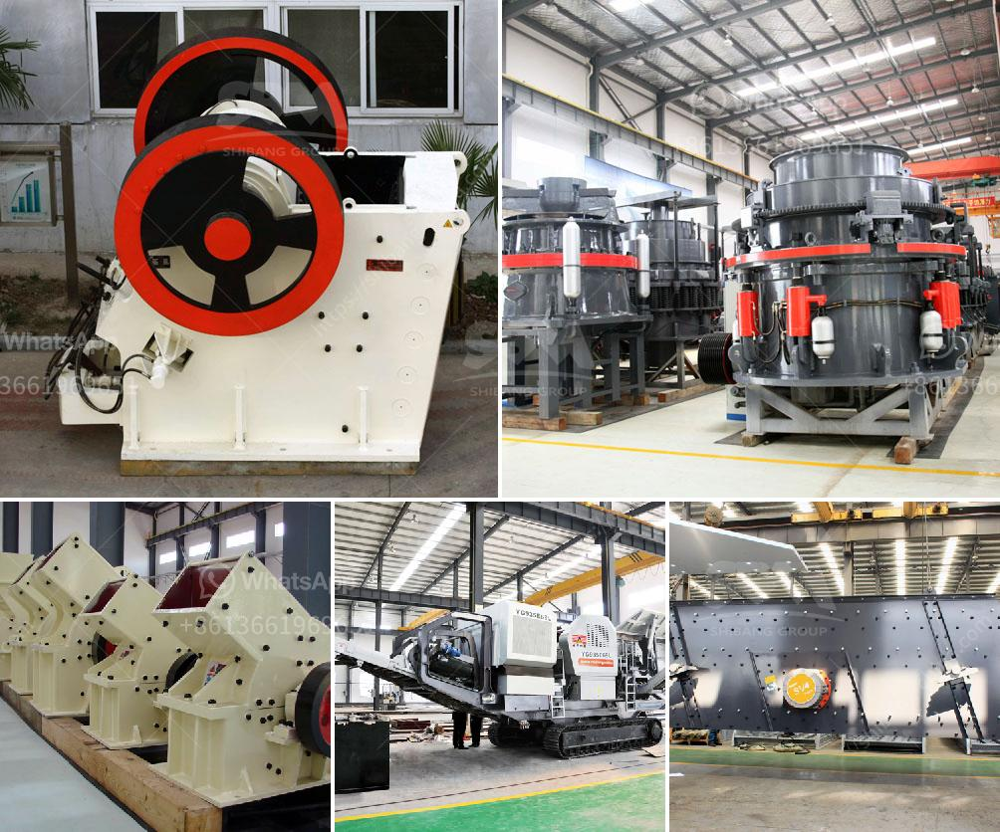

<h3>كسارة الحجر الجيري المتنقلة</h3>
تكمن أهمية كسارة الحجر الجيري المتنقلة في قدرتها على طحن وسحق الحجر الجيري بكفاءة عالية وتحويله إلى مواد قابلة للاستخدام في مجموعة متنوعة من التطبيقات الصناعية والإنشائية.

تعتبر كسارة الحجر الجيري المتنقلة حلا مثاليا للمواقع التي تحتاج إلى تكسير الحجر الجيري في مكان العمل نفسه بدلاً من نقل الحجر إلى موقع آخر للمعالجة. تقوم هذه الكسارة بتوفير وقت وجهد كبيرين للمشغلين وتخفف من تكاليف النقل والتخلص من المواد الفائضة.

تتميز كسارة الحجر الجيري المتنقلة بعدة ميزات قوية، مثل التنقل السهل والسرعة العالية في تجهيز المواد. بفضل العجلات أو المجنزرات المستخدمة في هذه الكسارة، يمكن نقلها بسهولة من موقع إلى آخر. كما تستطيع تجهيز الحجر الجيري بسرعة كبيرة مع قدرة تكسير تصل إلى 200-400 طن في الساعة، مما يساعد على زيادة الإنتاجية وتحسين كفاءة العمل.

تعتبر هذه الكسارات مناسبة للمواقع الصناعية المختلفة مثل الألغام ومحاجر الحجر الطبيعي ومواقع البناء والهدم. هذه الكسارات قادرة على سحق الحجر الجيري إلى أحجام مختلفة تتراوح من الحصى الناعم إلى الحجارة الكبيرة.

بالإضافة إلى ذلك، تعتبر الكسارة المتنقلة الحل المثلى للمشروعات الكبيرة التي تتطلب تكسير كميات كبيرة من الحجر الجيري في وقت قصير. هذه الكسارة تعمل على تحويل الحجر الجيري إلى مجموعة متنوعة من المواد النهائية المفيدة للمشاريع المختلفة مثل الخرسانة والأسفلت والزفت.

في الختام، تُعتبر كسارة الحجر الجيري المتنقلة خياراً مثلى للمشروعات التي تتطلب تكسير حجر الجيري بكميات كبيرة وبها قابلية للتنقل بسهولة. يمكن أن يؤدي استخدام هذه الكسارة إلى زيادة الإنتاجية وتحسين كفاءة العمل في العديد من الصناعات والمشاريع الإنشائية.
<h3>Contact us</h3><ul><li><strong>Whatsapp:&nbsp;<a href="https://wa.me/8613661969651">+8613661969651</a></strong></li><li><a href="https://swt.shibang-china.com/?git&amp;zhl&amp;كسارة الحجر الجيري المتنقلة"><strong>Online Service(chat now)</strong></a></li></ul><h3>Related</h3><ul><li><a href='تكلفة إنشاء مصنع الأسمنت الصغير في الهند.md'>تكلفة إنشاء مصنع الأسمنت الصغير في الهند</a></li><li><a href='تطبيق محطة الكسارة.md'>تطبيق محطة الكسارة</a></li><li><a href='كسارة الفك 1200 طن في الساعة.md'>كسارة الفك 1200 طن في الساعة</a></li><li><a href='سعر آلة الكسارة في كينيا.md'>سعر آلة الكسارة في كينيا</a></li><li><a href='اختلافات بين مطحنة الهامر ومطحنة الكرة.md'>اختلافات بين مطحنة الهامر ومطحنة الكرة</a></li></ul>