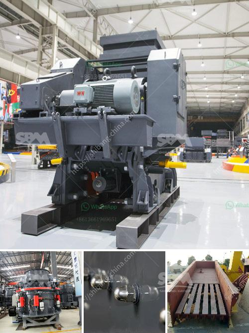

<h3>كسارة الحجر الجيري بيرو الجير</h3>
تعتبر كسارة الحجر الجيري بيرو الجير واحدة من أهم وأكبر الكسارات في صناعة البناء والإنشاءات. يتم استخدام الحجر الجيري بشكل واسع في صناعة الإسمنت والطوب والخرسانة والأسفلت، وذلك بسبب خصائصه الفريدة وقوته الميكانيكية العالية.

تقوم كسارة الحجر الجيري بيرو الجير بتكسير الصخور الجيرية الخام وتحويلها إلى حجارة صغيرة قابلة للاستخدام في عمليات البناء. يتم استخدام مختلف الأجهزة والمعدات في عملية التكسير بكسارة الحجر الجيري، مثل الكسارات الفكية والكسارات الصدمية والكسارات المخروطية.

تتميز كسارة الحجر الجيري بيرو الجير بالعديد من المزايا. أولاً، فإنها تتميز بأداء عالي وكفاءة في عملية التكسير، مما يتيح استغلال الحجر الجيري بشكل أفضل وتقليل تكاليف الإنتاج. ثانياً، فإنها تتمتع ببنية قوية ومتينة، مما يساعد على تحمل الضغوط العالية التي يتعرض لها خلال عملية التشغيل. ثالثاً، فإنها تساهم بشكل كبير في حماية البيئة، إذ تعمل على تقليل الانبعاثات الضارة والتأثير البيئي السلبي الناجم عن عملية التكسير التقليدية.

تعتبر صناعة الحجر الجيري من الصناعات الحيوية والرئيسية في العديد من البلدان، حيث تلعب دورًا هاما في دعم الاقتصاد المحلي وتوفير فرص العمل. بالإضافة إلى ذلك، فإن استخدام الحجر الجيري في صناعة البناء والإنشاءات يتيح الحصول على مواد بناء عالية الجودة ومتينة، مما يعزز جودة الأعمال ويطيل عمر المباني.

في النهاية، يمكن القول إن كسارة الحجر الجيري بيرو الجير تلعب دوراً حاسماً في صناعة البناء والإنشاءات. تعمل على توفير مواد بناء عالية الجودة والمتانة تساهم في نمو الاقتصاد المحلي وتوفير فرص العمل. وتعتبر الإستثمارات في تصنيع وتشغيل كسارات الحجر الجيري فرصة استثمارية مثمرة للشركات والمستثمرين في صناعة البناء.
<h3>Contact us</h3><ul><li><strong>Whatsapp:&nbsp;<a href="https://wa.me/8613661969651">+8613661969651</a></strong></li><li><a href="https://swt.shibang-china.com/?git&amp;zhl&amp;كسارة الحجر الجيري بيرو الجير"><strong>Online Service(chat now)</strong></a></li></ul><h3>Related</h3><ul><li><a href='كسارة الحجر الصخري في الفلبين.md'>كسارة الحجر الصخري في الفلبين</a></li><li><a href='شركة تصنيع مقياس ضغط النحاس.md'>شركة تصنيع مقياس ضغط النحاس</a></li><li><a href='كسارات الحجر المستعملة في كوريا الجنوبية.md'>كسارات الحجر المستعملة في كوريا الجنوبية</a></li><li><a href='مصنع تكسير الحجر الكلي في الصين.md'>مصنع تكسير الحجر الكلي في الصين</a></li><li><a href='كسارة الفك PE 150x250.md'>كسارة الفك PE 150x250</a></li></ul>