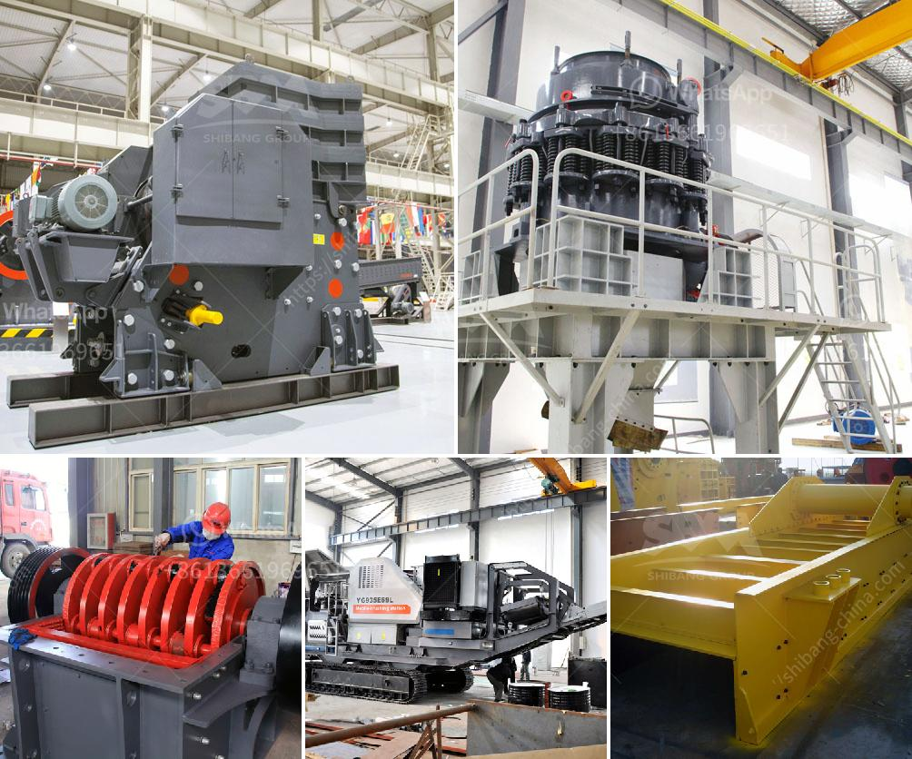

<h3>كسارة الحجر الجيري في مصنع الأسمنت</h3>
تلعب كسارة الحجر الجيري دورًا حيويًا في مصنع الأسمنت، حيث تقوم بتكسير الحجر الجيري الخام إلى أحجام أصغر قبل دخوله إلى عملية التصنيع. تستخدم كسارة الحجر الجيري في مصنع الأسمنت لضمان توفير مواد خام عالية الجودة للعملية الإنتاجية.

يتم استخدام الحجر الجيري الخام في صناعة الأسمنت بكميات كبيرة. بالتحديد، فإن الحجر الجيري الخام يحتوي على الكالسيوم والسيليكون والألومنيوم والحديد وغيرها من المعادن. وتختلف نسب هذه المعادن من منجم إلى آخر، ولذلك، يتم تكسير الحجر الجيري الخام في كسارة خاصة للسماح بتجانس نسبة المعادن.

تعمل كسارة الحجر الجيري على تكسير الحجر إلى جزيئات صغيرة بحجم تتراوح بين 20 و 75 ملم. ويتم تنظيم حجم هذه الجزيئات من خلال استخدام شبكة تهتز، حيث يتم فصل الجسيمات حسب حجمها وتوجيهها إلى منتجات نهائية مختلفة.

بالإضافة إلى تكسير الحجر الجيري، تعتمد كسارة الحجر الجيري في مصنع الأسمنت على أنظمة أخرى لضمان سلامة العملية الإنتاجية. على سبيل المثال، يتم استخدام الطاولات الاهتزازية لإزالة أي شوائب أو شوائب من الحجر قبل التكسير. كما يتم استخدام أنظمة النقل لنقل الحجر الجيري إلى كسارة الحجر الجيري ومنها للعملية التالية في عملية التصنيع.

أخيرًا، يتم التحكم في عملية كسارة الحجر الجيري في مصنع الأسمنت باستخدام أنظمة الأتمتة. تساهم الأتمتة في ضمان تشغيل الكسارة بكفاءة بحيث يتم تحقيق أعلى إنتاجية ممكنة وتوفير الطاقة وموارد التشغيل. تحتوي أنظمة الأتمتة على مجموعة متنوعة من الاستشعارات التي تقيس مستوى الحجر في الكسارة وتحكم في سرعة الحجر المتحرك والتيار المستمر.

باختصار، تُستخدم كسارة الحجر الجيري في مصنع الأسمنت لتكسير الحجر الجيري الخام وتحويله إلى جزيئات صغيرة قبل تدخله في عملية التصنيع. تلعب هذه العملية دورًا حاسمًا في ضمان جودة الأسمنت النهائية وكفاءة الإنتاج+.
<h3>Contact us</h3><ul><li><strong>Whatsapp:&nbsp;<a href="https://wa.me/8613661969651">+8613661969651</a></strong></li><li><a href="https://swt.shibang-china.com/?git&amp;zhl&amp;كسارة الحجر الجيري في مصنع الأسمنت"><strong>Online Service(chat now)</strong></a></li></ul><h3>Related</h3><ul><li><a href='معدات تعدين الذهب.md'>معدات تعدين الذهب</a></li><li><a href='أعمال تكسير الصخور في باكستان.md'>أعمال تكسير الصخور في باكستان</a></li><li><a href='كسارة الرخام إيطاليا.md'>كسارة الرخام إيطاليا</a></li><li><a href='كسارات الحجر في غانا.md'>كسارات الحجر في غانا</a></li><li><a href='كسارة الفك لتعدين الفحم.md'>كسارة الفك لتعدين الفحم</a></li></ul>