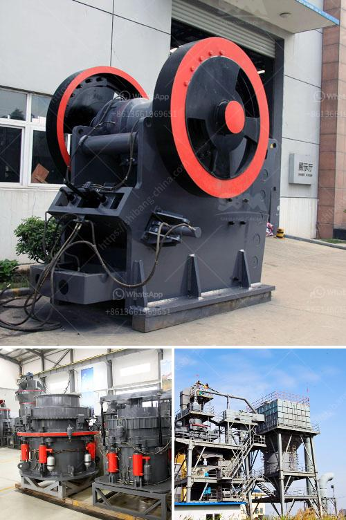

<h3>كسارة الحجر الجيري للبيع</h3>
تعد كسارة الحجر الجيري أحد أهم الآلات المستخدمة في معالجة الصخور والأحجار الجيرية، وتستخدم على نطاق واسع في صناعات البناء مثل الأسمنت والطرق والسكك الحديدية والبناء المدني. تهدف كسارة الحجر الجيري إلى تكسير الحجر الجيري إلى أحجام صغيرة يمكن استخدامها في البناء والصناعة. تعتبر شركة البيع والشراء للكسارات المستعملة مكانًا مثاليًا لشراء كسارة الحجر الجيري بنسبة تخفيض تصل إلى 50٪ مقارنة بالأسعار الجديدة.

يقدم موقع البيع والشراء للكسارات المستعملة مجموعة واسعة من كسارات الحجر الجيري المتوفرة بأسعار تبدأ من 200 دولار وتصل إلى 400 دولار. يتم فحص واختبار كل كسارة قبل عرضها للبيع لضمان جودتها وأنها تعمل بشكل صحيح.

تحتوي كسارات الحجر الجيري المتاحة على مجموعة متنوعة من الميزات والتكنولوجيا لتلبية احتياجات العملاء المختلفة. بعض الكسارات تأتي مع قدرة إنتاجية عالية وتستطيع تكسير الحجر الجيري بكفاءة عالية. تم تصميم بعض الكسارات لتكسير الصخور الجيرية الكبيرة إلى أحجام أصغر بشكل سريع وفعال. بعض الكسارات مزودة بأنظمة تحكم آلية لتعديل حجم الخرج من الكسارة وضمان حصولك على حجم الحجر الذي تحتاجه.

إذا كنت تبحث عن كسارة حجر جيري مستعملة للبيع، يمكنك زيارة موقعنا على الإنترنت وتصفح قائمة الكسارات المتاحة. ستجد لدينا مجموعة متنوعة من الكسارات المختلفة التي يمكن أن تلبي احتياجاتك وميزانيتك. قبل الشراء، يفضل أن تفحص الكسارة وتتحقق من حالتها وأنها تعمل بشكل جيد. أيضا، تأكد من مناقشة السعر وشروط البيع مع البائع.

في النهاية، كسارة الحجر الجيري هي أداة مهمة في صناعة البناء وتكسير الصخور والأحجار الجيرية. إذا كنت في حاجة إلى كسارة حجر جيري بأسعار مناسبة، فإن شركة البيع والشراء للكسارات المستعملة هي المكان المثالي لك. تأكد من زيارة موقعنا على الإنترنت وتحقق من الكسارات المتاحة واختر الأفضل لاحتياجاتك.
<h3>Contact us</h3><ul><li><strong>Whatsapp:&nbsp;<a href="https://wa.me/8613661969651">+8613661969651</a></strong></li><li><a href="https://swt.shibang-china.com/?git&amp;zhl&amp;كسارة الحجر الجيري للبيع"><strong>Online Service(chat now)</strong></a></li></ul><h3>Related</h3><ul><li><a href='آلة تعدين الكسارة.md'>آلة تعدين الكسارة</a></li><li><a href='مصنع كسارة الحصى بالقرب من مانيلا.md'>مصنع كسارة الحصى بالقرب من مانيلا</a></li><li><a href='مصنع معدات تعدين الرمال في جنوب أفريقيا.md'>مصنع معدات تعدين الرمال في جنوب أفريقيا</a></li><li><a href='أنظمة التحكم في كسارة الحجر المحمولة.md'>أنظمة التحكم في كسارة الحجر المحمولة</a></li><li><a href='مصنع معالجة الصخور.md'>مصنع معالجة الصخور</a></li></ul>