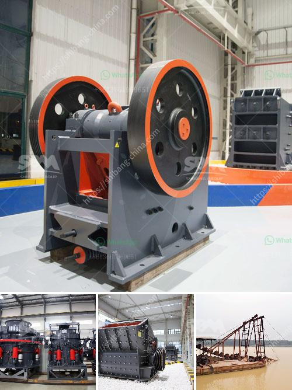

<h3>كسارة الحجر الجيري مستعملة</h3>
تعد كسارة الحجر الجيري من أهم الآلات المستخدمة في صناعة التعدين والإنشاءات. فهي تستخدم لكسر الصخور الهشة والصلبة مثل الحجر الجيري والغرانيت والبازلت والرخام والخرسانة المسلحة والطوب والزجاج والأسمنت. وتوجد مجموعة واسعة من كسارات الحجر الجيري المستعملة في السوق بمختلف الأحجام والقدرات والموديلات.

تعمل كسارة الحجر الجيري المستعملة عن طريق تطبيق قوة كبيرة على الصخرة لكسرها إلى قطع صغيرة. تحتوي عادة على مجموعة من الأسطوانات الدوارة المغطاة بأسنان معدنية، حيث يتم تجهيز الصخور بواسطة الأسنان الدوارة ويتم سحقها بسرعة عالية. يتم تخزين الحجر الجيري المكسور في صناديق تخزين ، ويتم تفريغها لاحقًا في نقل الشاحنات أو السفن للنقل.

تتميز كسارة الحجر الجيري المستعملة بعدة مزايا. فأولاً، فهي تتيح الدمج بين عمليات التكسير والغربلة في مكان واحد، مما يزيد من الكفاءة ويوفر الوقت والجهد. ثانيًا، فهي قابلة للتعديل لتلبية متطلبات تحجيم المنتج المختلفة. ثالثًا، يمكن استخدامها للعمل في ظروف قاسية مثل درجات الحرارة المرتفعة أو الرطوبة العالية. رابعًا، تتميز بتكلفة الاستثمار المنخفضة وأعلى عائد على الاستثمار. وأخيراً، فهي سهلة الصيانة والتشغيل.

ومع ذلك، يجب الانتباه إلى بعض العوامل قبل شراء كسارة الحجر الجيري المستعملة. يجب التحقق من حالة الآلة، والتحقق من كفاءتها وصيانتها السابقة. يجب أيضًا فحص أجزاء الآلة الرئيسية وضمانها واختبارها للتأكد من أنها تعمل بنجاح. ينصح بشراء من البائعين الموثوق بهم والحصول على ضمان للآلة.

في الختام، تعتبر كسارة الحجر الجيري المستعملة من العتاد الأساسي في عمليات التعدين والبناء. يمكنها تحطيم الصخور الصلبة المختلفة وتحويلها إلى مواد قابلة للبناء. إنها توفر الكثير من الوقت والجهد ويمكن استخدامها للعمل في العديد من البيئات المختلفة. لذا، يجب النظر في شراء كسارة الحجر الجيري المستعملة لمنحها فرصة تطبيق منافعها في صناعتك.
<h3>Contact us</h3><ul><li><strong>Whatsapp:&nbsp;<a href="https://wa.me/8613661969651">+8613661969651</a></strong></li><li><a href="https://swt.shibang-china.com/?git&amp;zhl&amp;كسارة الحجر الجيري مستعملة"><strong>Online Service(chat now)</strong></a></li></ul><h3>Related</h3><ul><li><a href='مورد كسارة الأسطوانة المزدوجة.md'>مورد كسارة الأسطوانة المزدوجة</a></li><li><a href='مطحنة أسطوانية الكالسيوم.md'>مطحنة أسطوانية الكالسيوم</a></li><li><a href='مطحنة رايموند للطحن الدقيق جدا.md'>مطحنة رايموند للطحن الدقيق جدا</a></li><li><a href='تخطيط منشأة تعدين الماس.md'>تخطيط منشأة تعدين الماس</a></li><li><a href='آلة كسارة الحجر في المملكة العربية السعودية.md'>آلة كسارة الحجر في المملكة العربية السعودية</a></li></ul>