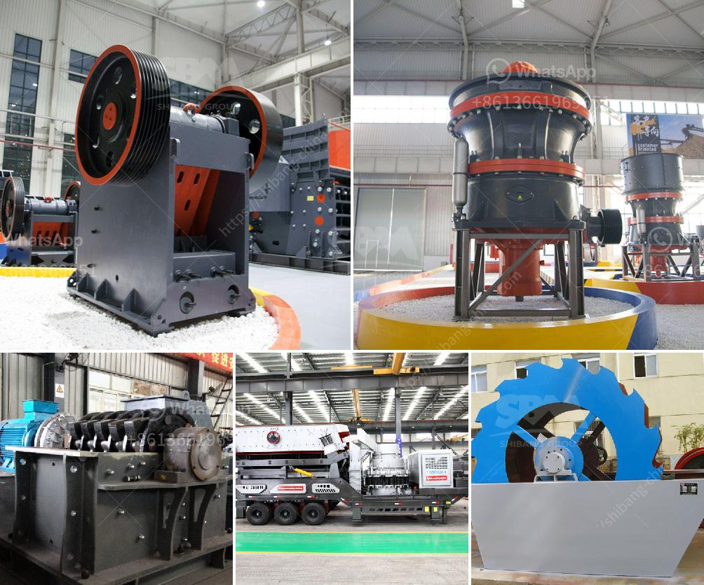

<h3>كسارة الحجر الدوارة</h3>
تعتبر كسارة الحجر الدوارة من الآلات الهامة في صناعة التعدين والبناء. تستخدم هذه الكسارة لتكسير وطحن الصخور الكبيرة إلى قطع صغيرة تستخدم في إنتاج مواد البناء والركام. تتكون كسارة الحجر الدوارة من جسم صلب قوي يحتوي على دوران أفقي يستخدم لسحق الصخور. وهي تعمل عن طريق استخدام القوة الميكانيكية والاحتكاك بين الصخور والأسطوانة الدوارة.

تصميم كسارة الحجر الدوارة يسمح بتكسير الصخور بشكل فعال وسريع. يتم تغذية الصخور إلى الكسارة عن طريق فتحة تغذية في الجزء العلوي من الجسم الدوار، ثم يتم تحطيم الصخور بواسطة الأسطوانة الدوارة المزودة بأسنان أو نتوءات صلبة. تدور الأسطوانة الدوارة بسرعة عالية مع تأثيرات قوية، مما يساعد في تفتيت الصخور وتحقيق حجم المطلوب لها.

تعتبر كسارة الحجر الدوارة من أجزاء المعدات الرئيسية في عملية التكسير والفرز، حيث يمكنها معالجة مجموعة متنوعة من المواد الصلبة. بفضل قدرتها على تكسير الصخور بسرعة، فإنها تزيد من إنتاجية عملية التعدين وتقلل من تكلفة الإنتاج. كما أن لديها تأثير إيجابي على تحسين جودة المواد النهائية التي تستخدم لبناء الطرق والمباني.

تتميز كسارة الحجر الدوارة بالقدرة على التكيف مع مختلف أنواع الصخور والمواد المعدنية. بفضل الأدوات المسننة أو اللوحات الصلبة الموجودة على الأسطوانة الدوارة، يمكن ضبط حجم الجسيمات المنتجة من الكسارة وفقًا لمتطلبات التطبيق المحددة.

وبالإضافة إلى ذلك، تعد كسارة الحجر الدوارة آلة قوية وموثوق بها، حيث تتميز بالكفاءة العالية والاستهلاك المنخفض للطاقة. وبفضل التحكم الدقيق في إعدادات الكسارة، يمكن تحسين كفاءة التشغيل وتقليل الضوضاء وانخفاض انبعاثات الغبار.

في الختام، تعتبر كسارة الحجر الدوارة أداة مهمة في صناعة التعدين والبناء. تُستخدم لتحطيم الصخور الكبيرة إلى قطع صغيرة تستخدم في إنتاج المواد النهائية للبناء. تعتبر قادرة على تحسين كفاءة التشغيل وتقليل التكلفة، بالإضافة إلى إنتاجية عالية وجودة عالية للمواد المنتجة.
<h3>Contact us</h3><ul><li><strong>Whatsapp:&nbsp;<a href="https://wa.me/8613661969651">+8613661969651</a></strong></li><li><a href="https://swt.shibang-china.com/?git&amp;zhl&amp;كسارة الحجر الدوارة"><strong>Online Service(chat now)</strong></a></li></ul><h3>Related</h3><ul><li><a href='مشغل مصنع كسارة في كسارة.md'>مشغل مصنع كسارة في كسارة</a></li><li><a href='مطاحن الهامر المستخدمة في تعدين الذهب.md'>مطاحن الهامر المستخدمة في تعدين الذهب</a></li><li><a href='مطاحن الكرة لتعدين ٦ × ٦.md'>مطاحن الكرة لتعدين ٦ × ٦</a></li><li><a href='كسارة تأثير صغيرة بشبكة 100.md'>كسارة تأثير صغيرة بشبكة 100</a></li><li><a href='سعر مصنع كسارة الحجر.md'>سعر مصنع كسارة الحجر</a></li></ul>