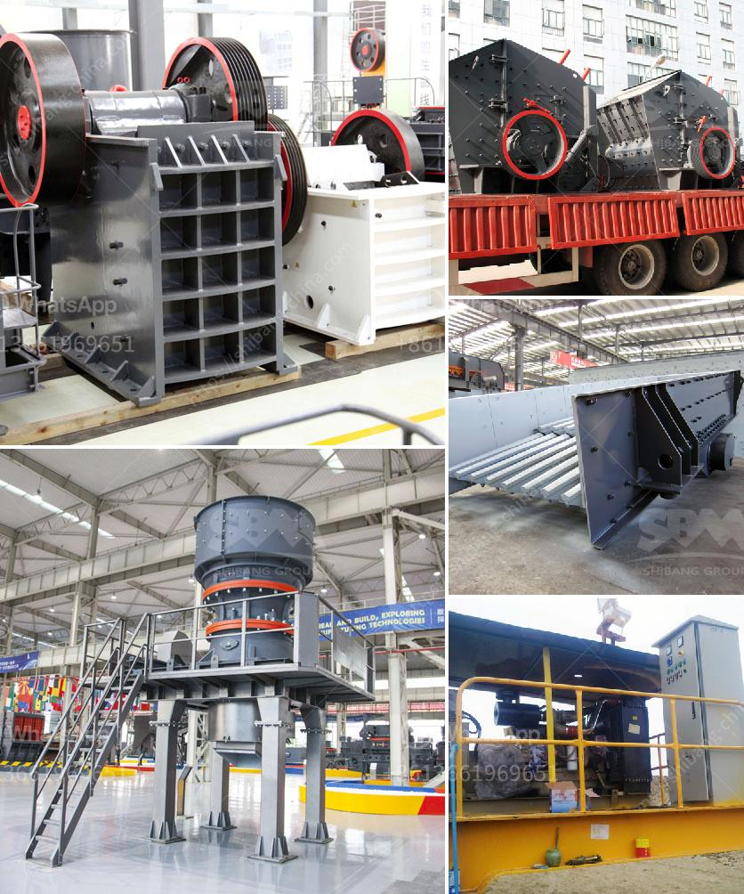

<h3>كسارة الحجر الصخري في الفلبين</h3>
إن كسارة الحجر الصخري في الفلبين هي واحدة من أهم الصناعات التي تساهم في تطوير البنية التحتية والاقتصاد في البلاد. تعتبر صناعة كسارة الحجر الصخري من أكبر الصناعات التحويلية في الفلبين، حيث تلبي الطلب المستمر على مواد البناء والبناء.

توجد العديد من المواقع في الفلبين التي تحتوي على صخور تستخدم في صناعة البناء والبناء. تمتلك الفلبين كميات وفيرة من الحصى والصخور المناسبة للاستخدام العمليات الصناعية. يتم استخراج الحجر الصخري من المناجم أو الحقول الصخرية ويتم تهديمه وتكسيره باستخدام معدات الكسارة لإنتاج الركام والرمل والحصى والحجارة اللازمة في مشاريع البناء المختلفة.

تلعب صناعة كسارة الحجر الصخري دورًا حاسمًا في تطوير البنية التحتية والاقتصاد في الفلبين. حيث يتم استخدام الركام والحصى من الحجر الصخري في بناء الطرق والجسور والمباني والمشاريع العمرانية الأخرى. بالإضافة إلى ذلك، يعمل قطاع كسارة الحجارة في الفلبين على توفير فرص العمل للمئات، إن لم يكن الآلاف من الأشخاص.

ومع ذلك، يواجه قطاع كسارة الحجارة في الفلبين العديد من التحديات. فعلى سبيل المثال، تواجه صناعة البناء في البلاد تحديات بيئية بسبب استخدام العمليات غير المستدامة لإزالة الصخور واسخدام التكنولوجيا القديمة وغير الفعالة في هذه الصناعة. مع ذلك، مع تزايد الوعي البيئي والتوجه نحو الاستدامة، تعمل الفلبين على تحديث وتحسين إجراءات استخراج الحجارة ومعالجتها في الكسارات.

بالإضافة إلى ذلك، تعمل الحكومة الفلبينية على مراقبة الصناعة وتنظيمها للتأكد من التزامها بالمعايير البيئية والصحية. وتشجع الحكومة أيضًا على استخدام التكنولوجيا الحديثة والمستدامة في قطاع كسارة الحجر الصخري، مما يؤدي إلى زيادة الكفاءة وتقليل الآثار البيئية السلبية.

بصفة عامة ، تلعب صناعة كسارة الحجر الصخري في الفلبين دورًا هامًا في تلبية احتياجات البنية التحتية وتطوير الاقتصاد. ومع الاستمرار في تطوير تقنيات استخراج الحجارة والالتزام بالمعايير البيئية والصحية، يمكن أن تكون هذه الصناعة مساهمة فعالة ومستدامة في تنمية البلاد.
<h3>Contact us</h3><ul><li><strong>Whatsapp:&nbsp;<a href="https://wa.me/8613661969651">+8613661969651</a></strong></li><li><a href="https://swt.shibang-china.com/?git&amp;zhl&amp;كسارة الحجر الصخري في الفلبين"><strong>Online Service(chat now)</strong></a></li></ul><h3>Related</h3><ul><li><a href='كيفية بدء عمل في مجال صناعة الكتل الخرسانية.md'>كيفية بدء عمل في مجال صناعة الكتل الخرسانية</a></li><li><a href='مسحوق الدولوميت 200 شبكة.md'>مسحوق الدولوميت 200 شبكة</a></li><li><a href='كسارة مخروطية سلسلة CS.md'>كسارة مخروطية سلسلة CS</a></li><li><a href='كسارة الحجر في الفلبين.md'>كسارة الحجر في الفلبين</a></li><li><a href='كسارة الفك الصينية PE 150 250 في الفلبين.md'>كسارة الفك الصينية PE 150 250 في الفلبين</a></li></ul>