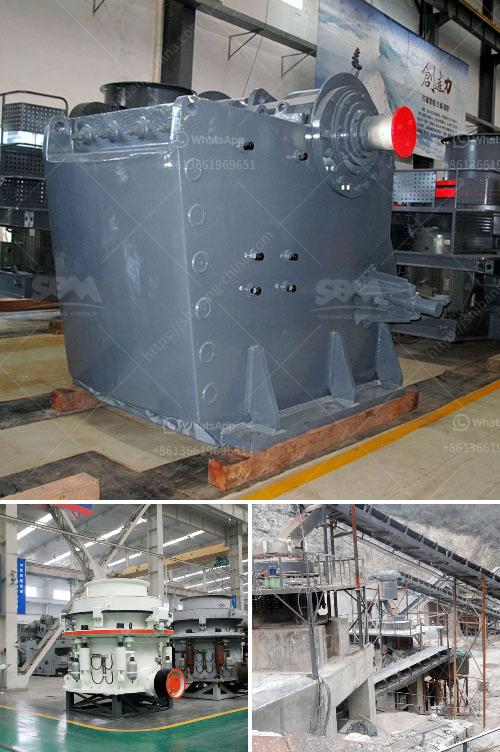

<h3>كسارة الحجر الصغيرة للبيع في الفلبين</h3>
تعتبر كسارة الحجر الصغيرة من المعدات الهامة في صناعة التعدين والبناء، والتي تستخدم لتكسير الأحجار الكبيرة إلى أحجام صغيرة. وتعد الفلبين واحدة من الدول التي تشهد نمواً سريعاً في قطاعي التعدين والبناء، مما يزيد من الطلب على كسارات الحجر الصغيرة في السوق المحلية.

تتميز كسارات الحجر الصغيرة بأنها سهلة الاستخدام وقادرة على تكسير الأحجار ذات القساوة المختلفة، مثل الجرانيت والحجر الجيري والرخام والصخور البركانية. كما تعمل هذه الكسارات بكفاءة عالية، مما يجعلها مناسبة للاستخدام في العديد من المشاريع المختلفة، بدءًا من إنشاء الطرق والجسور وصولاً إلى إعادة تدوير الخرسانة المهملة.

تتوفر كسارات الحجر الصغيرة للبيع في الفلبين بأحجام وموديلات مختلفة، ويتناسب سعرها عادة مع قدرتها على تكسير الأحجار ومدى قوتها. وبناءً على الاحتياجات والمتطلبات الفردية للعميل، يتم تحديد الحجم المثالي للكسارة المطلوبة وقوة المحرك المطلوبة لتحقيق الأداء المثلى.

يعتبر السعر من العوامل المهمة في اختيار كسارة الحجر الصغيرة، خاصةً للعملاء الذين يحتاجون إلى معدات ذات تكلفة منخفضة وجودة عالية. قد يتراوح سعر كسارة الحجر الصغيرة في الفلبين بين ٢٠٠٠ إلى ٥٠٠٠ دولار، اعتمادًا على الموديل والحجم والكفاءة.

بشكل عام، يجب على العملاء البحث عن الموزعين الموثوق بهم والمصنعين الموثوق بهم لشراء كسارة الحجر الصغيرة في الفلبين. يجب أن يتم اختيار الكسارة التي تمتلك سمعة جيدة في الصناعة وتتمتع بضمان قوي وخدمة ما بعد البيع الممتازة.

بالإضافة إلى ذلك، يجب على العملاء أيضًا النظر في الموقع الجغرافي للمشروع والاحتياجات المحددة لهم. فقد توفر بعض الشركات الكسارات المحمولة التي يمكن نقلها بسهولة إلى الموقع المطلوب، مما يسهل عملية التشغيل والتنقل في الموقع.

في النهاية، تعتبر كسارات الحجر الصغيرة للبيع في الفلبين فرصة مثالية للعملاء الذين يبحثون عن معدات عالية الجودة بأسعار مناسبة. باستخدام هذه الكسارات، يمكن تحسين فعالية الإنتاج وتقليل تكلفة العمل، مما يساهم في تعزيز تنمية صناعة التعدين والبناء في الفلبين.
<h3>Contact us</h3><ul><li><strong>Whatsapp:&nbsp;<a href="https://wa.me/8613661969651">+8613661969651</a></strong></li><li><a href="https://swt.shibang-china.com/?git&amp;zhl&amp;كسارة الحجر الصغيرة للبيع في الفلبين"><strong>Online Service(chat now)</strong></a></li></ul><h3>Related</h3><ul><li><a href='تدريب مطحنة ريموند.md'>تدريب مطحنة ريموند</a></li><li><a href='آلات معالجة الأحجار الكريمة لإثيوبيا.md'>آلات معالجة الأحجار الكريمة لإثيوبيا</a></li><li><a href='فرضية عامة لكسارة الفك.md'>فرضية عامة لكسارة الفك</a></li><li><a href='كسارة فك محمولة.md'>كسارة فك محمولة</a></li><li><a href='كيفية بدء مشروع كسارة الحجر.md'>كيفية بدء مشروع كسارة الحجر</a></li></ul>