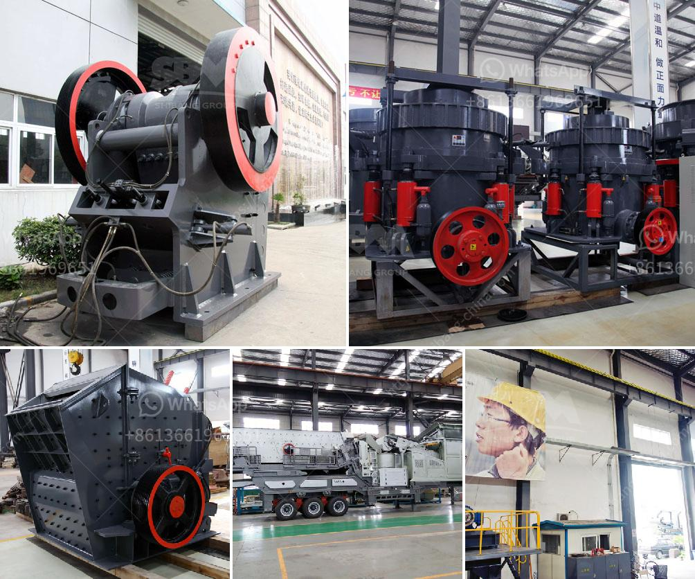

<h3>كسارة الحجر المحمولة اللوحة المزدوجة</h3>
تعد كسارة الحجر المحمولة اللوحة المزدوجة من أحدث التقنيات المستخدمة في صناعة البناء والتشييد. فهي توفر العديد من المزايا التي تجعلها اختيارًا ممتازًا للعديد من الشركات والمقاولين.

تم تصميم كسارة الحجر المحمولة لتكون متنقلة وسهلة الاستخدام، وتستطيع نقلها بسهولة بين المواقع المختلفة دون الحاجة إلى تركيبات معقدة أو إعدادات معينة. وتستفيد الكسارة المحمولة من نظام اللوحة المزدوجة الذي يعمل على تحسين كفاءة العمل وزيادة إنتاجية الكسارة.

تتميز اللوحة المزدوجة في كسارة الحجر المحمولة بقدرتها على سحق المواد الخام بشكل أكثر فعالية من خلال استغلال القوة المزدوجة للفكين. فعندما يتم التشغيل، يتحرك الفك العلوي أفقيًا والفك السفلي عموديًا، وبالتالي يتم زيادة كفاءة سحق المواد. كما يتم تقليل فقد الطاقة وتحسين الأداء العام للكسارة.

بالإضافة إلى ذلك، تأتي الكسارة المحمولة اللوحة المزدوجة بمحرك قوي يضمن توافر القوة اللازمة لسحق المواد الصلبة بفعالية. كما يعمل هذا المحرك على تقليل تكاليف الطاقة وزيادة كفاءة الكسارة. وبالتالي، يتم تحسين الأداء العام للكسارة المحمولة وزيادة الإنتاجية.

تتميز كسارة الحجر المحمولة اللوحة المزدوجة أيضًا بتصميمها المدمج والمحمول، مما يسهل عملية النقل والتنقل بين المواقع المختلفة. فإن وجود نظام اللوحة المزدوجة ومحرك قوي في كسارة صغيرة الحجم يعني أنها يمكن أن تكون محمولة بسهولة وتناسب المواقع الضيقة أو الصعبة الوصول.

بالإضافة إلى ذلك، تتوفر العديد من الإصدارات المختلفة من كسارة الحجر المحمولة اللوحة المزدوجة، مما يوفر للمتعاملين العديد من الخيارات المناسبة لاحتياجاتهم الفردية. يمكن تخصيص الكسارة بحيث يمكنها سحق مجموعة متنوعة من المواد الصلبة مثل الحجر الجيري والجرانيت والرخام والطين والخرسانة.

في النهاية، تعتبر كسارة الحجر المحمولة اللوحة المزدوجة اختيارًا مثاليًا للعديد من الشركات والمقاولين في صناعة البناء والتشييد. فهي توفر القوة والكفاءة اللازمة لسحق المواد الصلبة بسرعة وبجودة عالية، وتوفر النقل المريح بين المواقع المختلفة. بالإضافة إلى ذلك، تتوفر بتصميم محمول ومدمج يسهل الاستخدام والتنقل.
<h3>Contact us</h3><ul><li><strong>Whatsapp:&nbsp;<a href="https://wa.me/8613661969651">+8613661969651</a></strong></li><li><a href="https://swt.shibang-china.com/?git&amp;zhl&amp;كسارة الحجر المحمولة اللوحة المزدوجة"><strong>Online Service(chat now)</strong></a></li></ul><h3>Related</h3><ul><li><a href='آلة مطحنة الكرة في الصين.md'>آلة مطحنة الكرة في الصين</a></li><li><a href='مطحنة الهامر من إيديبيسا.md'>مطحنة الهامر من إيديبيسا</a></li><li><a href='مصانع المعالجة في الصين للحجر الجيري.md'>مصانع المعالجة في الصين للحجر الجيري</a></li><li><a href='كسارة الحجر غانا.md'>كسارة الحجر غانا</a></li><li><a href='كسارة الحجر 100 طن للبيع.md'>كسارة الحجر 100 طن للبيع</a></li></ul>