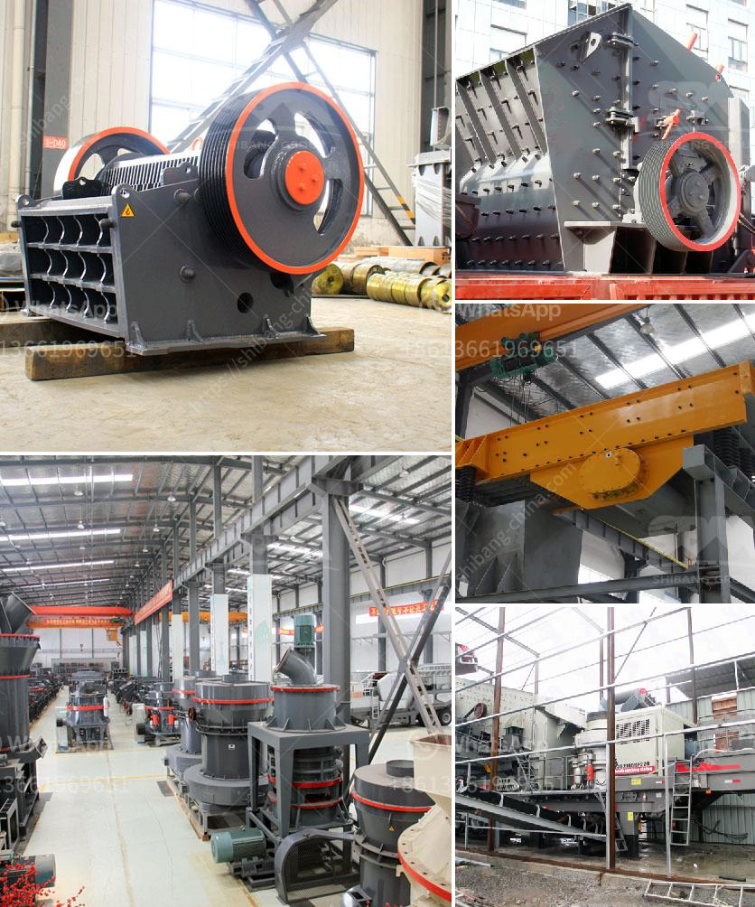

<h3>كسارة الحجر المحمولة للبيع في الفلبين</h3>
تعتبر كسارة الحجر المحمولة واحدة من أهم الأدوات المستخدمة في صناعة التعدين والبناء في الفلبين. تسهم الكسارة المحمولة في سهولة وسرعة تكسير الأحجار والصخور الصلبة ، مما يجعلها مثالية للاستخدام في العديد من المشاريع المختلفة.

تتميز الكسارة المحمولة بقدرتها على تكسير الصخور والأحجار في أماكن متعددة داخل وخارج الموقع. يمكن استخدامها في المواقع البعيدة والمناطق غير المأهولة ، حيث قد لا تتوفر معدات أخرى للتكسير. بالإضافة إلى ذلك ، يمكن تثبيت الكسارة المحمولة بسهولة وفكها ونقلها بين مواقع العمل بواسطة شاحنة أو مقطورة.

تتوفر الكسارات المحمولة بمختلف الأحجام والقدرات لتناسب احتياجات مختلف المشاريع. وبفضل قدرتها على تكسير الأحجار بمختلف الأحجام والصخور ، فإنها تستخدم على نطاق واسع في صناعة البناء والتعدين والمشاريع الهندسية الأخرى.

تعتبر الفلبين واحدة من الأسواق الرئيسية للكسارات المحمولة. يحتاج قطاع البناء والتعدين في الفلبين إلى معدات قوية وفعالة لتلبية الطلب المتزايد على البنية التحتية والإسكان والتطوير العمراني في البلاد. لذا يعتبر شراء كسارة حجر محمولة للبيع في الفلبين استثماراً جيدًا للشركات ورجال الأعمال في هذا القطاع.

توفر الكسارات المحمولة الفعالية والكفاءة في عمليات التكسير. تستخدم التكنولوجيا المتقدمة والمواد المتينة في بناء الكسارة ، لضمان استمرارية عملها في ظل ظروف التشغيل القاسية.

بالإضافة إلى ذلك ، فإن استخدام الكسارة المحمولة للبيع في الفلبين يوفر فوائد اقتصادية. يمكن للمشترين شراء الكسارة واستخدامها لفترة طويلة دون الحاجة إلى الاعتماد على خدمات الكسارات المستأجرة ، مما يوفر تكاليف التشغيل والصيانة.

عند شراء كسارة حجر محمولة للبيع في الفلبين ، يجب أن يأخذ المشترين في الاعتبار عدة عوامل. يجب التحقق من سمعة الشركة المصنعة وجودة المنتجات التي تقدمها. يجب أيضا النظر في القدرة والأداء والتكلفة للكسارة المحمولة بناءً على احتياجات المشروع. وهذا يشمل الانتباه إلى عوامل مثل نوع الطاقة والسعة ونوعية الأحجار المطلوب تكسيرها.

باختصار ، تعتبر كسارة الحجر المحمولة للبيع في الفلبين أداة مهمة وفعالة في صناعة التعدين والبناء. توفر هذه الأداة القوية قدرة تكسير فعالة ومرنة للصخور والأحجار ، وتلبي احتياجات المشاريع الهندسية المختلفة في الفلبين. بالإضافة إلى ذلك ، يعتبر شراء الكسارة المحمولة استثمارًا مجديًا للشركات والأفراد في قطاع البناء والتعدين في البلاد.
<h3>Contact us</h3><ul><li><strong>Whatsapp:&nbsp;<a href="https://wa.me/8613661969651">+8613661969651</a></strong></li><li><a href="https://swt.shibang-china.com/?git&amp;zhl&amp;كسارة الحجر المحمولة للبيع في الفلبين"><strong>Online Service(chat now)</strong></a></li></ul><h3>Related</h3><ul><li><a href='معدات المحجر المملكة المتحدة.md'>معدات المحجر المملكة المتحدة</a></li><li><a href='كسارة صنع الحصى.md'>كسارة صنع الحصى</a></li><li><a href='مطحنة الأسطوانة للسائل.md'>مطحنة الأسطوانة للسائل</a></li><li><a href='كسارة للبيع في كيرالا.md'>كسارة للبيع في كيرالا</a></li><li><a href='تكلفة إنشاء مصنع خام الحديد.md'>تكلفة إنشاء مصنع خام الحديد</a></li></ul>