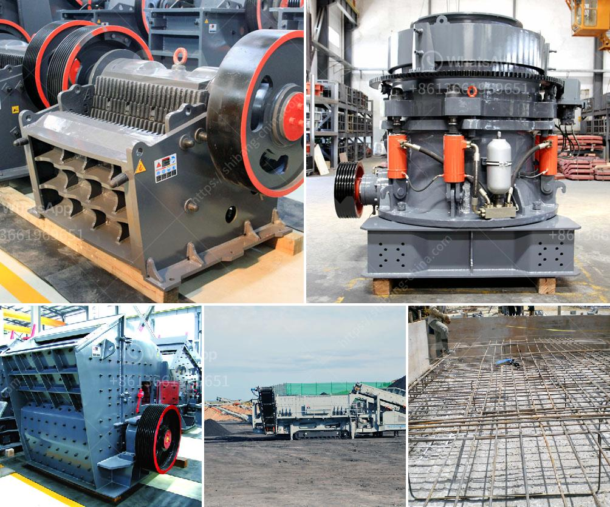

<h3>كسارة الحجر المحمولة</h3>
تعتبر كسارة الحجر المحمولة أداة هامة في صناعة البناء والتشييد، حيث تستخدم لسحق الحجارة وتقسيمها إلى قطع صغيرة قابلة للاستخدام في البناء. تتميز الكسارة المحمولة بالقدرة على نقلها بسهولة من موقع إلى آخر، مما يجعلها مريحة وعملية للاستخدام في أماكن متعددة.

تتكون الكسارة المحمولة عادة من ماكينة كسر الصخور والناقل الذي ينقل الحجارة المكسورة إلى مكان التخزين أو الموقع الذي سيتم استخدامها فيه. تتوفر الكسارات المحمولة بأحجام ومواصفات مختلفة، مما يجعلها ملائمة لمجموعة متنوعة من التطبيقات والمشاريع.

من أهم ميزات الكسارة المحمولة هو توفر الطاقة والمرونة في الاستخدام. بفضل تكنولوجيا القوة الهيدروليكية المتقدمة، يمكن للكسارة العمل بكفاءة عالية وأداء ممتاز في أي مكان وفي أي زمان. كما أنها تعمل بالطاقة الكهربائية أو الديزل، مما يتيح استخدامها في المواقع التي لا تتوفر فيها مصادر الكهرباء.

كما تعتبر الكسارة المحمولة طريقة مستدامة وصديقة للبيئة لسحق الحجارة. فبدلاً من نقل الحجارة المكسورة بشاحنات كبيرة إلى مكان التخزين، يمكن سحقها في الموقع نفسه بواسطة الكسارة المحمولة. هذا يقلل من انبعاثات ثاني أكسيد الكربون واستهلاك الوقود، كما يقلل من تكاليف النقل والتخزين.

تستخدم الكسارة المحمولة في العديد من التطبيقات مثل بناء الطرق والجسور، إعادة تدوير الحجارة في مواقع الهدم، إنشاء المدرجات والمستودعات، وغيرها من المشاريع. فهي تساعد في توفير الحجارة المقساة ذات الجودة العالية والمطلوبة للمشاريع الكبيرة.

بالاختصار، تعد كسارة الحجر المحمولة أداة حديثة ومهمة في صناعة البناء والتشييد. تتميز بالقدرة على النقل السهل، وسهولة الاستخدام، والمرونة في العمل، والاحترافية في الأداء. كما تسهم في الحفاظ على البيئة وتوفير الوقت والمال في تنفيذ المشاريع.
<h3>Contact us</h3><ul><li><strong>Whatsapp:&nbsp;<a href="https://wa.me/8613661969651">+8613661969651</a></strong></li><li><a href="https://swt.shibang-china.com/?git&amp;zhl&amp;كسارة الحجر المحمولة"><strong>Online Service(chat now)</strong></a></li></ul><h3>Related</h3><ul><li><a href='سينغ كسارة الحجر ناشيك.md'>سينغ كسارة الحجر ناشيك</a></li><li><a href='سعر مطرقة مطحنة سعة صنع في الصين.md'>سعر مطرقة مطحنة سعة صنع في الصين</a></li><li><a href='كيفية صنع مسحوق الجبس.md'>كيفية صنع مسحوق الجبس</a></li><li><a href='سعر مصنع الرمل والحصى في الهند.md'>سعر مصنع الرمل والحصى في الهند</a></li><li><a href='عملية كربونات الكالسيوم المترسبة.md'>عملية كربونات الكالسيوم المترسبة</a></li></ul>