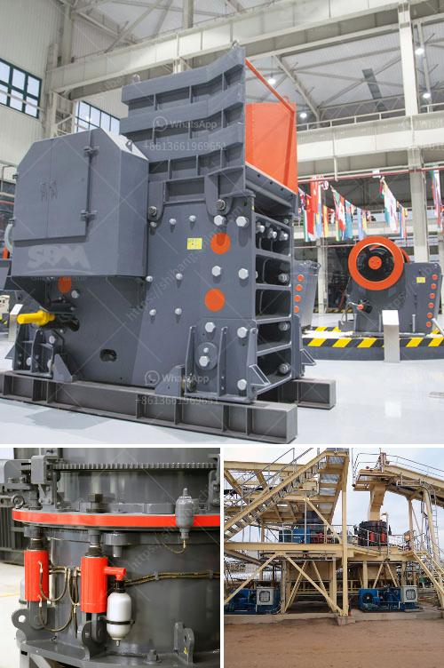

<h3>كسارة الحجر المستعملة للبيع في زيمبابوي</h3>
تعتبر صناعة التعدين والبناء من أهم القطاعات الاقتصادية في زيمبابوي. ومن بين المعدات المستخدمة في هذه الصناعة، تأتي كسارات الحجر الثابتة والمتنقلة في مقدمة الأدوات التي تسهم في تكسير الحجارة وفرزها، وتعدين الصخور والأحجار الثقيلة والاستفادة منها.

يعتبر شراء كسارة الحجر المستعملة للبيع في زيمبابوي مفيدًا لعدة أسباب. قد تكون هناك تكلفة أقل مقارنةً بالكسارات الجديدة، مما يساعد المشاريع ذات الميزانية المحدودة على الاستفادة منها. بالإضافة إلى ذلك، الكسارات المستعملة قد تحتاج إلى صيانة بسيطة وعادةً ما تكون في حالة جيدة، مما يعزز كفاءتها ويوفر المال على المدى الطويل.

تتوفر كسارات الحجر المستعملة للبيع في زيمبابوي بعدة نماذج وأحجام ومواصفات مختلفة، ويمكن للمشترين اختيار الطراز المناسب وفقًا لاحتياجاتهم الخاصة. قد يتم تصنيع البعض منها بواسطة الشركات المحلية، بينما يتم استيراد الآخرين من الدول الأخرى. ومع ذلك، يجب أن يتأكد المشتريون من شراء كسارات ذات جودة عالية وذات سمعة طيبة من بائعين موثوقين لضمان عملية شراء آمنة ومربحة.

تعتبر الكسارات المستعملة الثابتة والمتنقلة ذات القدرة المتوسطة والكبيرة مناسبة للعديد من التطبيقات المختلفة، مثل تكسير الصخور والأحجار الكبيرة لإنتاج الحصى والركام والرمل ومواد البناء الأخرى. وبفضل تصميمها المتين والمتين، تتحمل هذه الكسارات الظروف الصعبة وتستخدم لفترات طويلة دون مشاكل كبيرة.

هناك العديد من الشركات والموزعين في زيمبابوي التي تعمل في مجال بيع وشراء كسارات الحجر المستعملة. يمكن للمشترين البحث عن هذه الشركات عبر الإنترنت أو الاستعانة بوكلاء البيع المحليين. كما يمكنهم الاطلاع على وثائق المنتج واستشارة الخبراء في المجال للحصول على المشورة المهنية وضمان الحصول على المعدات المناسبة بأفضل سعر ممكن.

في الختام، يمكن القول إن كسارات الحجر المستعملة توفر فرصًا مربحة للمشاريع التعدينية والبنائية في زيمبابوي. وبفضل توفرها بتكلفة منخفضة وجودتها الممتازة، فإن شراء الكسارات المستعملة يعتبر خيارًا جيدًا للمستخدمين الذين يبحثون عن معدات قوية وموثوقة لتلبية احتياجاتهم الخاصة.
<h3>Contact us</h3><ul><li><strong>Whatsapp:&nbsp;<a href="https://wa.me/8613661969651">+8613661969651</a></strong></li><li><a href="https://swt.shibang-china.com/?git&amp;zhl&amp;كسارة الحجر المستعملة للبيع في زيمبابوي"><strong>Online Service(chat now)</strong></a></li></ul><h3>Related</h3><ul><li><a href='كسارة حجر لصنع رمل البناء.md'>كسارة حجر لصنع رمل البناء</a></li><li><a href='مطحنة ريموند الحجر الجيري.md'>مطحنة ريموند الحجر الجيري</a></li><li><a href='سعر كسارة الأسطوانة.md'>سعر كسارة الأسطوانة</a></li><li><a href='استفسار حول الكسارة.md'>استفسار حول الكسارة</a></li><li><a href='سعر مطحنة صغيرة.md'>سعر مطحنة صغيرة</a></li></ul>