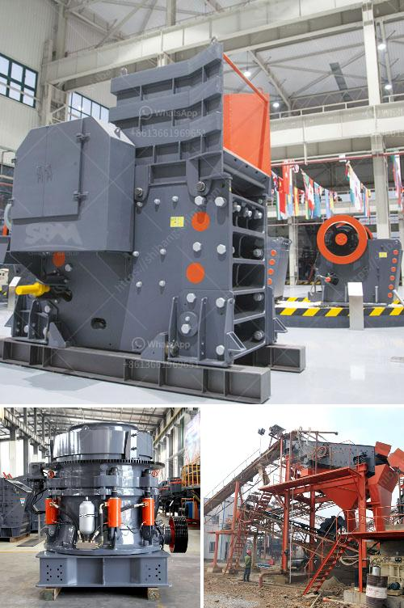

<h3>كسارة الحجر المصنوعة في إيطاليا</h3>
تعد كسارة الحجر المصنوعة في إيطاليا واحدة من أهم الآلات المستخدمة في صناعة البناء والمقالع. فإيطاليا تشتهر بتصنيع المعدات الثقيلة عالية الجودة، وتعتبر صناعة كسارات الحجر من الصناعات المتقدمة التي تشتهر بها البلاد عالميا.

تمتاز كسارة الحجر المصنوعة في إيطاليا بأنها قوية ومتينة وتستخدم أحدث التقنيات في التصنيع. تعمل الكسارات على تكسير الأحجار والصخور الضخمة إلى قطع صغيرة من الحجم المطلوب للمشروع البناء. تتكون الكسارة من عدة أجزاء، بما في ذلك الجزء العلوي الذي يشتمل على صخرة كبيرة تستخدم لتكسير الحجارة، والجزء السفلي الذي ينقل المواد المكسرة إلى موقع التخزين أو وحدة الفرز.

توفر كسارة الحجر المصنوعة في إيطاليا العديد من المزايا والفوائد. فأولاً وقبل كل شيء، فهي توفر قدرة عالية على التكسير والإنتاجية المرتفعة. بفضل القوة الهائلة المزودة بها، يمكن للكسارات التعامل مع الصخور الصعبة بكفاءة وسرعة. كما أنها تساهم في تقليل التكاليف والقيود المادية للمقاولين، حيث يمكنهم توفير العمالة والوقت والجهد الذي يُستهلك في عملية تكسير الحجارة يدويًا.

تضيف كسارة الحجر المصنوعة في إيطاليا قيمة لصناعة البناء من خلال تحويل الحجارة غير المفيدة والصخور الضخمة إلى مواد قابلة للاستخدام، مما يساهم في تحسين عملية إعادة التدوير والاستدامة. إضافة إلى ذلك، فإن البناء بالحجر يتمتع بمقاومة عالية للتآكل والتأثيرات البيئية، مما يضمن استدامة المشاريع على المدى الطويل.

بشكل عام، فإن كسارة الحجر المصنوعة في إيطاليا تعد استثمارًا مربحًا للعديد من المقاولين والمستثمرين العاملين في صناعة البناء. تتمتع بسمعة طيبة وتاريخ طويل من الأداء الموثوق والجودة العالية، مما يجعلها خيارًا مثاليًا للشركات والمؤسسات التي تهدف إلى تحسين إنتاجيتها وتحقيق الاستدامة. لذا، فإن استخدام كسارة الحجر المصنوعة في إيطاليا يعتبر خطوة حكيمة لتحسين أداء المشاريع وتحقيق النجاح في صناعة البناء.
<h3>Contact us</h3><ul><li><strong>Whatsapp:&nbsp;<a href="https://wa.me/8613661969651">+8613661969651</a></strong></li><li><a href="https://swt.shibang-china.com/?git&amp;zhl&amp;كسارة الحجر المصنوعة في إيطاليا"><strong>Online Service(chat now)</strong></a></li></ul><h3>Related</h3><ul><li><a href='تستخدم لمطحنة رايموند.md'>تستخدم لمطحنة رايموند</a></li><li><a href='سعر آلة كسارة الحجر العملاقة.md'>سعر آلة كسارة الحجر العملاقة</a></li><li><a href='حجم وقدرة كسارة الفك النموذجية.md'>حجم وقدرة كسارة الفك النموذجية</a></li><li><a href='مطحنة أسطوانية للبيع في نيوزيلندا.md'>مطحنة أسطوانية للبيع في نيوزيلندا</a></li><li><a href='مطحنة طحن دقيقة للبيع.md'>مطحنة طحن دقيقة للبيع</a></li></ul>