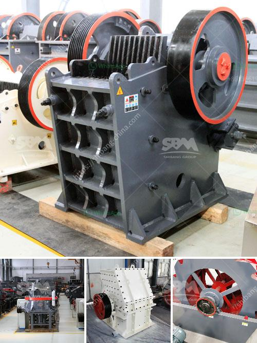

<h3>كسارة الحجر الهامر</h3>
تعد كسارة الحجر الهامر واحدة من أهم الآلات المستخدمة في صناعة التعدين والبناء. فهي تستخدم لكسر الصخور الكبيرة إلى قطع صغيرة قابلة للاستخدام في العديد من التطبيقات. تعد كسارة الحجر الهامر مثالية للعمليات التي تتطلب قدرة تكسير عالية وأداء موثوق به.

تتكون كسارة الحجر الهامر من آلية تكسير تعمل عن طريق تطرق الصخور بواسطة مطرقة ثقيلة تدور بسرعة عالية. الصخور المستهدفة يتم وضعها في فوهة أفقية وتدفع باتجاه المطرقة. وبعد الاصطدام بالمطرقة، تكسر الصخور وتتطاير في اتجاهات مختلفة. يتم تحويل تلك القطع المكسورة إلى حجم صغير بواسطة شبكة التصوير الضوئي التي تحيط بالجزء السفلي من الآلة.

تتميز كسارة الحجر الهامر بعدة ميزات تجعلها مفيدة في صناعة البناء والتعدين. أهم تلك الميزات هي سهولة الاستخدام والتشغيل. فهي تتطلب تشغيل بسيط ولا تحتاج إلى كفاءات فنية معقدة. بالإضافة إلى ذلك، يمكن تعديل حجم المنتج النهائي من قبل المشغل حسب الحاجة، مما يتيح التحكم الكامل في عملية التكسير.

تعتبر كسارة الحجر الهامر مثالية لتكسير الصخور الصلبة مثل الجرانيت والحجر الجيري والحجر الطبيعي. كما تستخدم أيضًا في تكسير الخامات ومواد البناء الأخرى. تعد قدرة التكسير لكسارة الحجر الهامر التي تتراوح بين 50-800 طن في الساعة من أهم العوامل التي تجعلها مثالية للمشاريع الكبيرة التي تتطلب إزالة مواد البناء والأحجار الكبيرة.

في الختام، تعتبر كسارة الحجر الهامر أحدث التجهيزات في صناعة التعدين والبناء. توفر أداءً عاليًا وكفاءة تكسير ممتازة. سهولة الاستخدام ومرونة التكيف مع متطلبات المشروعات تجعلها ضرورية في الصناعات ذات الصلة. لذا، فإن استخدام كسارة الحجر الهامر يمكن أن يوفر الوقت والجهد والمال للمهندسين والمقاولين وأصحاب المشاريع.
<h3>Contact us</h3><ul><li><strong>Whatsapp:&nbsp;<a href="https://wa.me/8613661969651">+8613661969651</a></strong></li><li><a href="https://swt.shibang-china.com/?git&amp;zhl&amp;كسارة الحجر الهامر"><strong>Online Service(chat now)</strong></a></li></ul><h3>Related</h3><ul><li><a href='كسارة نصف متنقلة.md'>كسارة نصف متنقلة</a></li><li><a href='كيفية تصحيح كسارة مخروطية.md'>كيفية تصحيح كسارة مخروطية</a></li><li><a href='مصنع الأسمنت للبيع في دبي.md'>مصنع الأسمنت للبيع في دبي</a></li><li><a href='سعر كسارة الفك في جنوب أفريقيا.md'>سعر كسارة الفك في جنوب أفريقيا</a></li><li><a href='رسم تخطيطي لعملية إنتاج الأسمنت.md'>رسم تخطيطي لعملية إنتاج الأسمنت</a></li></ul>