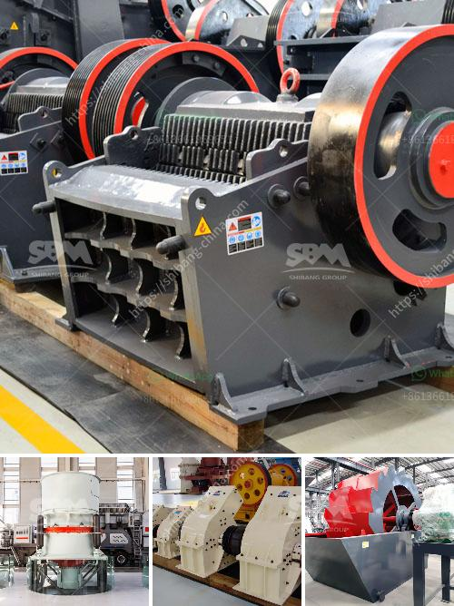

<h3>كسارة الحجر بالمطرقة</h3>
كسارة الحجر بالمطرقة: التكنولوجيا المبتكرة لتكسير الصخور

تلعب كسارة الحجر بالمطرقة دورًا حاسمًا في صناعة التعدين والبناء والهندسة المدنية. هذا الجهاز المبتكر يعمل عن طريق تطبيق قوة الضربات العالية على المواد الصلبة مثل الصخور والحصى والركام والخرسانة، مما يمكّن من تفتيتها وتتبعيقها إلى حجم أصغر.

تتكون كسارة الحجر بالمطرقة عادةً من جسم مركزي يتوفر فيه كراوين المطرقة، وهي جزء هام يقوم بضرب المواد، مما يدفعها باتجاه الشاشة أو الفتحة المعينة. تعتمد كفاءة الكسارة على سرعة الدوران وشكل المطرقة وطول الذراع. 

تتوفر كسارات الحجر بالمطرقة بأحجام وطاقات مختلفة. يمكن أن تتراوح قوة الإنتاج من 50 إلى 1000 طن/ساعة، مما يجعلها مناسبة للعديد من التطبيقات المختلفة. على سبيل المثال، يمكن استخدامها في تكسير الصخور الصلبة والحصى الكبيرة لاستخراج الخامات والمواد الجيولوجية المفيدة.

من أهم ميزات كسارة الحجر بالمطرقة هو أنها سهلة الصيانة والاستخدام. يتم تشغيلها بسيطرة ذاتية ويمكن ضبط نسبة التكسير بسهولة وفقًا لاحتياجات المشروع أو المواد المعالجة. بعض الكسارات تحتوي على نظام هيدروليكي يسمح بتعديل ضغط الضربة لتكسير المادة بشكل أكثر فعالية.

علاوة على ذلك، فإن كسارة الحجر بالمطرقة قابلة للنقل والتركيب بسهولة، مما يزيد من قدرتها على العمل والأداء في أماكن مختلفة وظروف تشغيل متنوعة. إن تقنية هذا الجهاز المتقدمة تستخدم في العديد من الصناعات، بما في ذلك صناعة الرخام وصناعة الأسمنت وصناعة التعدين، حيث يتم استخدامها لتكسير الصخور والحجر الجيري والفحم والخامات الأخرى.

تستمد كسارات الحجر بالمطرقة فوائدها من سرعة العمل والكفاءة العالية التي توفرها في عملية التكسير. بفضل تلك القوة، يمكن تحطيم المواد الصلبة بشكل سريع وفعال، مما يزيد من إنتاجية العمل ويقلل من تكاليف العمليات اللاحقة.

باختصار، تعد كسارة الحجر بالمطرقة تطورًا هامًا في صناعة التعدين والبناء، حيث توفر طريقة فعالة وموثوقة لتكسير الصخور الصلبة والحصى. إن تكنولوجيا المطرقة الحجرية تعمل على تعزيز كفاءة العمل وتحسين الأداء العام لعملية التكسير، مما يمكن من تقليل وقت التشغيل وتحسين جودة المنتجات النهائية.
<h3>Contact us</h3><ul><li><strong>Whatsapp:&nbsp;<a href="https://wa.me/8613661969651">+8613661969651</a></strong></li><li><a href="https://swt.shibang-china.com/?git&amp;zhl&amp;كسارة الحجر بالمطرقة"><strong>Online Service(chat now)</strong></a></li></ul><h3>Related</h3><ul><li><a href='أسعار مصنع الكسارة بوزولانا 50 طن في الساعة.md'>أسعار مصنع الكسارة بوزولانا 50 طن في الساعة</a></li><li><a href='مسحوق الدولوميت 200 شبكة.md'>مسحوق الدولوميت 200 شبكة</a></li><li><a href='قائمة أسعار معدات كسارة الحجر الثقيلة.md'>قائمة أسعار معدات كسارة الحجر الثقيلة</a></li><li><a href='غسيل الرمال الصغيرة.md'>غسيل الرمال الصغيرة</a></li><li><a href='كسارة الرمال والحجر في فرايبورج.md'>كسارة الرمال والحجر في فرايبورج</a></li></ul>