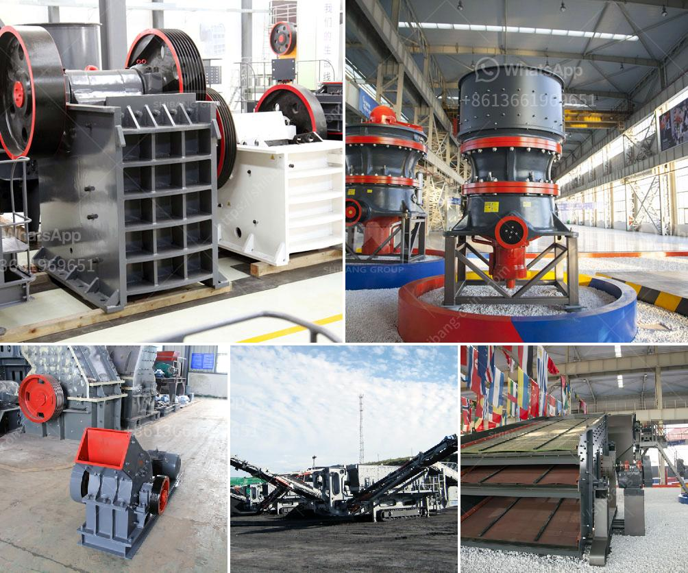

<h3>كسارة الحجر بسعة 200 طن في الساعة</h3>
تعتبر كسارة الحجر بسعة 200 طن في الساعة واحدة من أهم الأدوات التي تُستخدم في صناعة البناء والتشييد. وتعتبر العمليات الميكانيكية في صناعة الحجر وتكسيره من أخطر الأعمال، حيث يتم تعريض الصخور الصلبة للاهتزاز والتحطيم والطحن للتحويل إلى حجم صغير يمكن استخدامه في العديد من التطبيقات.

تتميز كسارة الحجر بسعة 200 طن في الساعة بقدرتها الهائلة على تكسير الصخور بشكل فعال وسريع. وتتكون الكسارة من عدة أجزاء أساسية، بما في ذلك المغذي الاهتزازي والكسارة الفكية والكسارة المخروطية والشاشة الاهتزازية وحزام الناقل ونظام التحكم.

وتقدم الكسارة الفكية أداءً ممتازًا في عملية التكسير، حيث تعمل على محطة الكسارة بانتظام وبسرعة عالية. وتعتبر الكسارة الفكية قادرة على تكسير الصخور بأحجام تصل إلى 1000 ملم إلى حجم صغير بحوالي 10-300 مم. وتعتبر الكسارة المخروطية مثالية لتكسير الصخور الثانوية والعمل في ظروف صعبة.

تعد كسارة الحجر بسعة 200 طن في الساعة ضرورية لتلبية الطلب المتزايد على المواد الكسارة في قطاع البناء والتشييد. فهي قادرة على توفير كميات كبيرة من الحجارة المكسرة المطلوبة في فترة زمنية قصيرة، مما يتيح للمقاولين والمشغلين اكتمال المشاريع في وقت أقل وبتكلفة أقل.

وعلاوة على ذلك، تحتوي الكسارة الحجر على نظام تحكم ذكي يساعد في زيادة الكفاءة وتحسين الأداء. يمكن للمشغلين ضبط الإعدادات المختلفة للكسارة ومراقبة العقبات والمشاكل المحتملة عن طريق النظام لضمان عملية سلسة وآمنة.

في الختام، تعد كسارة الحجر بسعة 200 طن في الساعة أداة حاسمة في صناعة البناء والتشييد. ومن خلال قدرتها على إنتاج كميات كبيرة من الحجارة المكسرة في وقت قصير، تساعد العديد من المشغلين في إكمال المشاريع بكفاءة وفعالية.
<h3>Contact us</h3><ul><li><strong>Whatsapp:&nbsp;<a href="https://wa.me/8613661969651">+8613661969651</a></strong></li><li><a href="https://swt.shibang-china.com/?git&amp;zhl&amp;كسارة الحجر بسعة 200 طن في الساعة"><strong>Online Service(chat now)</strong></a></li></ul><h3>Related</h3><ul><li><a href='كيف يعمل مطحنة الطحن.md'>كيف يعمل مطحنة الطحن</a></li><li><a href='كسارات الفك في تنزانيا.md'>كسارات الفك في تنزانيا</a></li><li><a href='كسارة الكاولين المحمولة في نيجيريا.md'>كسارة الكاولين المحمولة في نيجيريا</a></li><li><a href='كسارة تأثير خام الحديد المتنقلة في الهند.md'>كسارة تأثير خام الحديد المتنقلة في الهند</a></li><li><a href='سعر كسارة حجر البازلت.md'>سعر كسارة حجر البازلت</a></li></ul>