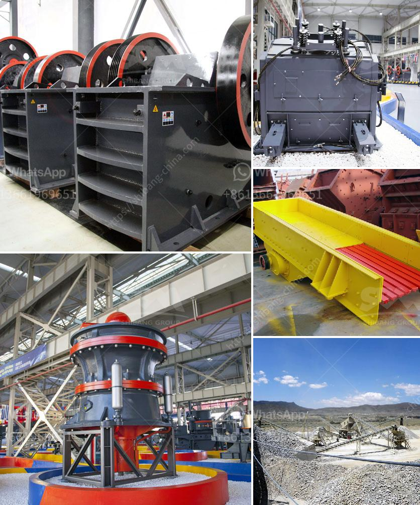

<h3>كسارة الحجر بوزولانا 100 طن في الساعة</h3>
تعتبر كسارة الحجر بوزولانا 100 طن في الساعة عبارة عن آلة متطورة تستخدم في عمليات التكسير والطحن لصخور الحجر. تتميز هذه الكسارة بقدرتها على تكسير حتى 100 طن في الساعة من البوزولانا، وهي مادة حجرية مهمة في صناعة البناء والهندسة المدنية.

تعد صخور البوزولانا ذات ملمس خشن وتحتوي على مواد معدنية مثل السيليكا والألومينا والحديد. تتميز بروتينات صلبة ومقاومة للتآكل والضغط. وتعد البوزولانا معروفة بقدرتها على تعزيز خصائص الخرسانة وتحسين مقاومتها ومتانتها.

تعد كسارة الحجر بوزولانا لديها عملية تكسير متطورة تساهم في تحويل صخور البوزولانا إلى الحجم المطلوب. تتألف الكسارة من وحدة تغذية تقوم بإرسال المواد إلى الفك الميكانيكي الموجود في الجزء العلوي من الكسارة. يتم سحق الصخور بواسطة الفك المتحرك الذي يتحرك بحرية أثناء التشغيل.

تعد كسارة الحجر بوزولانا قوية ومتينة وتستطيع تحمل الضغوط العالية، مما يجعلها مثالية للمشاريع الكبيرة التي تتطلب نسبة إنتاج عالية. بالإضافة إلى ذلك، فإن الكسارة مجهزة بنظام تحكم آلي يجعل عملية التكسير أكثر كفاءة وتوفيرًا للطاقة.

توفر كسارة الحجر بوزولانا فوائد عديدة في صناعة البناء والهندسة المدنية. تعمل الكسارة على توفير الزمن والجهد، حيث تتمكن من تكسير الصخور بشكل سريع وفعال. كما يمكن أيضًا استخدام مخلفات البوزولانا لتقليل التكاليف والحفاظ على الموارد الطبيعية.

علاوة على ذلك، فإن استخدام كسارة الحجر بوزولانا يساهم في تحسين جودة الخرسانة المنتجة. فبفضل ملمس البوزولانا الخشن، يمكن تعزيز قوة الالتصاق والثبات بين الحبيبات ومعطرة الأسمنت. ومن ثم، فإن الخرسانة المنتجة تكون أكثر متانة وقوة في الأماكن ذات الاحتكاك العالي.

في الختام، فإن كسارة الحجر بوزولانا 100 طن في الساعة تعد آلة مهمة في عمليات التكسير والطحن لصخور البوزولانا. تتميز بقوتها ومتانتها وقدرتها على تحمل الضغوط العالية. يمكن استخدامها في المشاريع الكبيرة لتحسين جودة الخرسانة وتوفير الزمن والجهد. بالإضافة إلى ذلك، فإنها تعد آلة فعالة في استخدام المواد الخام والمحافظة على الموارد الطبيعية.
<h3>Contact us</h3><ul><li><strong>Whatsapp:&nbsp;<a href="https://wa.me/8613661969651">+8613661969651</a></strong></li><li><a href="https://swt.shibang-china.com/?git&amp;zhl&amp;كسارة الحجر بوزولانا 100 طن في الساعة"><strong>Online Service(chat now)</strong></a></li></ul><h3>Related</h3><ul><li><a href='عملية تصنيع كسارة الطين المكلس.md'>عملية تصنيع كسارة الطين المكلس</a></li><li><a href='مصنع كسارة الحجر بسعة 100 طن.md'>مصنع كسارة الحجر بسعة 100 طن</a></li><li><a href='مطاحن الكرة الاصطناعية الجبس.md'>مطاحن الكرة الاصطناعية الجبس</a></li><li><a href='ضبط حجم الفك كسارة الإغلاق.md'>ضبط حجم الفك كسارة الإغلاق</a></li><li><a href='مصنع إنتاج مسحوق الجبس بسعة 500 طن.md'>مصنع إنتاج مسحوق الجبس بسعة 500 طن</a></li></ul>