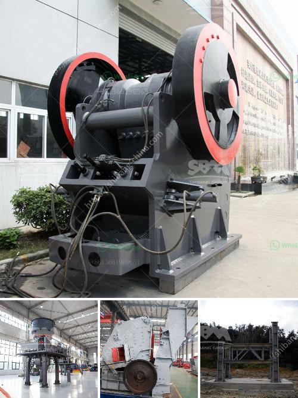

<h3>كسارة الحجر بوزولانا للبيع</h3>
تعد كسارة الحجر بوزولانا إحدى الآلات المهمة في صناعة البناء والتشييد، حيث تستخدم في تكسير الأحجار الكبيرة إلى قطع صغيرة تستخدم في إنشاء الطرق والمباني. وتتميز كسارة الحجر بوزولانا بالقوة والفعالية في تحويل الأحجار الضخمة إلى فتات صغيرة وذلك بفضل نظامها الميكانيكي المتقدم والتقنيات الحديثة التي تمتاز بها.

تتوفر كسارة الحجر بوزولانا للبيع بأحجام وطاقات مختلفة. وتتراوح أحجامها عادةً بين 200 إلى 400 كلمة. وهي متوفرة بعدة نماذج تتناسب مع احتياجات المستخدمين المختلفة. تتميز هذه الكسارة بقدرتها على تكسير الأحجار بشكل سريع وفعال، مما يساهم في زيادة إنتاجية الموقع وتقليل تكلفة العمل.

تعمل كسارة الحجر بوزولانا بتقنية الضغط العالي، حيث يتم تطبيق قوة ضغط كبيرة على الأحجار لتكسيرها. وتتكون الكسارة من مجموعة من المكونات التي تعمل بشكل متناسق معًا. وتشمل هذه المكونات المغذي الاهتزازي، والكسارة الفكية، والكسارة المخروطية، والغربال الاهتزازي، وحزام النقل، وغيرها من الأجزاء. تعمل هذه المكونات معًا على تحقيق أقصى استفادة من الحجر المكسر وضمان حجم وشكل متساوٍ للفتات الناتجة.

وتتميز كسارة الحجر بوزولانا أيضًا بكونها طاقة منخفضة الاستهلاك، مما يعني أنها تستهلك كمية أقل من الطاقة الكهربائية بالمقارنة مع الكسارات التقليدية. وهذا يعزز فوائد الاستدامة ويقلل من الأثر البيئي لعمليات التكسير.

في النهاية، تُعد كسارة الحجر بوزولانا للبيع خيارًا ممتازًا للمقاولين والشركات في صناعة البناء والتشييد. وتوفر لهم وسيلة فعالة وقوية لتحويل الأحجار الضخمة إلى فتات صغيرة وذلك بتكلفة منخفضة. إن استخدام كسارة الحجر بوزولانا يضمن عملية تكسير فعالة وسريعة وموثوقة، مما يعزز إنتاجية المشروع ويحسن جودة العمل النهائي.
<h3>Contact us</h3><ul><li><strong>Whatsapp:&nbsp;<a href="https://wa.me/8613661969651">+8613661969651</a></strong></li><li><a href="https://swt.shibang-china.com/?git&amp;zhl&amp;كسارة الحجر بوزولانا للبيع"><strong>Online Service(chat now)</strong></a></li></ul><h3>Related</h3><ul><li><a href='دليل مطحنة الكرة الرطبة بتنسيق PDF.md'>دليل مطحنة الكرة الرطبة بتنسيق PDF</a></li><li><a href='عملية صنع الإسمنت مع مطاحن الكرة.md'>عملية صنع الإسمنت مع مطاحن الكرة</a></li><li><a href='كسارة تأثير الكلي.md'>كسارة تأثير الكلي</a></li><li><a href='تكلفة الكسارة المحمولة.md'>تكلفة الكسارة المحمولة</a></li><li><a href='شاشات غسيل الركام في جنوب أفريقيا.md'>شاشات غسيل الركام في جنوب أفريقيا</a></li></ul>