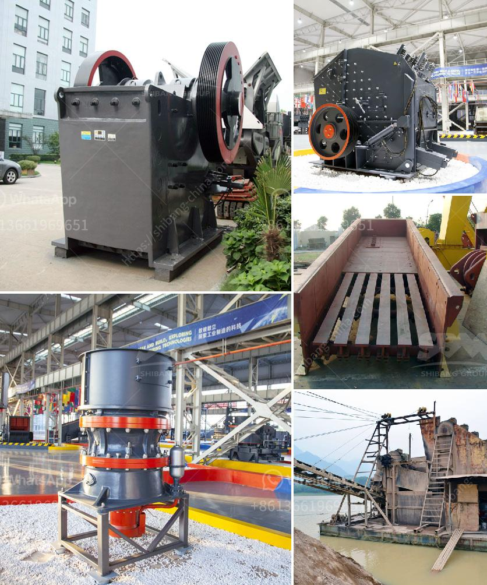

<h3>كسارة الحجر ديربان</h3>
تعتبر كسارة الحجر في ديربان واحدة من الأدوات الهامة في صناعة البناء والتشييد والهندسة المدنية. تستخدم هذه الآلة لتكسير الحجارة الكبيرة إلى حجم أصغر، مما يتيح استخدامها في العديد من التطبيقات المختلفة. يتم تشغيل هذه الكسارات عادة بواسطة محركات كهربائية أو ديزل قوية، وتحتوي على مطارق وأسطوانات متحركة تقوم بتكسير الحجارة بطرق مختلفة وفقًا للغرض المطلوب.

تستخدم كسارة الحجر في ديربان في العديد من التطبيقات، بما في ذلك صناعة البناء. فهي تساعد في تحويل الحجارة الكبيرة إلى حصى صغيرة التي يمكن استخدامها لصنع الخرسانة والأسفلت والرصف. يعد استخدام الحصى في صناعة البناء مفيدًا لأنه يساعد على تحسين قوة المواد ويجعلها أكثر متانة ومقاومة للتآكل. بالإضافة إلى ذلك، يمكن استخدام الحصى الناتج من عملية التكسير في بناء المنحدرات الأرضية والدروج والحواجز الصوتية والمزيد.

تجد كسارة الحجر في ديربان أيضًا استخدامات في صناعة الطرق. فعند بناء الطرق، يتم استخدام الحصى المكسر كمادة أساسية لتعبيد الطرق وتحسين سطح المسار. يعتبر الحصى المكسر أحد المواد الأكثر فعالية لهذا الغرض، حيث يعزز من قوة واستقرار الطرق ويمنع تراكم المياه وتشكل الحفر. يعزز استخدام الحصى في بناء الطرق أيضًا من تدفق حركة المرور، حيث يسهم في توزيع الوزن بشكل أفضل وتقليل انزلاق المركبات.

بالإضافة إلى ذلك، تستخدم كسارة الحجر في ديربان في صناعة التعدين واستخراج المواد الخام. فعند استخراج المواد الخام مثل الحصى والرمال والحجر الجيري والجرانيت، تستخدم الكسارات لتحطيم الصخور وتقسيمها إلى مقاسات مناسبة للتعدين. تساهم هذه الآلات في زيادة كفاءة عمليات التعدين وتقليل التكاليف العامة.

باختصار، تعد كسارة الحجر في ديربان أداة أساسية في العديد من الصناعات مثل صناعة البناء والطرق والتعدين. تساهم في تحويل الصخور الكبيرة إلى مواد أصغر، مما يمكن استخدامها في العديد من التطبيقات المختلفة. استخدام كسارات الحجر يعزز من قوة المواد ويحسن أداءها ويسهم في تحقيق مشاريع بناء متينة ومستدامة.
<h3>Contact us</h3><ul><li><strong>Whatsapp:&nbsp;<a href="https://wa.me/8613661969651">+8613661969651</a></strong></li><li><a href="https://swt.shibang-china.com/?git&amp;zhl&amp;كسارة الحجر ديربان"><strong>Online Service(chat now)</strong></a></li></ul><h3>Related</h3><ul><li><a href='مخطط تدفق التعدين ومعالجة المعادن للنيكل.md'>مخطط تدفق التعدين ومعالجة المعادن للنيكل</a></li><li><a href='مصنع كسارة الفك للبيع في أفريقيا.md'>مصنع كسارة الفك للبيع في أفريقيا</a></li><li><a href='نوع من مطحنة الكرة.md'>نوع من مطحنة الكرة</a></li><li><a href='سعر آلة تكسير الذهب في الولايات المتحدة.md'>سعر آلة تكسير الذهب في الولايات المتحدة</a></li><li><a href='تقدير لعمليات تكسير الحجر.md'>تقدير لعمليات تكسير الحجر</a></li></ul>