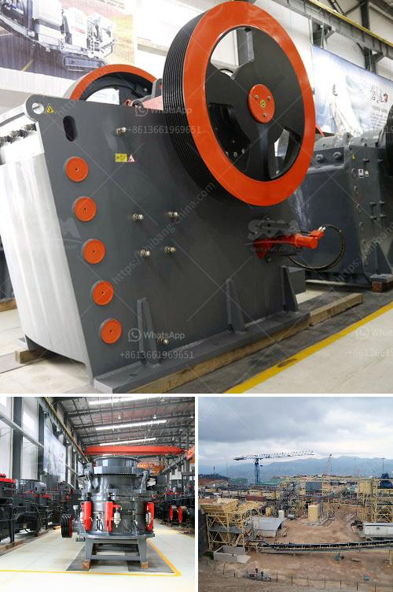

<h3>كسارة الحجر غانا</h3>
كسارة الحجر هي آلة تستخدم لكسر الصخور الكبيرة إلى قطع صغيرة أو الحصى. وتستخدم هذه الكسارات في صناعة البناء والإنشاءات لإنتاج الخرسانة والركام والأسفلت.

تتميز غانا بمواردها الطبيعية الغنية بالحجر والركام، مما يتيح فرصًا ضخمة لتطوير صناعة التعدين والبناء وسوق الكسارات في البلاد. وتعد كسارة الحجر في غانا من أهم الآلات التي تستخدم للحصول على مواد البناء الضرورية.

تعمل كسارات الحجر في غانا على قدم وساق لتلبية الطلب المستمر على مواد البناء في البلاد. وتحتاج الكسارات إلى تجهيزات وآلات خاصة لتكسير الصخور الكبيرة إلى أجزاء أصغر. مثل هذه الكسارات مزودة بفكين متحركين تتحرك في اتجاهين معاكسين، بحيث يضغط كل فك على الحجر لتكسيره أثناء الحركة الثانية. وتستخدم الكسارات الهيدروليكية العديد من التقنيات والتجهيزات لضمان تشغيلها بكفاءة عالية وبأمان.

تلعب كسارات الحجر دورًا حاسمًا في صناعة البناء في غانا. حيث تُستخدم المواد التي تحصل عليها من الكسارات في إنشاء الطرق والجسور والمباني. وبفضل قوة كسارات الحجر، يمكن تحويل الصخور الكبيرة جدًا إلى مواد بنائية صغيرة وسهلة الاستخدام.

وعلاوة على ذلك، تحتاج غانا إلى مواد البناء لتلبية النمو السكاني السريع وتطور الاقتصاد. وتقدم الكسارات في غانا فرص عمل للكثير من العمال والفنيين في قطاع البناء والتشييد. كما يتم استغلال الموارد الطبيعية المحلية بشكل فعال، مما يقلل من الاعتماد على استيراد مواد البناء من الخارج.

بشكل عام، تعد كسارة الحجر في غانا جزءًا أساسيًا من صناعة البناء في البلاد. حيث توفر هذه الآلة المواد البنائية اللازمة للمشاريع الكبيرة والصغيرة على حد سواء. وتساهم في دفع نمو الاقتصاد وتحسين البيئة الحضرية في غانا من خلال توفير مواد بنائية عالية الجودة ومحلية المصدر.
<h3>Contact us</h3><ul><li><strong>Whatsapp:&nbsp;<a href="https://wa.me/8613661969651">+8613661969651</a></strong></li><li><a href="https://swt.shibang-china.com/?git&amp;zhl&amp;كسارة الحجر غانا"><strong>Online Service(chat now)</strong></a></li></ul><h3>Related</h3><ul><li><a href='خطة عمل لكربونات الكالسيوم.md'>خطة عمل لكربونات الكالسيوم</a></li><li><a href='مصنع معالجة رمل السيليكا.md'>مصنع معالجة رمل السيليكا</a></li><li><a href='تصميم مصنع الإسمنت بتنسيق PDF.md'>تصميم مصنع الإسمنت بتنسيق PDF</a></li><li><a href='مصنع الحجر الجيري والآلات في تاميل نادو للبيع.md'>مصنع الحجر الجيري والآلات في تاميل نادو للبيع</a></li><li><a href='موردي مطحنة ريموند.md'>موردي مطحنة ريموند</a></li></ul>