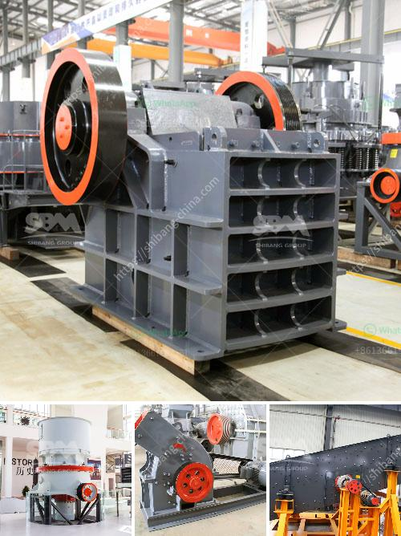

<h3>كسارة الحجر في إثيوبيا</h3>
توجد العديد من كسارات الحجر في إثيوبيا ، وهي تعد من أهم الصناعات الرئيسية في البلاد. تستخدم كسارات الحجر لسحق الصخور الكبيرة والحجارة في قطع صغيرة أو منخفضة الحجم، مما يجعلها مثالية للاستخدام في مشاريع البناء والطرق والأعمال العامة.

تعد إثيوبيا من أكبر المناطق المنتجة للحجر في العالم، حيث تحتوي على ثروات طبيعية غنية من الجرانيت والبازلت والحجر الجيري والرخام وغيرها من الأحجار القيمة. تمتاز هذه الأحجار بجودتها ومتانتها ، مما يعزز الطلب المحلي والعالمي على منتجات الحجر التي تتميز بالجودة العالية والتصميمات المتميزة.

تلعب كسارة الحجر دورًا محوريًا في عملية استخراج الحجر وتحضيره للاستخدام في مختلف الصناعات. تعمل هذه الكسارات عادة بواسطة الطاقة الكهربائية وتستخدم آلات ومعدات متقدمة مثل الكسارات الفكية والكسارات المخروطية والطواحين والغرابيل وحزام النقل ومعدات الفحص وغيرها. يتم استخدام هذه الآلات الحديثة لضمان سرعة وكفاءة عملية السحق وتجهيز الحجارة بشكل مناسب.

توفر صناعة الحجر في إثيوبيا فرص عمل للكثير من العمال المحليين وتساهم في تعزيز النمو الاقتصادي. كما تسهم هذه الصناعة في تلبية الطلب المحلي على مواد البناء والتشييد وتعزيز البنية التحتية في البلاد.

ومع ذلك ، يواجه قطاع الحجر في إثيوبيا بعض التحديات. من بين هذه التحديات البيئية والاقتصادية والتنظيمية. يجب مراعاة آثار الصناعة على البيئة واتخاذ التدابير اللازمة للحفاظ على الموارد الطبيعية والتنوع البيولوجي. كما يجب تعزيز الإجراءات الرقابية لضمان تحسين ظروف العمل والسلامة والصحة في المناجم والكسارات.

بشكل عام ، تعتبر صناعة الحجر في إثيوبيا مهمة للغاية وتلبي الطلب المتزايد على مواد البناء والتشييد. بفضل الاستثمارات المستدامة والتنظيم الجيد ، يمكن أن تستمر هذه الصناعة في توفير فرص العمل ودعم التنمية الاقتصادية في البلاد.
<h3>Contact us</h3><ul><li><strong>Whatsapp:&nbsp;<a href="https://wa.me/8613661969651">+8613661969651</a></strong></li><li><a href="https://swt.shibang-china.com/?git&amp;zhl&amp;كسارة الحجر في إثيوبيا"><strong>Online Service(chat now)</strong></a></li></ul><h3>Related</h3><ul><li><a href='كم يكلف كسارة الحجر.md'>كم يكلف كسارة الحجر</a></li><li><a href='تقرير مشروع وحدات كسارة الحجر.md'>تقرير مشروع وحدات كسارة الحجر</a></li><li><a href='كسارة محمولة للكوبالت.md'>كسارة محمولة للكوبالت</a></li><li><a href='مورد كسارة النحاس.md'>مورد كسارة النحاس</a></li><li><a href='جهات اتصال ووكلاء شاشات الرمل والغرابيل.md'>جهات اتصال ووكلاء شاشات الرمل والغرابيل</a></li></ul>