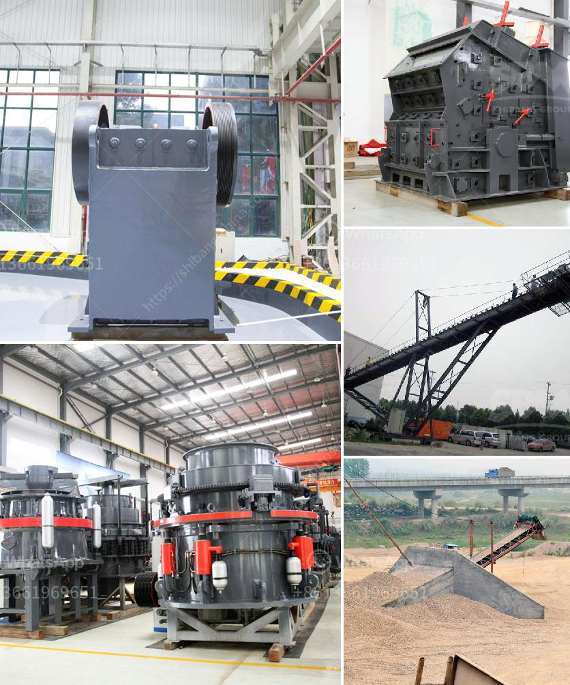

<h3>كسارة الحجر في إندونيسيا</h3>
تعد كسارة الحجر واحدة من الصناعات الرئيسية في إندونيسيا التي تساهم في تطور البنية التحتية والبناء في البلاد. تعتبر إندونيسيا واحدة من أكبر الأسواق للحجر المسحوق في جنوب شرق آسيا، وتعتبر الكسارات الحجرية الرئيسية هناك هي مصدرا رئيسيا للمواد الخام.

تستخدم الكسارات الحجرية في إندونيسيا لسحق الصخور الكبيرة إلى قطع صغيرة من الحجر المسحوق المستخدم في بناء الطرق والمباني والمشاريع الأخرى. لذلك، فإن الكسارات الحجرية تلعب دورًا حاسمًا في تلبية الاحتياجات العمرانية للبلاد.

تتواجد الكسارات الحجرية في مختلف المناطق في إندونيسيا، والتي تعتبر مصادر رئيسية للأحجار الطبيعية مثل الجرانيت والدولوميت والبازلت والرخام والحجر الجيري وغيرها. تُعتبر إندونيسيا واحدة من أكبر منتجي الحجر المسحوق في العالم، حيث يتم استخدامه بكميات كبيرة في العديد من المشاريع الكبرى في البلاد ودول أخرى.

تتمتع الكسارات الحجرية في إندونيسيا بتقنيات متقدمة ومعدات متطورة، مما يسهم في زيادة الإنتاجية وتحسين جودة الحجر المسحوق. كما يضطلع العاملون في هذه الصناعة بدور مهم في ضمان الامتثال للمعايير البيئية والسلامة أثناء عملية الإنتاج.

ومع ذلك، يواجه القطاع تحديات بيئية، حيث يؤثر العمل المفرط على البيئة المحيطة بكسارات الحجر، مما يتطلب وضع إجراءات صارمة للحد من التلوث والحفاظ على البيئة. بالإضافة إلى ذلك، قد تواجه العمليات التعدينية الأخرى في البلاد تحديات فيما يتعلق بالتشريعات والاستدامة البيئية.

بصفة عامة، تلعب كسارات الحجر دورًا حاسمًا في دعم النمو العمراني في إندونيسيا وتلبية احتياجات البنية التحتية. تعمل هذه الصناعة على تشجيع الاستثمار الأجنبي وتوفير فرص عمل وتعزيز التنمية الاقتصادية. ومع ذلك، يجب أخذ الاحتياطات اللازمة لمعالجة التحديات البيئية والاستدامة في هذا القطاع، وتنفيذ سياسات وإجراءات فعالة للحد من التأثيرات السلبية وضمان استدامة الصناعة على المدى الطويل.
<h3>Contact us</h3><ul><li><strong>Whatsapp:&nbsp;<a href="https://wa.me/8613661969651">+8613661969651</a></strong></li><li><a href="https://swt.shibang-china.com/?git&amp;zhl&amp;كسارة الحجر في إندونيسيا"><strong>Online Service(chat now)</strong></a></li></ul><h3>Related</h3><ul><li><a href='مصنع آلات كسارة الحجر في كمبوديا.md'>مصنع آلات كسارة الحجر في كمبوديا</a></li><li><a href='تكلفة مطحنة الخام ٢٠٠ شبكة.md'>تكلفة مطحنة الخام ٢٠٠ شبكة</a></li><li><a href='تدفق معالجة البنتونيت.md'>تدفق معالجة البنتونيت</a></li><li><a href='آلة صنع مسحوق الجبس.md'>آلة صنع مسحوق الجبس</a></li><li><a href='مصنعي مطاحن الرايموند في الهند.md'>مصنعي مطاحن الرايموند في الهند</a></li></ul>