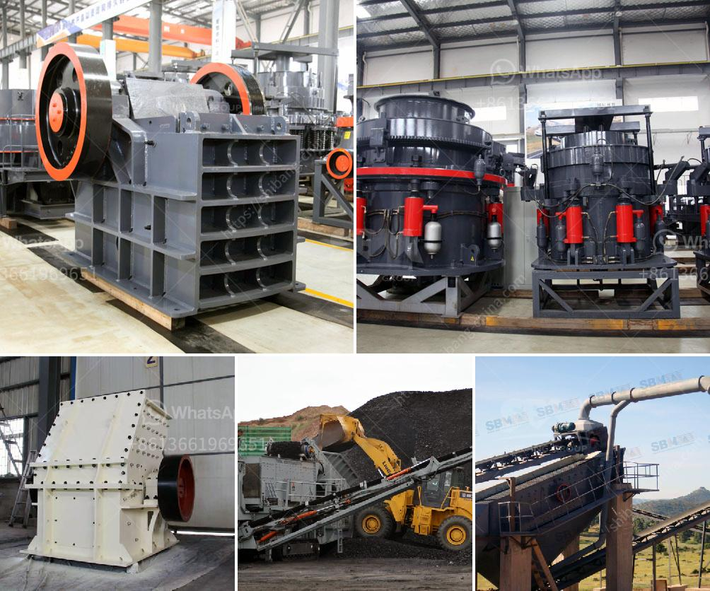

<h3>كسارة الحجر في الفلبين للبيع</h3>
تعتبر كسارة الحجر من الآلات الهامة في صناعة البناء، حيث تستخدم لسحق الحجارة وتحويلها إلى حصى صغيرة أو رمل لاستخدامها في الإنشاءات المختلفة. وفي الفلبين، توجد العديد من الشركات التي تختص في بيع كسارات الحجر بأحجام وموديلات مختلفة، وبأسعار تتراوح عادةً بين 200 إلى 400 دولار.

تتميز كسارات الحجر في الفلبين بقدرتها العالية على سحق الحجارة الصلبة والكبيرة بكفاءة عالية. تتكون هذه الكسارات في العادة من آلية تكسير تعمل بواسطة محرك كهربائي. يتم وضع الحجارة في فوهة الكسارة حيث تتمكن من سحقها تحت ضغط عالي وتحويلها إلى حصى أو رمال ناعمة حسب الحاجة.

تتوافر كسارات الحجر في العديد من المقاسات والأحجام المختلفة. تتراوح الكسارات الصغيرة بين 1 إلى 20 طن، بينما تصل الكسارات الكبيرة إلى 50 طن أو أكثر. وتختلف أسعارها حسب الحجم والميزات الإضافية المتوفرة فيها.

تعد كسارة الحجر في الفلبين أداة حاسمة في صناعة البناء والبنية التحتية. فهي تستخدم بشكل واسع في بناء الطرق، وإنشاء المباني، ومشاريع الصرف الصحي، والمشاريع الحكومية الأخرى. تلعب الكسارات دورًا مهما في توفير المواد اللازمة لهذه المشاريع، وهي تحل محل الحاجة إلى استخدام الحجارة الطبيعية التي غالباً ما تكون مكلفة وغير متوفرة بكميات كافية.

عند شراء كسارة الحجر، يجب أن يأخذ المشتري بعين الاعتبار عدة عوامل. من بينها جودة وسمعة الشركة المصنعة، والسعر، وحجم وطاقة الكسارة، وكذلك خدمة العملاء المتاحة من الشركة المصنعة. يجب أيضاً أن يتم اختيار الكسارة المناسبة حسب حجم ونوع الحجارة المراد سحقها حسب احتياجات المشروع.

بالاختصار، يمكن القول إن كسارات الحجر في الفلبين تعتبر مكمل أساسي في عمليات البناء والتشييد. توفر هذه الكسارات مواد البناء اللازمة بشكل فعال وبأسعار معقولة، مما يساعد على تقليل التكاليف ووقت البناء. لذا، فإن البحث عن كسارة الحجر المناسبة هو أمر حيوي للمقاولين والمهندسين المعماريين في الفلبين.
<h3>Contact us</h3><ul><li><strong>Whatsapp:&nbsp;<a href="https://wa.me/8613661969651">+8613661969651</a></strong></li><li><a href="https://swt.shibang-china.com/?git&amp;zhl&amp;كسارة الحجر في الفلبين للبيع"><strong>Online Service(chat now)</strong></a></li></ul><h3>Related</h3><ul><li><a href='الطحن بالكرات يعتمد على ماذا.md'>الطحن بالكرات يعتمد على ماذا</a></li><li><a href='موردين كسارات الفك والمخروط في موكوباني.md'>موردين كسارات الفك والمخروط في موكوباني</a></li><li><a href='تكلفة سيور النقل.md'>تكلفة سيور النقل</a></li><li><a href='موردين للرمل والحصى في سيبو.md'>موردين للرمل والحصى في سيبو</a></li><li><a href='سعر كسارة الفحم القدرة.md'>سعر كسارة الفحم القدرة</a></li></ul>