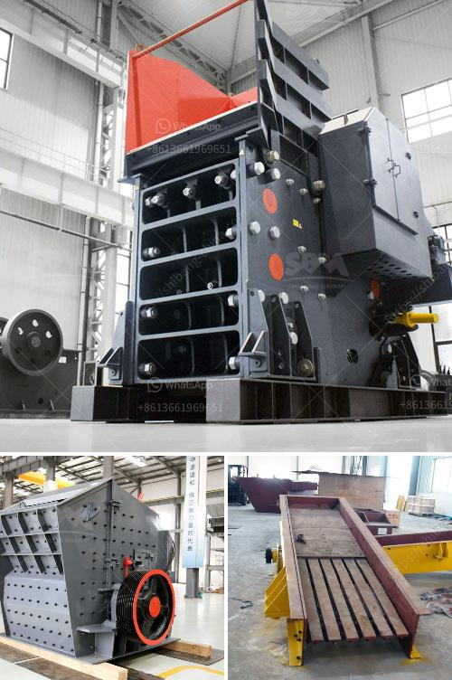

<h3>كسارة الحجر في الفلبين</h3>
تعتبر صناعة الكسارات من الصناعات الهامة في الفلبين، حيث تلعب دورًا حاسمًا في إعادة تدوير واستخدام المواد الصلبة مثل الحجر والركام. تعتبر الكسارات آلات متطورة تستخدم في عمليات تكسير وطحن المواد الصلبة، وهي تستخدم على نطاق واسع في البناء والتشييد التحتية.

توجد العديد من الكسارات في الفلبين، وتشمل محاجر الحجر الجيري والبازلت والرمل والحصى. تقوم هذه الكسارات بتكسير المواد الصلبة إلى حجم أصغر، الذي يمكن استخدامه في الأعمال الإنشائية. عادة ما تستخدم هذه الكسارات في تصنيع الخرسانة والأسفلت والطرق والأنهار والجسور والمباني الصناعية والسكنية.

ومن المعروف أن الفلبين هي دولة ذات طبيعة خلابة وجميلة، ولكنها أيضًا تعاني من العديد من المشاكل البيئية، بما في ذلك تلوث الهواء والمياه. تعمل الكسارات على إنتاج الغبار والضوضاء الناجمة عن عمليات التكسير، وهذا قد يتسبب في آثار سلبية على البيئة وصحة السكان المحليين.

لمواجهة هذه المشكلة، تعمل السلطات الفلبينية على فرض قيود صارمة على عمليات الكسارات، مع تشديد الرقابة ومراقبة الاحتياطات البيئية اللازمة. تشمل هذه الإجراءات استخدام تقنيات حديثة للحد من الانبعاثات ومراقبة جودة الهواء وتأمين تصاريح صارمة وتنظيم وتنظيف المناطق المحيطة بالكسارات بشكل دوري.

علاوة على ذلك، يجب أن تتبنى الشركات المشغلة للكسارات تقنيات الاستدامة وإعادة التدوير للمواد الناتجة عن عمليات التكسير. يمكن استخدام بعض المواد الناتجة كمادة خام ثانوية في صناعات أخرى، مما يقلل بشكل كبير من إنتاج النفايات والتلوث الناتج عنها.

بشكل عام، تعتبر صناعة الكسارات في الفلبين من الصناعات المهمة للاقتصاد المحلي ولتلبية الاحتياجات البنائية والتشييدية. ولكن يجب أن تكون العمليات متوافقة مع القوانين البيئية والاستدامة البيئية، للحفاظ على البيئة الطبيعية وصحة السكان المحليين. يجب على الحكومة والشركات العاملة في هذا القطاع العمل سويًا لتحقيق التوازن بين التنمية الاقتصادية والمحافظة على الطبيعة الجميلة للفلبين.
<h3>Contact us</h3><ul><li><strong>Whatsapp:&nbsp;<a href="https://wa.me/8613661969651">+8613661969651</a></strong></li><li><a href="https://swt.shibang-china.com/?git&amp;zhl&amp;كسارة الحجر في الفلبين"><strong>Online Service(chat now)</strong></a></li></ul><h3>Related</h3><ul><li><a href='سعر كسارة الهامر العلامة التجارية.md'>سعر كسارة الهامر العلامة التجارية</a></li><li><a href='مطحنة الكرة لمسحوق الألمنيوم.md'>مطحنة الكرة لمسحوق الألمنيوم</a></li><li><a href='مناجم رمل السيليكا في الفلبين.md'>مناجم رمل السيليكا في الفلبين</a></li><li><a href='قائمة شركات كسارة المحاجر في نيجيريا.md'>قائمة شركات كسارة المحاجر في نيجيريا</a></li><li><a href='طحن معدات الطحن الطحن.md'>طحن معدات الطحن الطحن</a></li></ul>