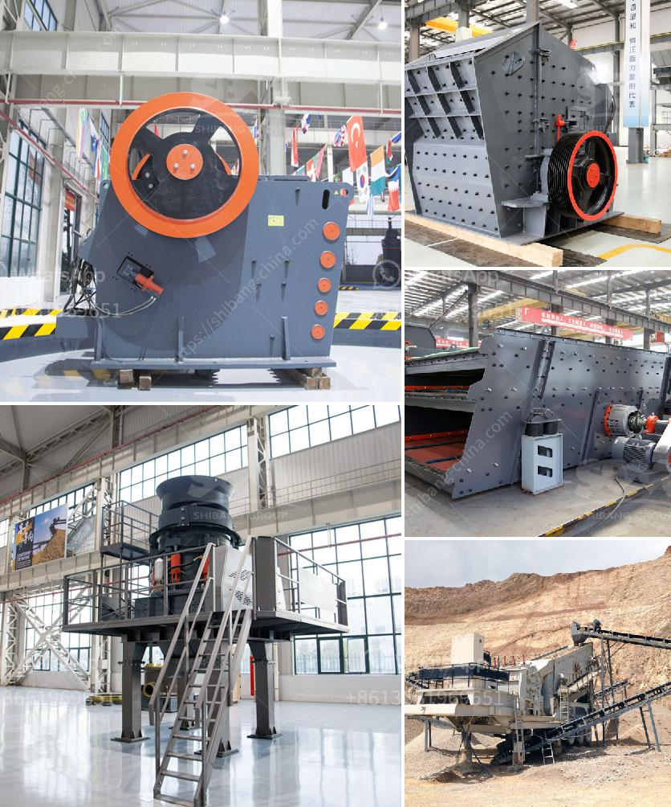

<h3>كسارة الحجر في الكاميرون</h3>
تعتبر كسارة الحجر في الكاميرون واحدة من الصناعات الهامة التي تلعب دورًا حاسمًا في تنمية البنية التحتية وتلبية احتياجات البناء في البلاد. الكاميرون هي دولة تقع في غرب وسط أفريقيا وتواجه تحديات كبيرة في مجال البنية التحتية. تعد الكسارة من الوسائل الفعالة لتلبية احتياجات الحجر والركام في البناء والبنية التحتية.

تعتبر الكاميرون غنية بالموارد الحجرية مثل الحجر الجيري والغرانيت والرخام. توجد العديد من المحاجر في مختلف مناطق البلاد والتي تعمل على استخراج وتكسير الصخور لإنتاج الحصى والركام. يتم نقل هذه المواد إلى كسارات الحجر حيث يتم طحنها وفرزها لتصبح جاهزة للاستخدام في مشاريع البناء.

تعتبر صناعة كسارة الحجر هامة للاقتصاد الكاميروني لعدة أسباب. أولاً، تساهم هذه الصناعة في توفير فرص العمل للعديد من الأشخاص، سواء كانوا في صناعة التعدين أو في صناعة البناء. ثانيًا، تعزز كسارة الحجر من البنية التحتية للبلاد، حيث تتم استخدام المواد المنتجة في المشاريع الكبرى مثل الطرق والجسور والمستشفيات والمدارس.

بالإضافة إلى ذلك، تساهم كسارة الحجر في تلبية احتياجات السوق المحلية من المواد الإنشائية. تعتبر البنية التحتية الكاميرونية متنوعة وتحتاج إلى العديد من العناصر المختلفة لتنفيذ المشاريع بنجاح. يتم استخدام الحصى والركام في البناء وصيانة الطرق، إنشاء المباني، وبناء المنشآت العامة.

ومع ذلك، فإن هذه الصناعة تواجه تحديات ناجمة عن العديد من العوامل مثل نقص التمويل والتكنولوجيا المتقدمة وضعف البنية التحتية للنقل. هذه التحديات تؤثر على القدرة التنافسية وجودة المنتجات المصنعة.

في الختام، تلعب كسارة الحجر في الكاميرون دورًا حاسمًا في تنمية البنية التحتية وتلبية الطلب على مواد البناء. تحتاج هذه الصناعة إلى دعم حكومي قوي من أجل تحسين البنية التحتية وزيادة الاستثمارات في التكنولوجيا وتوفير المزيد من الفرص الوظيفية.
<h3>Contact us</h3><ul><li><strong>Whatsapp:&nbsp;<a href="https://wa.me/8613661969651">+8613661969651</a></strong></li><li><a href="https://swt.shibang-china.com/?git&amp;zhl&amp;كسارة الحجر في الكاميرون"><strong>Online Service(chat now)</strong></a></li></ul><h3>Related</h3><ul><li><a href='موردين لمعدات التعدين في جنوب أفريقيا.md'>موردين لمعدات التعدين في جنوب أفريقيا</a></li><li><a href='تقنيات معالجة الطين.md'>تقنيات معالجة الطين</a></li><li><a href='سعر مصنع الجبس.md'>سعر مصنع الجبس</a></li><li><a href='خط إنتاج الباريت.md'>خط إنتاج الباريت</a></li><li><a href='كسارة مخروط في الصين.md'>كسارة مخروط في الصين</a></li></ul>