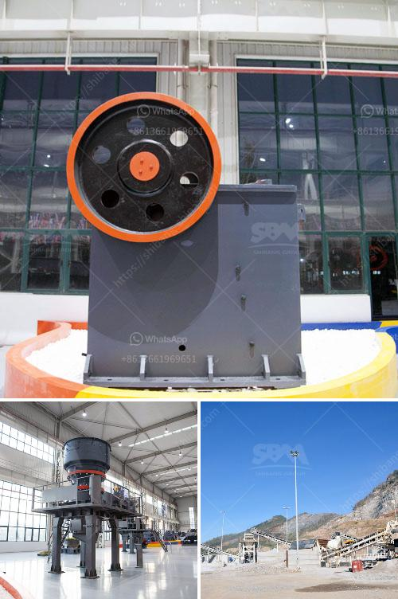

<h3>كسارة الحجر في المملكة المتحدة</h3>
تعتبر كسارة الحجر من الأدوات الرئيسية في صناعة البناء والهندسة المدنية. فهي تقوم بسحق الصخور والحجارة الكبيرة إلى قطع أصغر تستخدم في مجموعة من التطبيقات المختلفة، مثل البناء والطرق وتعدين المواد الخام.

تتميز المملكة المتحدة، وخاصة إنجلترا، بالعديد من المحاجر ومواقع الكسارات المنتشرة في جميع أنحائها. فهي تعتبر إحدى الدول الرائدة في هذا المجال. تعد وظيفة كسارة الحجر من أهم الوظائف في صناعة البناء ، حيث تلعب دورًا فعّالًا في تحويل الصخور الضخمة إلى مواد بناء صغيرة الحجم.

تتباين أنواع كسارات الحجر في المملكة المتحدة تبعاً لحجم وصلابة المواد التي تحتاج إلى سحقها واستخدامها المستقبلي. تشمل هذه الكسارات الفكية والتصادمية والمخروطية والصدمية. تعمل الكسارات الفكية عن طريق ضغط الصخور بين صفائح متحركة وثابتة لسحقها إلى قطع أصغر. بينما تستخدم الكسارات التصادمية الصدمة العالية السرعة لسحق الصخور، وتعد الكسارات المخروطية هي الأكثر استخداماً في صناعة البناء، حيث تستخدم لسحق الحجارة إلى قطع دقيقة.

توجد العديد من الشركات الرائدة في صناعة كسارة الحجر في المملكة المتحدة، مثل ساندفيك ، وتيريكس فنلاند ، وباورسكرين. وتوفر هذه الشركات مجموعة واسعة من الكسارات المختلفة التي تلبي احتياجات العملاء.

تعتبر صناعة كسارة الحجر في المملكة المتحدة قطاعًا هامًا من قطاعات البناء والهندسة المدنية. حيث تلعب دورًا حاسمًا في توفير المواد اللازمة للبنية التحتية للمدن والطرق والأبنية السكنية والتجارية. وبفضل توريد هذه المواد عالية الجودة، تحافظ المملكة المتحدة على مكانتها كمنتج مهم عالمياً للتكنولوجيا والهندسة.

وفي الختام، يمكن القول إن كسارة الحجر تلعب دورًا حيويًا في صناعة البناء في المملكة المتحدة. فهي المعدة الأساسية التي تتولى سحق الصخور الضخمة لتحويلها إلى قطع أصغر تستخدم في العديد من التطبيقات المختلفة.
<h3>Contact us</h3><ul><li><strong>Whatsapp:&nbsp;<a href="https://wa.me/8613661969651">+8613661969651</a></strong></li><li><a href="https://swt.shibang-china.com/?git&amp;zhl&amp;كسارة الحجر في المملكة المتحدة"><strong>Online Service(chat now)</strong></a></li></ul><h3>Related</h3><ul><li><a href='آلات كسارة الحجر الكوارتز.md'>آلات كسارة الحجر الكوارتز</a></li><li><a href='مصنع تكسير السلاغ في تاميل نادو.md'>مصنع تكسير السلاغ في تاميل نادو</a></li><li><a href='تصميم كسارة الحجر في الفلبين.md'>تصميم كسارة الحجر في الفلبين</a></li><li><a href='سعر كسارة الزحف المتنقلة.md'>سعر كسارة الزحف المتنقلة</a></li><li><a href='مطحنة الكرة للبيع في جنوب أفريقيا.md'>مطحنة الكرة للبيع في جنوب أفريقيا</a></li></ul>