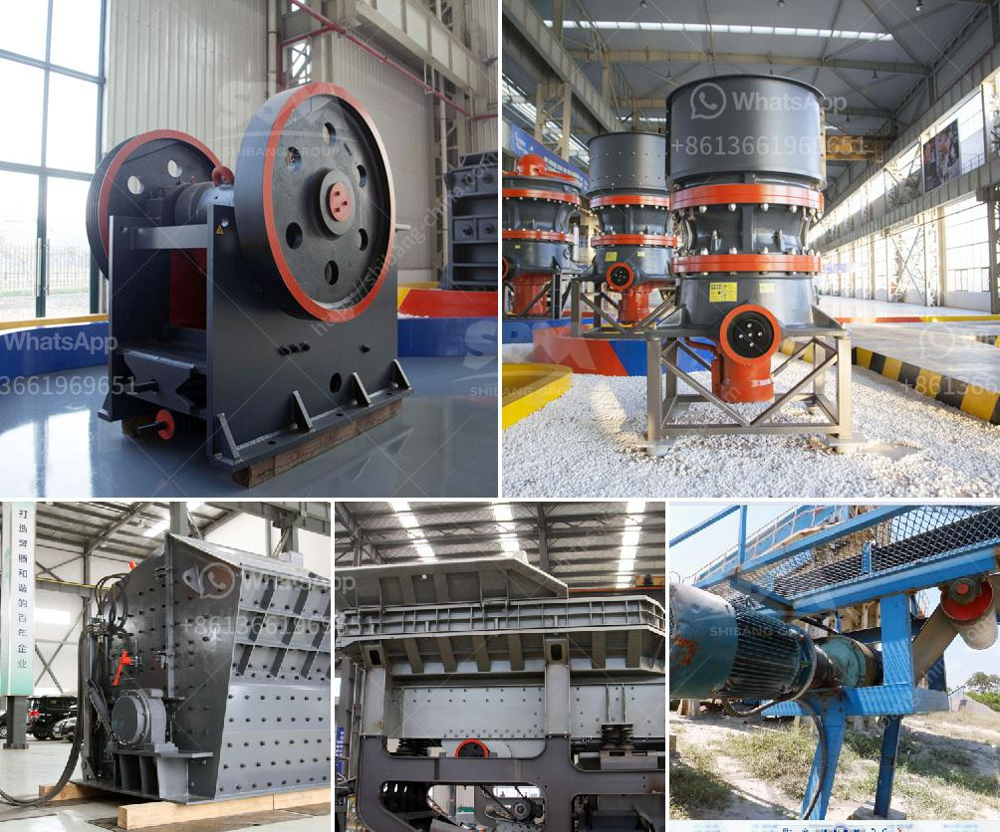

<h3>كسارة الحجر في بيرو</h3>
تعد كسارة الحجر في بيرو واحدة من أهم الصناعات التعدينية في البلاد. تقدم هذه الكسارات مجموعة واسعة من المواد الخام للصناعات المختلفة، بما في ذلك البناء والبناء وصناعة الطرق والسكك الحديدية.

تمتلك بيرو ثروات طبيعية ضخمة في صناعة الحجر ، وهو ما يجعلها وجهة مثالية لعمليات التعدين والكسارات. تعتبر كسارة الحجر في بيرو تكلفة فعالة لتصنيع المواد الخام، حيث يتم استخراج الحجر من المحاجر المحلية ومعالجته بجودة عالية.

تعمل هذه الكسارات عن طريق سحق الصخور الكبيرة إلى قطع صغيرة ، والتي يمكن استخدامها في العديد من التطبيقات المختلفة. يتم استخدام الحجر المسحوق لإنتاج الخرسانة والأسفلت والطرق والاسمنت والبناء والصناعات الهندسية والأخرى. كما يتم تصنيع الصخور الكبيرة بأحجام وأشكال مختلفة للغاية للاستخدام في المناظر الطبيعية وحدائق العامة والديكورات والمنشآت الأخرى.

تضطلع شركات الكسارات في بيرو بدور حيوي في تطوير البنية التحتية للبلاد وتعزيز الاقتصاد المحلي. تقدم هذه الصناعة فرص عمل كبيرة للسكان المحليين وتعزز نمو القطاع التعديني والصناعي. بالإضافة إلى ذلك ، تقدم صناعة الكسارات في بيرو منتجات عالية الجودة للصناعة المحلية والتصدير إلى الأسواق العالمية.

مع زيادة الطلب على المواد الخام ، يشهد قطاع الكسارات في بيرو نموًا مستدامًا. تعمل الشركات المنتجة باستمرار على تحسين تقنيات الإنتاج ومنتجاتها لتلبية احتياجات العملاء والمعايير البيئية. فبفضل إدارة المخلفات واعتبارات الاستدامة البيئية ، تتم حماية البيئة المحلية بشكل فعال من أي تأثير ضار لعمليات التعدين والكسارات.

في الختام، يمثل قطاع الكسارات في بيرو نجاحًا ملحوظًا للبلاد في توفير المواد الخام ذات الجودة العالية للعديد من الصناعات المختلفة. تعمل هذه الكسارات كمحرك للتنمية الاقتصادية وتعزز فرص العمل المحلية. كما تلتزم بممارسات الاستدامة وحماية البيئة لضمان استدامة هذه الصناعة الحيوية على المدى الطويل.
<h3>Contact us</h3><ul><li><strong>Whatsapp:&nbsp;<a href="https://wa.me/8613661969651">+8613661969651</a></strong></li><li><a href="https://swt.shibang-china.com/?git&amp;zhl&amp;كسارة الحجر في بيرو"><strong>Online Service(chat now)</strong></a></li></ul><h3>Related</h3><ul><li><a href='مشغل مصنع كسارة في كسارة.md'>مشغل مصنع كسارة في كسارة</a></li><li><a href='آلة تسخين حجر الكوارتز للبيع.md'>آلة تسخين حجر الكوارتز للبيع</a></li><li><a href='تكلفة مطحنة مسحوق صغيرة.md'>تكلفة مطحنة مسحوق صغيرة</a></li><li><a href='كسارة الحجر Kyc.md'>كسارة الحجر Kyc</a></li><li><a href='تكلفة كسارة محمولة كم.md'>تكلفة كسارة محمولة كم</a></li></ul>