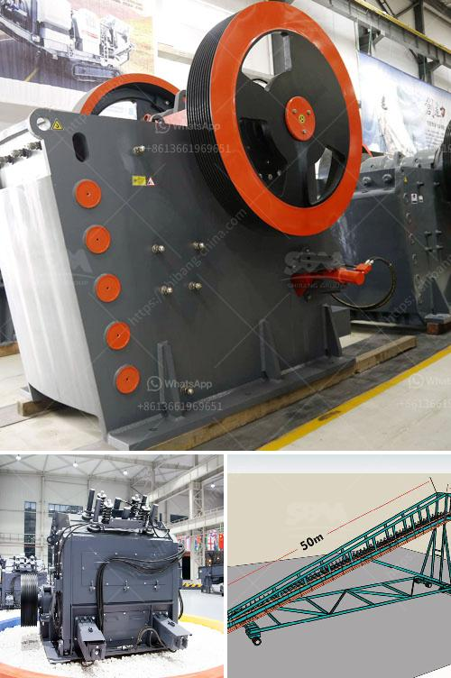

<h3>كسارة الحجر في تركيا</h3>
تعد كسارة الحجر من أهم الصناعات الواعدة في تركيا، حيث تشهد البلاد نمواً اقتصادياً مستداماً وتطوراً صناعياً ملحوظاً. وتعتبر كسارة الحجر من أهم المعدات اللازمة في عمليات البناء والبنية التحتية، وهي تستخدم لسحق الأحجار الكبيرة إلى أحجام أصغر لتتناسب مع استخدامات مختلفة.

تعد تركيا من أهم البلدان المصدرة للحجر في العالم، حيث تتميز بتوفر مصادر حجرية غنية ومتنوعة. وتمتلك البلاد تكنولوجيا متطورة وخبرة عالية في إنتاج وتصنيع كسارات الحجر ذات الجودة العالية والأداء الفعال.

تنتج تركيا العديد من أنواع الحجر المختلفة مثل الرخام والجرانيت والحجر الجيري والبازلت والترافرتين وغيرها. وتتميز هذه الأحجار بالجودة العالية والمتانة، وتعتبر مفضلة في العديد من الأعمال البنائية والديكورية.

تعتمد كسارة الحجر في تركيا على تقنيات حديثة وتكنولوجيا متقدمة، مما يضمن سرعة الإنتاج وتحسين كفاءة العمل وتقليل التكاليف. وتتوفر العديد من الأحجام والأنواع المختلفة من كسارات الحجر في السوق، مما يتيح اختيار الجهاز المناسب وفقاً للغرض المطلوب.

تستخدم كسارات الحجر في مختلف الصناعات مثل صناعة البناء والتشييد والطرق والسكك الحديدية والحفر والتعدين وغيرها. وبفضل جودة الحجر وجودة الكسارات، تستطيع تركيا تحقيق نتائج ممتازة ورضا العملاء من خلال تلبية احتياجاتهم بشكل كامل.

بشكل عام، تعد كسارة الحجر في تركيا نشاطاً مهماً يسهم في تحقيق التنمية الاقتصادية وزيادة التصدير وتوفير فرص العمل. كما أنها تعزز دور البلاد كمنتج رئيسي ومورد عالمي للحجر، مما يعزز مكانتها في السوق العالمية.

يمكن القول أن كسارة الحجر في تركيا تمثل قطاعاً مهماً في الاقتصاد التركي، وتحقق نتائج ممتازة من خلال جودة الحجر والتكنولوجيا المتقدمة. وتعزز هذه الصناعة التطور الصناعي وتعزز الاستثمار في البلاد.
<h3>Contact us</h3><ul><li><strong>Whatsapp:&nbsp;<a href="https://wa.me/8613661969651">+8613661969651</a></strong></li><li><a href="https://swt.shibang-china.com/?git&amp;zhl&amp;كسارة الحجر في تركيا"><strong>Online Service(chat now)</strong></a></li></ul><h3>Related</h3><ul><li><a href='كسارات مستعملة للبيع في الولايات المتحدة.md'>كسارات مستعملة للبيع في الولايات المتحدة</a></li><li><a href='مصنع الكرة.md'>مصنع الكرة</a></li><li><a href='كسارات الحجر المحمولة للبيع في جنوب أفريقيا.md'>كسارات الحجر المحمولة للبيع في جنوب أفريقيا</a></li><li><a href='مصانع غسل الفحم المحمولة.md'>مصانع غسل الفحم المحمولة</a></li><li><a href='شركة تصنيع لوحات الجبس في سنغافورة.md'>شركة تصنيع لوحات الجبس في سنغافورة</a></li></ul>