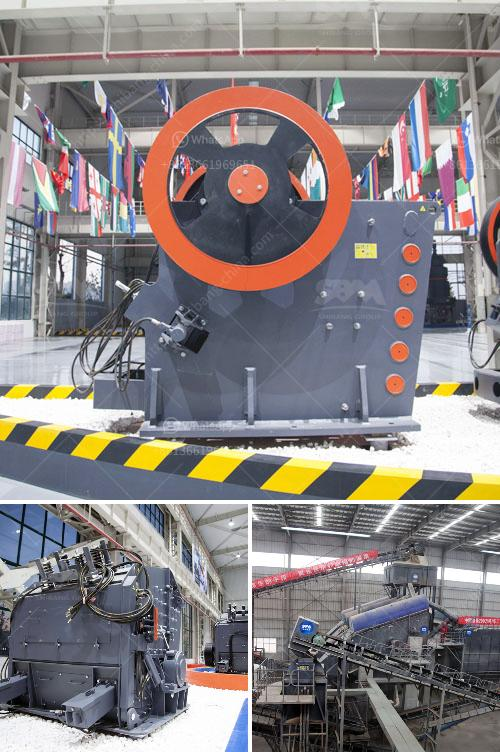

<h3>كسارة الحجر في شرق لندن</h3>
تقع كسارة الحجر في شرق لندن وتُعتبر واحدة من المعالم الهامة في المنطقة. تاريخها يعود إلى العصور القديمة حيث استُخدمت لأول مرة في استخراج الحجارة لبناء المنازل والمعابد في العصور القديمة. منذ ذلك الحين، أصبحت الكسارة موقعًا هامًا لاستخراج الحجر المستخدم في البناء والبنية التحتية في المنطقة.

تعد الكسارة مثالًا حيًا للتطور التكنولوجي حيث تطورت من كونها موقعًا بدائيًا يتم فيه الحفر يدويًا إلى كسارة حديثة مجهزة باحدث الآلات والمعدات. تستخدم الآن طرق حديثة لاستخراج الحجارة بطريقة فعالة واقتصادية.

تعد هذه الكسارة موردًا هامًا للحجر في المنطقة، حيث يتم استخدامه في العديد من المشاريع الكبيرة، مثل بناء الجسور والطرق والمباني التجارية والسكنية. كما أن الحجر المستخرج من الكسارة يستخدم أيضًا في تأسيس الأساسات للمباني وفي إنشاء الأرصفة والطرق. بفضل جودة الحجر المستخدم، تم تطوير الكثير من المشاريع الناجحة في المنطقة.

توظف الكسارة العديد من العمال المهرة في مجال استخراج الحجر. يقوم هؤلاء العمال بأعمال الحفر والتفجير لاستخراج الصخور، ثم يتم تجهيزها باستخدام المعدات المتطورة لتكون جاهزة للاستخدام في المشاريع المختلفة. يتم اتباع معايير صارمة للجودة والسلامة أثناء عملية التعدين في الكسارة.

علاوة على ذلك، تسعى الكسارة ومالكيها لإتاحة فرص العمل ودعم الاقتصاد المحلي. يتم توفير فرص العمل للعديد من الأشخاص في المجالات المختلفة مثل الهندسة المدنية والآلات الثقيلة والصيانة. كما أن الكسارة تعزز النمو الاقتصادي المحلي من خلال توفير المواد اللازمة للمشاريع الكبيرة في المنطقة، مما يؤدي إلى زيادة الاستثمار وتعزيز النشاط الاقتصادي.

في الختام، تعد كسارة الحجر في شرق لندن موقعًا هامًا يساهم في تلبية احتياجات المنطقة من الحجر. توفر الكسارة فرص العمل وتدعم الاقتصاد المحلي. بفضل تطور التكنولوجيا والجودة العالية للحجر، تساهم الكسارة في إنشاء مشاريع ناجحة في المنطقة وتعزز النمو الاقتصادي.
<h3>Contact us</h3><ul><li><strong>Whatsapp:&nbsp;<a href="https://wa.me/8613661969651">+8613661969651</a></strong></li><li><a href="https://swt.shibang-china.com/?git&amp;zhl&amp;كسارة الحجر في شرق لندن"><strong>Online Service(chat now)</strong></a></li></ul><h3>Related</h3><ul><li><a href='آلة كسارة في الفلبين.md'>آلة كسارة في الفلبين</a></li><li><a href='كسارات محمولة بمعدل ١٠٠ طن في الساعة.md'>كسارات محمولة بمعدل ١٠٠ طن في الساعة</a></li><li><a href='تكلفة مشروع وحدة طحن الكلنكر.md'>تكلفة مشروع وحدة طحن الكلنكر</a></li><li><a href='تقرير المشروع حول وحدة تكسير الحجر.md'>تقرير المشروع حول وحدة تكسير الحجر</a></li><li><a href='سعر كسارة الفك في جنوب أفريقيا.md'>سعر كسارة الفك في جنوب أفريقيا</a></li></ul>