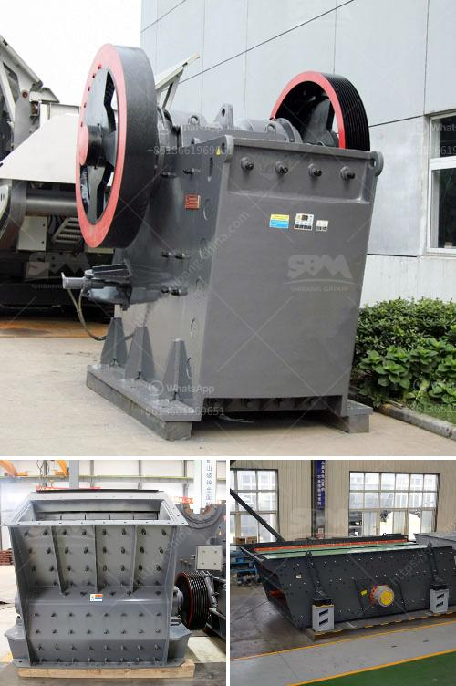

<h3>كسارة الحجر في ماليزيا</h3>
تعد ماليزيا واحدة من أهم الدول الآسيوية التي تمتاز بموقعها الجغرافي الاستراتيجي واحتياطياتها الطبيعية الغنية. وتعد كسارة الحجر واحدة من الصناعات الهامة في البلاد.

تعتبر كسارة الحجر في ماليزيا صناعة نشطة ومتنامية تأخذ في اعتبارها الطلب المتزايد على التعمير والبنية التحتية في البلاد. وتعتبر الحجارة المكسورة منتجًا مهمًا للبناء في قطاعات مختلفة مثل البناء والطرق والسكك الحديدية والأنفاق، فضلاً عن الاستخدام الزراعي والصناعي.

ماليزيا تحظى بتاريخ طويل وغني في استخراج الحجر والاستغلال المستدام للموارد الطبيعية. تمتاز بالمحاجر الكبيرة والمتنوعة في البلاد، وخاصة في مناطق شرق ماليزيا مثل صباح وسراوق، حيث تعد كسارة الحجر من أحد الصناعات الحيوية والمصادر الرئيسية للدخل.

تتميز ماليزيا بتشكيلة واسعة من المواد الخام مثل الحجارة الجيرية والبازلت والجرانيت والرخام والصخر الرملي. وتتم عملية تكسير الحجارة من خلال استخدام معدات وآلات حديثة التكنولوجيا لتكسير الصخور الضخمة إلى حجارة صغيرة ومن ثم تمريرها في العديد من المراحل للحصول على المنتج النهائي.

توفر كسارة الحجر فرص عمل كبيرة في ماليزيا، حيث يعمل العديد من العمال في التعدين وتكسير الحجارة. كما أنها توفر أيضًا فرص للشركات لاستثمار رأس المال في هذا القطاع الحيوي، مما يساهم في تعزيز الاقتصاد وتحسين مستوى المعيشة.

ومن الجوانب البيئية، هناك توجه مستدام لتعدين الحجر في ماليزيا، حيث يتم تطبيق معايير صارمة للحفاظ على البيئة والمحافظة على التنوع البيولوجي. تمتلك كسارة الحجر العديد من الشهادات البيئية وتلتزم بتنفيذ عمليات التعدين بطرق صديقة للبيئة، بما في ذلك إعادة تأهيل المناطق وتطبيق أعلى معايير السلامة والصحة المهنية.

باختصار، يعد قطاع كسارة الحجر في ماليزيا من أهم القطاعات الاقتصادية والبيئية. يوفر فرص عمل واستثمار ويساهم في التنمية المستدامة للبلاد. كما أنه يلعب دورًا حيويًا في تلبية الطلب المتزايد على المواد البنائية وتطور البنية التحتية في ماليزيا.
<h3>Contact us</h3><ul><li><strong>Whatsapp:&nbsp;<a href="https://wa.me/8613661969651">+8613661969651</a></strong></li><li><a href="https://swt.shibang-china.com/?git&amp;zhl&amp;كسارة الحجر في ماليزيا"><strong>Online Service(chat now)</strong></a></li></ul><h3>Related</h3><ul><li><a href='كسارة الحجر الجيري المتنقلة.md'>كسارة الحجر الجيري المتنقلة</a></li><li><a href='مصانع معالجة الدولوميت من ألمانيا.md'>مصانع معالجة الدولوميت من ألمانيا</a></li><li><a href='كسارات مخروط متنقلة.md'>كسارات مخروط متنقلة</a></li><li><a href='كسارة للبيع في الفلبين.md'>كسارة للبيع في الفلبين</a></li><li><a href='تكلفة ماكينات كسارة المحاجر.md'>تكلفة ماكينات كسارة المحاجر</a></li></ul>