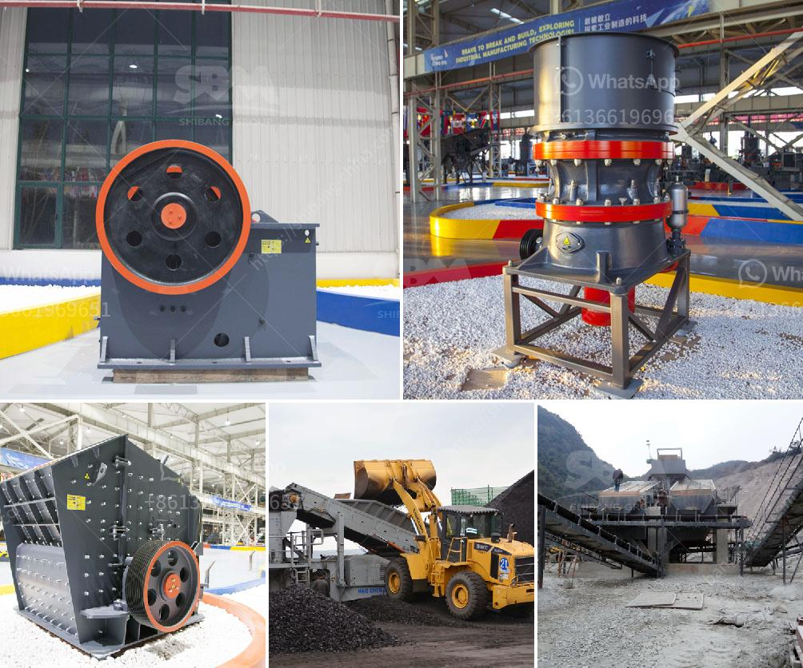

<h3>كسارة الحجر في هيماتشال براديش</h3>
تعتبر كسارة الحجر في هيماتشال براديش واحدة من أهم المصانع الصناعية في المنطقة، حيث تقوم بتكسير الحجارة وتحويلها إلى حصى صغيرة للاستخدام في مختلف الأغراض البنائية والصناعية. تنتج كسارة الحجر موادًا قيمة يعتمد عليها العديد من القطاعات الاقتصادية المختلفة.

تمتلك كسارات الحجر عدة محاجر تحتوي على مجموعة متنوعة من الصخور مثل الجرانيت والرخام والبازلت والحجر الجيري، وكلها تعتبر مواد أساسية للبناء والتشييد. يتم سحق هذه الصخور في كسارة الحجر باستخدام معدات متطورة مثل الكسارات الفكية والكسارات المخروطية والكسارات الصدمية. تُدار هذه المعدات بواسطة عمال مهرة يتمتعون بالخبرة في التعامل مع الأحجار الكبيرة وتحويلها إلى مواد صغيرة يمكن استخدامها في البناء.

تُستخدم المواد الناتجة عن كسارة الحجر في العديد من المشاريع بمختلف الأحجام والأغراض. يتم استخدامها في بناء المنازل والمباني التجارية والمعابد والجسور والطرق والأنفاق. كما يمكن استخدامها في صناعة الخرسانة والأسمنت والطوب والبلاط والطلاء. بفضل مرونتها ومقاومتها العالية للتآكل، فإن هذه المواد تعتبر خيارًا مثاليًا للبناء وتلبية احتياجات القطاعات المختلفة.

تأتي كسارة الحجر في هيماتشال براديش بفوائد عديدة للمنطقة. أولاً، فإنها توفر فرص عمل للسكان المحليين، حيث يعمل العديد من العمال في المحاجر والمصانع المرتبطة بها. ثانيًا، تُعزز نشاط الكسارة الاقتصاد المحلي وتساهم في زيادة الإيرادات والنمو الاقتصادي للمنطقة. ثالثًا، تُعد كسارة الحجر مصدرًا مهمًا لتوفير المواد البنائية المحلية، مما يقلل من تكاليف الاستيراد ويزيد من الاستدامة البيئية.

مع ذلك، يواجه قطاع مصانع الحجر التحديات بالنسبة للبيئة. يمكن أن يتسبب عمليات التكسير في انبعاثات الغبار والضجيج، مما يؤثر على صحة العمال والسكان المحليين. لذا، يجب على مصانع الحجر اتباع التدابير البيئية اللازمة للحد من هذه التأثيرات السلبية، مثل تحسين نظام التهوية واستخدام المعدات الحديثة وتنفيذ برامج للحفاظ على البيئة.

باختصار، تُعد كسارة الحجر في هيماتشال براديش منشأة صناعية مهمة تلبي احتياجات البناء والتشييد للمنطقة، وتسهم في توفير فرص العمل وتعزيز الاقتصاد المحلي. ومع ذلك، يجب على هذه الكسارات أيضًا أن تولي الاهتمام الكافي للبيئة وتعمل على تنفيذ سياسات وتدابير بيئية للحفاظ على استدامتها في المستقبل.
<h3>Contact us</h3><ul><li><strong>Whatsapp:&nbsp;<a href="https://wa.me/8613661969651">+8613661969651</a></strong></li><li><a href="https://swt.shibang-china.com/?git&amp;zhl&amp;كسارة الحجر في هيماتشال براديش"><strong>Online Service(chat now)</strong></a></li></ul><h3>Related</h3><ul><li><a href='مطحنة ريموند مستعملة للبيع في تايوان.md'>مطحنة ريموند مستعملة للبيع في تايوان</a></li><li><a href='كسارة الفك بالديزل sp 60x100.md'>كسارة الفك بالديزل sp 60x100</a></li><li><a href='مصانع غسيل صغيرة للبيع.md'>مصانع غسيل صغيرة للبيع</a></li><li><a href='سعر طاحونة المطرقة.md'>سعر طاحونة المطرقة</a></li><li><a href='كسارة محمولة للشراء.md'>كسارة محمولة للشراء</a></li></ul>