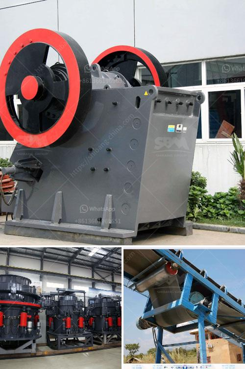

<h3>كسارة الحجر كسارة الحجر</h3>
تعتبر كسارة الحجر أحد الأدوات الرئيسية في صناعة الأحجار والتعدين. تستخدم هذه الآلة لسحق الأحجار الكبيرة إلى قطع صغيرة. يتم استخدام كسارة الحجر في العديد من الصناعات مثل البناء والبنية التحتية والتشييد وغيرها.

يتكون جسم كسارة الحجر من جزأين رئيسيين: الفك الثابت والفك المتحرك. يتم وضع الحجارة الكبيرة داخل فوهة الإدخال ويتم سحقها بفضل حركة الفك المتحرك والفك الثابت. عملية السحق تحدث عن طريق تطبيق قوة كبيرة على الحجارة لتجعلها تقسم إلى أجزاء صغيرة.

تأتي كسارات الحجر بأحجام مختلفة وقدرات إنتاج مختلفة. تتراوح القدرة الإنتاجية من 50 إلى 500 طن في الساعة تقريبًا، وتتفاوت حسب نوع الحجر والقوة المطلوبة للتكسير.

يوجد العديد من أنواع كسارات الحجر المتاحة في السوق بما في ذلك كسارة الفك، وكسارة الصدم، وكسارة المخروط، وكسارة الأسطوانة. تختلف هذه الأنواع في الأداء والتطبيق. للمثال، تعتبر كسارات الفك مثالية لسحق الحجارة الصلبة والمتوسطة الصلابة في حين تستخدم كسارات الصدم للحصول على قطع تكسير ذات مواصفات معينة.

تؤدي كسارات الحجر إلى توفير العديد من المزايا للمستخدمين. فهي توفر عملية تكسير أسرع وأكثر كفاءة وصيانة أقل. كما تحسن كفاءة إنتاجية العمل وتقلل من النفايات. تستخدم الكسارات أيضًا في إعادة تدوير الحجارة المستخدمة والتخلص من المخلفات الصلبة.

وفي النهاية، تُعتبر كسارة الحجر أداة حاسمة في صناعة البناء والتعدين وتساهم في تعزيز تنمية المجتمعات. تحقق هذه الآلة تكسير فعال وسريع للأحجار الكبيرة وتمكن من استخدام الحجارة المكسّرة في العديد من الأغراض المختلفة. إنها تسهم في إنشاء مبانٍ وطرق وأنفاق وغيرها من المشروعات الكبيرة التي تعتمد على الحجارة كمورد أساسي.
<h3>Contact us</h3><ul><li><strong>Whatsapp:&nbsp;<a href="https://wa.me/8613661969651">+8613661969651</a></strong></li><li><a href="https://swt.shibang-china.com/?git&amp;zhl&amp;كسارة الحجر كسارة الحجر"><strong>Online Service(chat now)</strong></a></li></ul><h3>Related</h3><ul><li><a href='كسارة الفك المحمولة في غرب أفريقيا تجار.md'>كسارة الفك المحمولة في غرب أفريقيا تجار</a></li><li><a href='مطحنة أسطوانية للبيع في نيوزيلندا.md'>مطحنة أسطوانية للبيع في نيوزيلندا</a></li><li><a href='مصانع الفرز للبيع.md'>مصانع الفرز للبيع</a></li><li><a href='طحن المطاحن الصناعية.md'>طحن المطاحن الصناعية</a></li><li><a href='سعر مصنع كسارة الحجر في الهند.md'>سعر مصنع كسارة الحجر في الهند</a></li></ul>