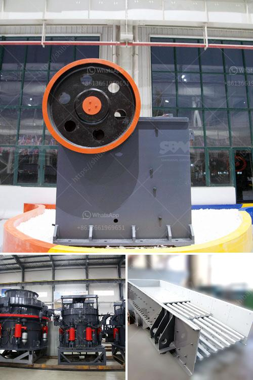

<h3>كسارة الحجر للبيع الفلبين</h3>
تُعتبر الفلبين واحدة من الدول النامية التي تشهد تطورًا اقتصاديًا كبيرًا في السنوات الأخيرة. ومع هذا التطور السريع، ينمو الطلب على موارد البناء والبنية التحتية الحديثة. ومن بين هذه الموارد، يأخذ الحجر دورًا مهمًا في صناعة البناء في الفلبين.

تستخدم كسارة الحجر لتكسير الأحجار الكبيرة إلى قطع أصغر يمكن استخدامها في البناء وصناعة المواد الإنشائية الأخرى. وقد يتم استخدام كسارة الحجر لسحق الصخور القاسية مثل الجرانيت، والرخام، والحجر الجيري، والبازلت، والحجر الجيري الصلب وغيرها. يمكن تعديل حجم الحصى المكسر وفقًا لمتطلبات العميل ومتطلبات البناء.

هناك العديد من الكسارات المتاحة للبيع في الفلبين بمختلف المواصفات والأحجام، وبأسعار تتراوح بين 200 إلى 400 دولارًا تقريبًا، وتختلف الأسعار اعتمادًا على العلامة التجارية والموديل والحجم والقوة وسعة الكسارة. هذه الكسارات قوية وفعالة، وتتوافق مع المعايير الفنية الحديثة للاستخدام الآمن والفعال.

بالإضافة إلى الأداء العالي والمتانة، تعد الكسارات المتاحة في الفلبين سهلة الاستخدام ويمكنها توفير الكفاءة العالية لأنها مزودة بتقنيات متقدمة ومحركات قوية. وتتوفر الكسارات بمختلف الأحجام والسعات لتلبية احتياجات العملاء المختلفة.

بالإضافة إلى الأداء العالي والمتانة، تهدف الكسارات المتاحة في السوق إلى تحسين جودة البناء وتوفير تكاليف الإنشاء. يعتمد استخدام الكسارات في الفلبين على نظام مراقبة صارم للجودة لضمان تلبية الاحتياجات والمتطلبات الفنية للمشاريع البنائية.

في النهاية، تُعتبر كسارة الحجر للبيع في الفلبين فعالة وموثوقة في سحق الأحجار الصلبة للاستخدام في صناعة البناء. هذه الكسارات عبارة عن استثمار جيد للمقاولين وأصحاب المشاريع الذين يبحثون عن طرق موثوقة وفعالة لتوفير المواد الإنشائية بسهولة وكفاءة عالية.

عند اختيار كسارة الحجر للبيع في الفلبين، ينبغي أن ينظر المشتري في الجودة والأداء والسعر وخدمة العملاء. يُنصح بشدة أن يتم البحث قبل الشراء لضمان الحصول على منتج عالي الجودة ومعتمد ويمكنه تلبية الاحتياجات الفردية والمتطلبات التقنية.
<h3>Contact us</h3><ul><li><strong>Whatsapp:&nbsp;<a href="https://wa.me/8613661969651">+8613661969651</a></strong></li><li><a href="https://swt.shibang-china.com/?git&amp;zhl&amp;كسارة الحجر للبيع الفلبين"><strong>Online Service(chat now)</strong></a></li></ul><h3>Related</h3><ul><li><a href='تأجير كسارة الفك في جدة.md'>تأجير كسارة الفك في جدة</a></li><li><a href='أسعار آلات كسارة الأسمنت في الهند.md'>أسعار آلات كسارة الأسمنت في الهند</a></li><li><a href='مصنع تكسير السلاغ في تاميل نادو.md'>مصنع تكسير السلاغ في تاميل نادو</a></li><li><a href='مصنع كسارة مسحوق الرخام.md'>مصنع كسارة مسحوق الرخام</a></li><li><a href='الطحن بالكرات في بنغالور.md'>الطحن بالكرات في بنغالور</a></li></ul>