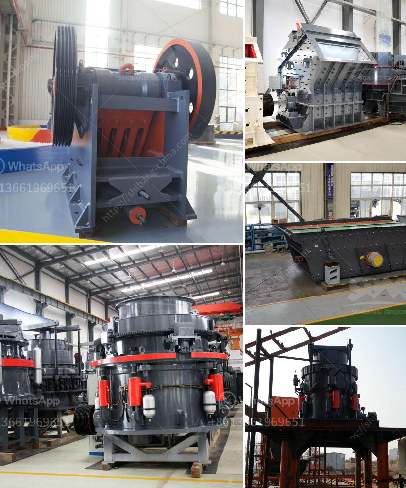

<h3>كسارة الحجر للبيع في الإمارات</h3>
تعد كسارة الحجر واحدة من الآلات الهامة في صناعة البناء والتشييد. وتعمل على سحق الأحجار الكبيرة إلى قطع صغيرة قابلة للاستخدام في مجموعة واسعة من التطبيقات. وفي الإمارات العربية المتحدة، يتم توفير مجموعة واسعة من كسارات الحجر المستعملة والجديدة للبيع، بمواصفات وأحجام مختلفة وفقًا لاحتياجات المشتري.

تُستخدم كسارات الحجر في العديد من المجالات، بما في ذلك البناء والتشييد وصناعة الركام وصناعة الأسفلت. وتتوفر الكسارات الحجرية المختلفة بقدرات إنتاجية تتراوح من العشرات إلى المئات من الأطنان في الساعة، وبالتالي يمكن اختيار الكسارة المناسبة وفقًا لحجم وكمية الحجارة التي تحتاجها.

تتميز كسارة الحجر بالقدرة على تحويل الأحجار الكبيرة إلى مخلفات ناعمة يمكن استخدامها في تشييد الطرق والبنية التحتية. عملية السحق تتطلب العديد من المكونات الرئيسية مثل المصدات الاهتزازية، ومغذيات الطاقة، والكسارة الفكية، والكسارة المخروطية، وغرابيل الاهتزاز. كما تتوفر بعض الكسارات بوحدات إضافية مثل الفرز والتجفيف والغسيل التي تساعد في إنتاج منتجات نهائية عالية الجودة.

تشتهر الإمارات بالعديد من المشاريع الضخمة في قطاع البناء والتشييد، مثل برج خليفة ومدينة دبي الرياضية وجزيرة السعديات. ولضمان الجودة والكفاءة، يعتمد المهندسون والمقاولون على كسارات الحجر لتوريد المواد الأساسية المطلوبة لهذه المشاريع. لذا، فإن الطلب على كسارات الحجر للبيع في الإمارات عالي ومستمر.

يتوفر في الإمارات العديد من مواقع بيع وشراء كسارات الحجر المستعملة والجديدة، حيث يمكن للزبائن الاختيار من بين مجموعة متنوعة من الموردين والماركات. يتم تصنيع العديد من هذه الكسارات بجودة عالية وتتوافق مع المعايير العالمية، مما يجعلها مثالية للاستخدام في الإمارات وغيرها من البلدان. وبالإضافة إلى ذلك، فإن بعض الموردين يقدمون خدمات ما بعد البيع، مثل الصيانة وتوفير قطع الغيار، لضمان عمل مستدام وطويل الأمد للكسارة.

باختصار، تُعد كسارة الحجر للبيع في الإمارات منتجًا رئيسيًا وضروريًا في صناعة البناء والتشييد. وتتميز بالقدرة على تحويل الأحجار الكبيرة إلى مواد ناعمة واستخدامها في تشييد البنية التحتية والطرق. تتوفر العديد من الكسارات بمواصفات وحجم مختلف لتناسب احتياجات المشتري. وباعتبارها واحدة من دولة المشاريع الضخمة، يظل الطلب على كسارات الحجر في الإمارات عاليًا ومتواصلاً.
<h3>Contact us</h3><ul><li><strong>Whatsapp:&nbsp;<a href="https://wa.me/8613661969651">+8613661969651</a></strong></li><li><a href="https://swt.shibang-china.com/?git&amp;zhl&amp;كسارة الحجر للبيع في الإمارات"><strong>Online Service(chat now)</strong></a></li></ul><h3>Related</h3><ul><li><a href='سعر النحاس.md'>سعر النحاس</a></li><li><a href='مطحنة الأسطوانة في نيجيريا.md'>مطحنة الأسطوانة في نيجيريا</a></li><li><a href='سعة كسارة الحجر.md'>سعة كسارة الحجر</a></li><li><a href='الطحن بالكرات في بنغالور.md'>الطحن بالكرات في بنغالور</a></li><li><a href='سعر كسارة الحجر الصلب.md'>سعر كسارة الحجر الصلب</a></li></ul>