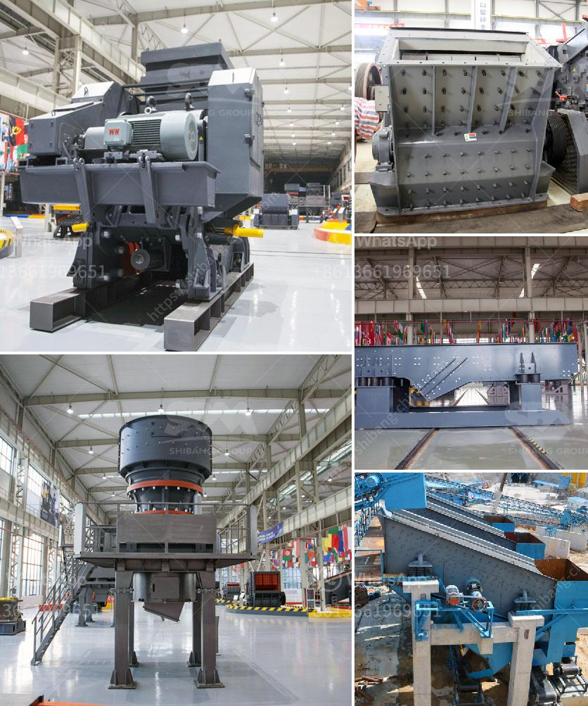

<h3>كسارة الحجر للبيع في سريلانكا</h3>
تعتبر سريلانكا واحدة من أجمل الدول في جنوب آسيا، حيث تتميز بطبيعتها الخلابة وثقافتها العريقة. وفي السنوات الأخيرة، تشهد سريلانكا نمواً اقتصادياً متسارعاً، مما يفسح الطريق أمام فرص الاستثمار في مجالات متنوعة. ومن بين هذه المجالات، يبرز قطاع البناء والتشييد.

يعتبر قطاع البناء والتشييد من القطاعات الحيوية في سريلانكا، حيث يزداد الطلب على المواد الإنشائية الحديثة والمتقدمة. واحدة من هذه المواد هي الحجر المكسر أو الركام المكسر الذي يستخدم في إنتاج مواد البناء مثل الخرسانة والأسفلت.

وهنا يأتي دور كسارات الحجر في سريلانكا. فهذه الآلات الضرورية تستخدم لكسر الصخور الكبيرة إلى قطع أصغر المقاسات التي يمكن استخدامها في مجالات البناء المختلفة. تقدم عمليات الكسر المختلفة بفضل التكنولوجيا المتقدمة، حيث تعمل الكسارات الحجر بكفاءة عالية وبأقل قدر من الإشراف البشري.

وهناك العديد من معدات كسارة الحجر في سوق سريلانكا، وذلك بفضل تنافسية السوق والطلب المتزايد. تتراوح أسعار فتحات كسارة الحجارة من 200 إلى 400 دولار، وفقاً للحجم والمواصفات والقدرة. وتتوفر هذه الكسارات عادة في العديد من الأحجام، حيث يمكن للعملاء اختيار الحجم الذي يناسب احتياجاتهم.

ويجب أن يأخذ المستثمرون في الاعتبار بعض العوامل الهامة عند شراء كسارة حجر في سريلانكا. أولاً وقبل كل شيء، يجب التحقق من جودة الكسارة وكفاءتها، فلا ينبغي أن يكون هناك توقف متكرر في الإنتاج. بالإضافة إلى ذلك، يجب توخي الحذر في اختيار الشركة المصنعة، حيث يجب أن تكون ذو سمعة جيدة وتوفر خدمات ما بعد البيع الممتازة.

في الختام، فإن كسارات الحجر تعتبر استثمارًا ناجحًا في سريلانكا في ظل طلب مستمر على الحجر المكسر في قطاع البناء والتشييد. بالاستفادة من التكنولوجيا المتقدمة واختيار الشركة المصنعة الموثوقة، يمكن تحقيق أرباح كبيرة من عمليات الكسارة في هذا السوق في نمو مستمر.
<h3>Contact us</h3><ul><li><strong>Whatsapp:&nbsp;<a href="https://wa.me/8613661969651">+8613661969651</a></strong></li><li><a href="https://swt.shibang-china.com/?git&amp;zhl&amp;كسارة الحجر للبيع في سريلانكا"><strong>Online Service(chat now)</strong></a></li></ul><h3>Related</h3><ul><li><a href='مصنع كسارة الحجر.md'>مصنع كسارة الحجر</a></li><li><a href='كسارات تأثير للبيع في الولايات المتحدة.md'>كسارات تأثير للبيع في الولايات المتحدة</a></li><li><a href='مطحنة طحن ريموند في أوروبا.md'>مطحنة طحن ريموند في أوروبا</a></li><li><a href='كيفية بدء منجم المحاجر.md'>كيفية بدء منجم المحاجر</a></li><li><a href='خط إنتاج طلاء الحجر.md'>خط إنتاج طلاء الحجر</a></li></ul>