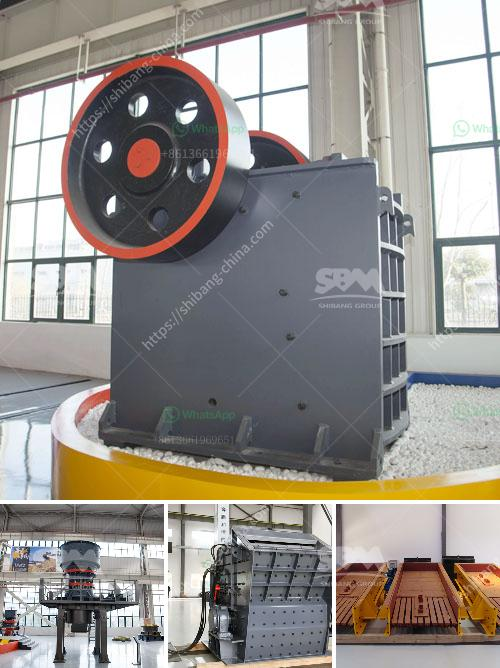

<h3>كسارة الحجر للبيع</h3>
كسارة الحجر للبيع هي معدة هندسية تستخدم لكسر الصخور والحجارة إلى قطع صغيرة ومنتظمة الشكل للاستخدام في مختلف الصناعات كمواد البناء والطرق والأساسات. وهي تُستخدم عادة في مناجم الحجر ومواقع البناء لتحويل الصخور الكبيرة إلى قطع صغيرة وسهلة النقل والاستخدام.

تتوفر كسارات الحجر للبيع بمختلف الأحجام والقدرات والقوى الحصانية، ويمكن تصنيفها بناءً على طريقة التشغيل إلى كسارات الفك وكسارات الصدم. تتميز كسارات الفك بقدرتها على قطع الصخور بطريقة قوية ودقيقة، وغالبًا ما تستخدم في مواقع البناء لكسر الأحجار الكبيرة وتحويلها إلى قطع صغيرة مناسبة للاستخدام في التشييد. من الجانب الآخر، تتميز الكسارات الصدم بقوتها العالية في تحطيم الصخور، وتستخدم عادة لاستخراج الحصى والركام الخشن.

تباع الكسارات الحجر للبيع بأسعار متفاوتة وتختلف حسب الحجم والمواصفات والشركة المصنعة. ومن الممكن العثور على كسارات الحجر المستعملة للبيع بأسعار أقل قليلاً من الجديدة. إذا كنت تبحث عن كسارة الحجر للبيع بسعر مناسب لميزانيةك ، فمن الجيد أن تراجع العديد من الموزعين والمعارض المختلفة للحصول على أفضل الصفقات والعروض.

عند شراء كسارة حجر للبيع ، يجب أن يتم الاهتمام بالعديد من العوامل. أولاً وقبل كل شيء ، يجب التأكد من جودة الماكينة وكفاءتها. يجب أن تكون الكسارة الحجر بناءً على معايير الجودة والسلامة ، ويفضل أن يتم تصنيعها من قبل شركة موثوقة ومعروفة بجودتها. من الضروري أيضًا التأكد من أن الكسارة تتوافق مع احتياجاتك ومتطلباتك الخاصة من حيث القوة والسعة ونوع الصخور التي ستتعامل معها.

في الختام، يمكن القول أن كسارة الحجر للبيع عبارة عن أداة هامة في صناعة البناء والمناجم والطرق، وتلعب دورًا حاسمًا في تحويل الصخور الكبيرة إلى قطع صغيرة يمكن التعامل معها بسهولة وفعالية. تأتي كسارات الحجر بمختلف الأحجام والقدرات والأنواع ويمكن العثور على العديد من الاختيارات المناسبة لمتطلباتك. ومع الاهتمام الصحيح وشراء الجهاز المناسب ، ستتمكن من الحصول على كسارة حجر ذات جودة عالية تعمل بكفاءة وتلبي احتياجاتك بشكل مثالي.
<h3>Contact us</h3><ul><li><strong>Whatsapp:&nbsp;<a href="https://wa.me/8613661969651">+8613661969651</a></strong></li><li><a href="https://swt.shibang-china.com/?git&amp;zhl&amp;كسارة الحجر للبيع"><strong>Online Service(chat now)</strong></a></li></ul><h3>Related</h3><ul><li><a href='مصنع معالجة ملح الصخور.md'>مصنع معالجة ملح الصخور</a></li><li><a href='مشاريع المطاحن للسائل الزجاجي في الهند.md'>مشاريع المطاحن للسائل الزجاجي في الهند</a></li><li><a href='كسارة حجر لاستخراج الحجر.md'>كسارة حجر لاستخراج الحجر</a></li><li><a href='سعر التحسين العالي لطحن الكرة.md'>سعر التحسين العالي لطحن الكرة</a></li><li><a href='مطاحن الكرة في زابوبان.md'>مطاحن الكرة في زابوبان</a></li></ul>