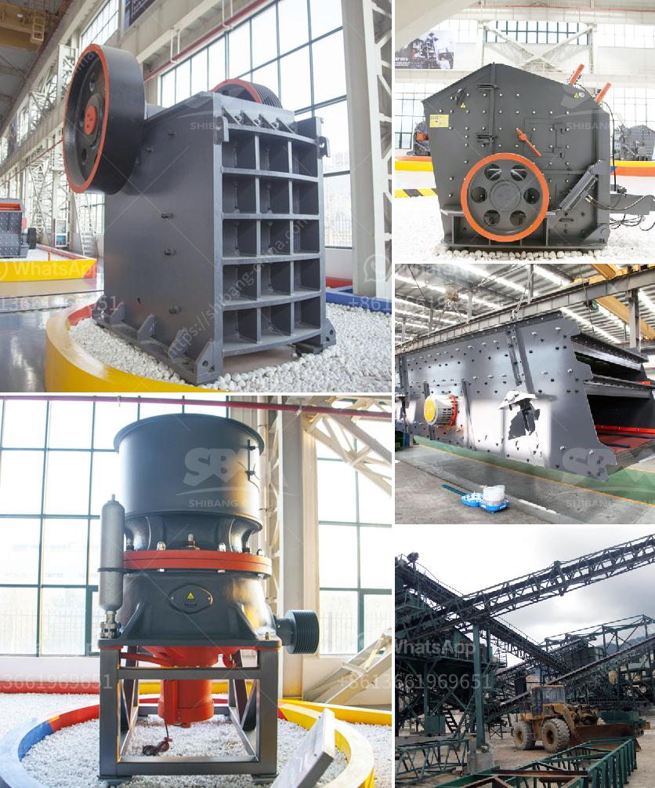

<h3>كسارة الحجر للجرار</h3>
تُعتبر كسارة الحجر للجرار من المعدات الهامة التي تستخدم في صناعة التعدين والبناء. يتم استخدام هذا الجهاز لسحق الحجارة الكبيرة إلى حجم أصغر يمكن استخدامه في إنشاء المباني والطرق.

تتألف كسارة الحجر للجرار من عدة أجزاء رئيسية، بما في ذلك الفك المتحرك والقاطع والمحرك. تبدأ العملية باستخدام الجرار لنقل الحجر الكبير إلى الكسارة، حيث يتم سحقه بواسطة الفك المتحرك. بعد السحق، يتم نقل الحجر المكسر إلى القاطع حيث يتم تفريغه من الكسارة.

تشتهر كسارة الحجر للجرار بكفاءتها العالية في سحق الحجارة. إن استخدام هذا الجهاز يسمح بإعادة استخدام المواد الخام بدلاً من رميها، مما يقلل من التلوث البيئي ويقوي التنمية المستدامة. 

بالإضافة إلى ذلك، يتميز الجهاز بقدرته على سحق الحجارة المتنوعة في مجموعة متنوعة من الأحجام. يمكن للكسارة العمل بكفاءة على العديد من أنواع الحجارة مثل الجرانيت والحجر الجيري والرخام والحجر الجيري والبازلت والصخور الصلبة الأخرى.

واحدة من أهم مزايا كسارة الحجر للجرار هو أنه يمكن نقلها بسهولة من موقع إلى آخر. بفضل تصميمها المحمول والمدمج، يمكن نقل هذا الجهاز بواسطة الجرار إلى أي موقع على الطرق أو مواقع البناء الأخرى.

بشكل عام، يتم استخدام كسارة الحجر للجرار على نطاق واسع وتلبي احتياجات العديد من الشركات في صناعة البناء والتعدين. يساهم استخدام هذا الجهاز في تحسين عمليات البناء وتقليل تكاليف الإنتاج، مما يحقق الكفاءة والاستدامة في العمل.
<h3>Contact us</h3><ul><li><strong>Whatsapp:&nbsp;<a href="https://wa.me/8613661969651">+8613661969651</a></strong></li><li><a href="https://swt.shibang-china.com/?git&amp;zhl&amp;كسارة الحجر للجرار"><strong>Online Service(chat now)</strong></a></li></ul><h3>Related</h3><ul><li><a href='سعر آلة كسارة الفك.md'>سعر آلة كسارة الفك</a></li><li><a href='مصنع كسارة المحاجر في إيطاليا.md'>مصنع كسارة المحاجر في إيطاليا</a></li><li><a href='سعر مطحنة الكرة.md'>سعر مطحنة الكرة</a></li><li><a href='كسارة المطرقة في الصين.md'>كسارة المطرقة في الصين</a></li><li><a href='تكلفة كسارة السيليكا.md'>تكلفة كسارة السيليكا</a></li></ul>