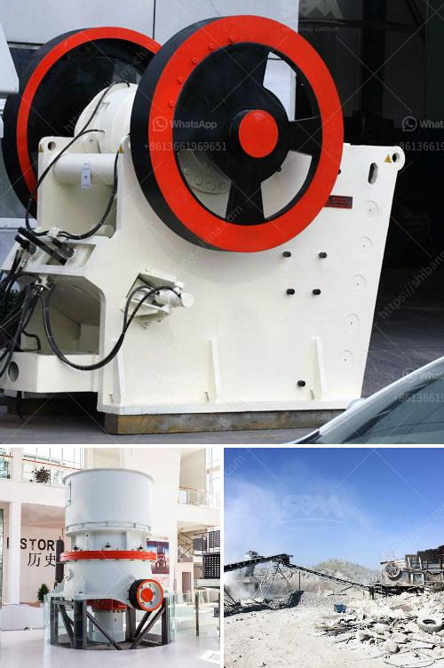

<h3>كسارة الحجر من النوع الصغير</h3>
يعتبر الحجر من الموارد الهامة في العديد من الصناعات والتطبيقات المختلفة، وعلى مر السنين، زاد الطلب على الحجر لأغراض البناء والتشييد. ومع ذلك، أصبح تحويل الحجر إلى حجم مناسب يستخدم لأغراض بناء الأبنية والطرق أمرًا ضروريًا.

تلعب كسارات الحجر الصغيرة دورًا حيويًا في تحويل الحجر الخام إلى قطع صغيرة من الحجم المطلوب. تفي كسارة الحجر الصغيرة بمتطلبات تحجيم الحجر، سواء لغرض استخدامه في البناء أو لتصنيع منتجات أخرى. عادةً، تكون الكسارات الصغيرة محمولة، مما يجعلها ملائمة للعمل في الأماكن ذات مساحات محدودة، مثل المواقع البنائية وحقول البناء.

تتميز الكسارات الصغيرة بقوة ودقة تحجيم الحجر. فبغض النظر عن حجم الكسارة الصغيرة، فإنها تمتلك القدرة على تحويل الحجر الخام إلى قطع بحجم موحد ودقيق. توفر القدرة على تحجيم الحجر هذه ميزة إضافية للكسارات الصغيرة، بالإضافة إلى توفير الوقت والجهد المطلوبين لتحويل الحجر الخام إلى الحجم المطلوب يدويًا.

تنوع الاستخدامات المتعددة لكسارات الحجر الصغيرة هو أيضًا ميزة أخرى تجعلها شائعة الاستخدام. لا تقتصر استخدامات تحجيم الحجر على صناعة البناء فقط، بل يمكن استخدامها أيضًا في تحضير الأرض وإعدادها للزراعة. فعلى سبيل المثال، يتم استخدام التكسير في تجهيز الحجر الصخري لأغراض زراعية، حيث تمتلك الكسارات الصغيرة القدرة على تحويل الصخور الكبيرة إلى تربة خصبة.

بالإضافة إلى ذلك، فإن كسارات الحجر الصغيرة ذات الحجم المدمج تحتوي على بنية قوية وعمر افتراضي طويل، مما يجعلها مستدامة واقتصادية في المدى الطويل. وبفضل تصميمها المحمول، يمكن نقل الكسارات الصغيرة بسهولة من موقع لآخر، مما يتيح القدرة على استخدامها في مشروعات متعددة.

وفي الختام، تعد كسارات الحجر الصغيرة من الأدوات الحديثة والمهمة في صناعة البناء والتشييد. تقدم الكسارات الصغيرة حلاً سريعًا وفعالًا لتحويل الحجر الخام إلى قطع مستدامة ومناسبة للاستخدام في البناء أو في تحضير الأرض. بالإضافة إلى ذلك، فإن توفر الكسارات الصغيرة بأحجام مختلفة ومحمولة تسهم في توفير الجهد والوقت والموارد في أي مشروع بناء.
<h3>Contact us</h3><ul><li><strong>Whatsapp:&nbsp;<a href="https://wa.me/8613661969651">+8613661969651</a></strong></li><li><a href="https://swt.shibang-china.com/?git&amp;zhl&amp;كسارة الحجر من النوع الصغير"><strong>Online Service(chat now)</strong></a></li></ul><h3>Related</h3><ul><li><a href='كسارة للبيع في ماليزيا.md'>كسارة للبيع في ماليزيا</a></li><li><a href='معدات طحن رفيعة جداً رطبة.md'>معدات طحن رفيعة جداً رطبة</a></li><li><a href='معدات زراعية للبيع بأسعار مناسبة.md'>معدات زراعية للبيع بأسعار مناسبة</a></li><li><a href='خطة عمل لإنتاج الطوب.md'>خطة عمل لإنتاج الطوب</a></li><li><a href='شاشة محمولة وكسارة.md'>شاشة محمولة وكسارة</a></li></ul>