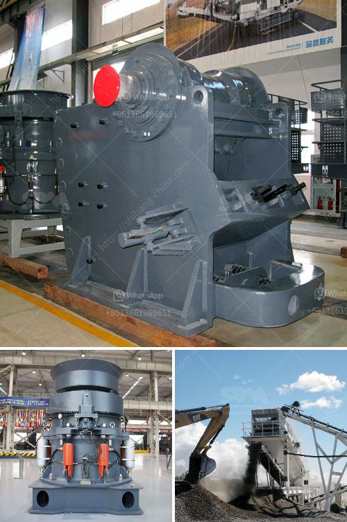

<h3>كسارة الحجر وأسعارها</h3>
كسارة الحجر هي آلة تستخدم لسحق الصخور الكبيرة إلى قطع صغيرة من الحجر المستخدم في عدة مجالات مثل البناء والطرق. تتكون الكسارة الحجرية من وحدة تغذية، محرك، غربال صفير، سلسلة من الفكين أو الأسطوانات لتكسير الصخور وآلية تفريغ.

تعتبر كسارات الحجر من المعدات الأساسية في صناعة البناء والتشييد، وتستخدم على نطاق واسع في تكسير الصخور الصلبة والصخور الناعمة. تعتبر الكسارات الثابتة والمحمولة من أنواع الكسارات الشائعة. الكسارات الثابتة تركب في موقع ثابت وتستخدم عادة في المناجم ومحاجر الحجر، في حين تستخدم الكسارات المحمولة في البناء المؤقت والصيانة العامة.

تتفاوت أسعار كسارات الحجر بناءً على الحجم والقدرة والتكنولوجيا المستخدمة. عمومًا، تتراوح أسعار كسارات الحجر بين 200 و 400 ألف دولار للوحدات الصغيرة إلى عدة ملايين من الدولارات للوحدات الأكبر والأكثر تطوراً.

تؤثر عدة عوامل في تحديد سعر كسارة الحجر، منها العلامة التجارية، السعة، الجودة والقدرة الإنتاجية. الشركات المصنعة الرائدة في صناعة كسارات الحجر تقدم ضمانات ودعم فني مستمر، وهذه العوامل قد ترفع من سعر الكسارة.

تستخدم الكسارات الصغيرة ذات الأسعار المنخفضة في مشاريع البناء الصغيرة والصيانة العامة، في حين يستخدم الكسارات الأكبر والأكثر تطورًا في المشاريع الكبيرة مثل بناء الطرق والسدود. ومع ذلك، فإن تكلفة الاستثمار في شراء كسارة الحجر يعتبر عائقًا ماليًا للكثير من المقاولين الصغار والمتوسطين، وبالتالي يمكن استخدام خدمات الإيجار كحل بديل للحصول على النتائج المطلوبة.

بصفة عامة، فإن اقتناء كسارة الحجر يمثل استثمارًا ضخمًا في صناعة البناء والتشييد، ولذلك ينبغي على المستثمرين دراسة السوق واحتياجاتهم بعناية قبل اتخاذ قرار الشراء. من الضروري أيضًا بحث عن الشركات المصنعة الموثوقة والمعروفة بمنتجات عالية الجودة والأداء الممتاز، مع تقديم الدعم الفني المناسب.
<h3>Contact us</h3><ul><li><strong>Whatsapp:&nbsp;<a href="https://wa.me/8613661969651">+8613661969651</a></strong></li><li><a href="https://swt.shibang-china.com/?git&amp;zhl&amp;كسارة الحجر وأسعارها"><strong>Online Service(chat now)</strong></a></li></ul><h3>Related</h3><ul><li><a href='خط إنتاج البوكسيت.md'>خط إنتاج البوكسيت</a></li><li><a href='مطاحن الكرة للبيع في زيمبابوي.md'>مطاحن الكرة للبيع في زيمبابوي</a></li><li><a href='مشكلة الناقل الفحم.md'>مشكلة الناقل الفحم</a></li><li><a href='وكيل وارد ريموند مطحنة إندونيسيا.md'>وكيل وارد ريموند مطحنة إندونيسيا</a></li><li><a href='معدات تحسين خامات مختلفة في جميع أنحاء العالم.md'>معدات تحسين خامات مختلفة في جميع أنحاء العالم</a></li></ul>