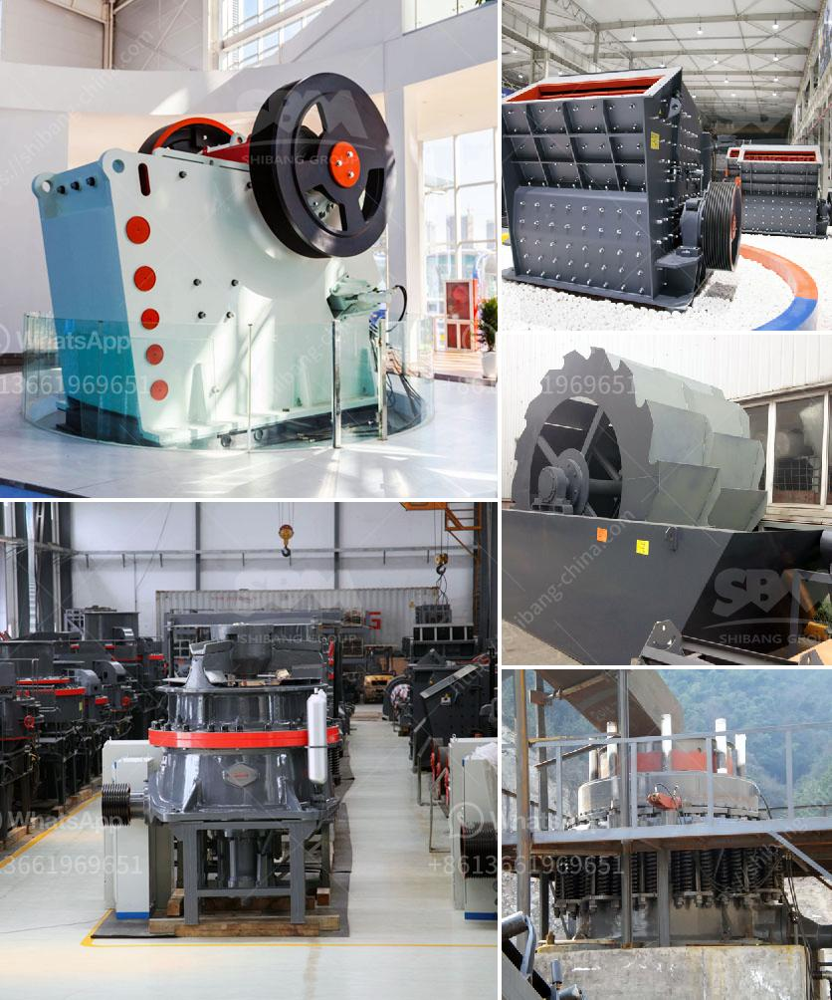

<h3>كسارة الحجر والمضافة</h3>
تُعد كسارة الحجر والمضافة من المعدات الهندسية المهمة في صناعة البناء والأعمال الإنشائية. فهي تُستخدم لكسر الحجارة الكبيرة إلى قطع أصغر، تستطيع بعدها استخدامها في البناء وصناعة الأساسات والطرق.

تتكون كسارة الحجر من جزئين رئيسيين، الجزء الميكانيكي والجزء الكهربائي. والجزء الميكانيكي يتألف من المحرك والحزام الناقل وجهاز التحكم في السرعة، بينما يحتوي الجزء الكهربائي على لوحة التحكم ومولد الكهرباء وقِطع الغيار اللازمة.

تتم عملية تشغيل كسارة الحجر من خلال تشغيل المحرك الكهربائي، الذي يقوم بتعجيل الحركة الدورانية للهيكل الميكانيكي. وعندما تتحرك الحجرة الفكية في اتجاه الأسفل، يقوم الحزام الناقل بنقل الحجر الكبير إلى الثقوب الصغيرة في المحطة، ومن ثم يتم كسر الحجر إلى قطع أصغر بواسطة الخطاف العلوي والخطاف السفلي.

يمكن تعديل حجم الفتحة في كسارة الحجر وفقًا لمتطلبات البناء المحددة. بعد تكسير الحجر، يتم نقله إلى حزام النقل المتحرك، الذي ينقله إلى الجزء التالي من عملية البناء. ويعتمد تصميم الحزام الناقل على المسافة المطلوبة لنقل الحجارة وتحميلها.

تتميز كسارات الحجر والمضافة بعدة مزايا، فهي جهاز كفء وسريع في تنفيذ العملية. كما أنها تتميز بالدقة في الكسر وتجنب الفوضى أو التلوث البيئي. يمكن استخدام كسارات الحجر في مجموعة متنوعة من التطبيقات، بدءًا من بناء الأبنية والجسور وانتهاءً بتحضير الحصى النهائي.

وفي الختام، تُعد كسارة الحجر والمضافة أداة هامة في صناعة البناء والأعمال الإنشائية. فهي تُستخدم لكسر الحجارة الكبيرة إلى قطع أصغر، مما يسهل استخدامها في البناء. كما أنها تتميز بالكفاءة والسرعة في العمل والدقة في الكسر. إذا كنت تخطط لمشروع بناء أو لديك حاجة لاستخدام مواد البناء المكسورة، فإن كسارة الحجر والمضافة تعد الخيار الأمثل لك.
<h3>Contact us</h3><ul><li><strong>Whatsapp:&nbsp;<a href="https://wa.me/8613661969651">+8613661969651</a></strong></li><li><a href="https://swt.shibang-china.com/?git&amp;zhl&amp;كسارة الحجر والمضافة"><strong>Online Service(chat now)</strong></a></li></ul><h3>Related</h3><ul><li><a href='تقنيات معالجة الطين.md'>تقنيات معالجة الطين</a></li><li><a href='كسارة الكرة للحديد فقط الشركة.md'>كسارة الكرة للحديد فقط الشركة</a></li><li><a href='تحكم هيدروليكي في فك الكسارة.md'>تحكم هيدروليكي في فك الكسارة</a></li><li><a href='أسعار مطاحن الكرة في جنوب أفريقيا.md'>أسعار مطاحن الكرة في جنوب أفريقيا</a></li><li><a href='سعر مصنع الأسمنت على نطاق صغير في الهند.md'>سعر مصنع الأسمنت على نطاق صغير في الهند</a></li></ul>