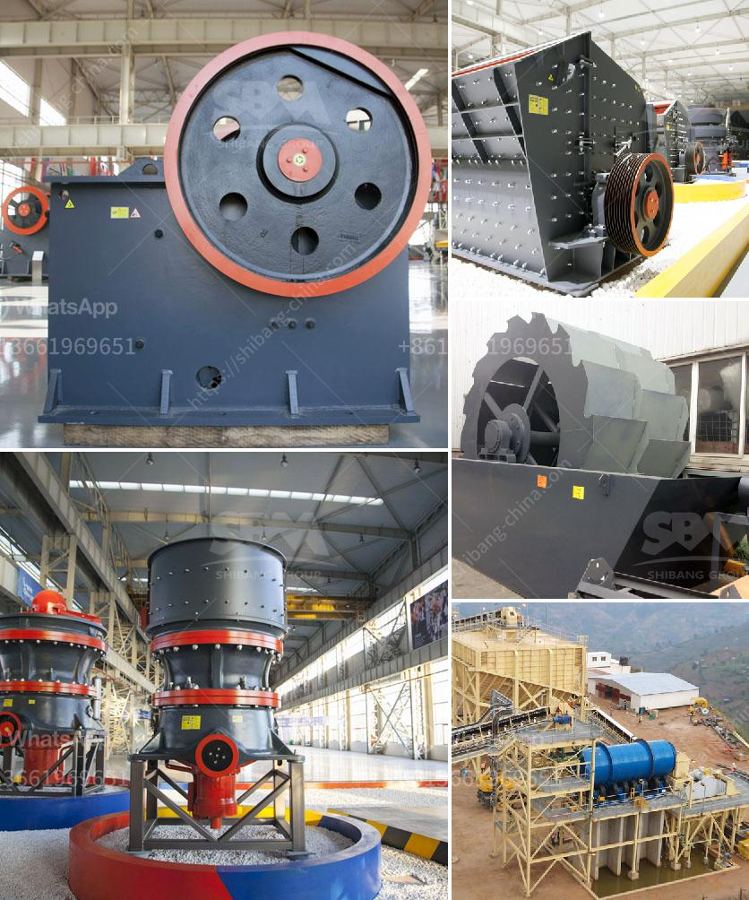

<h3>كسارة الحجر وشاشة الاهتزاز في مانيلا</h3>
تعد كسارة الحجر وشاشة الاهتزاز من المعدات الرئيسية المستخدمة في صناعة البناء والتعدين في مانيلا وفي العديد من البلدان الأخرى. تُستخدم هذه المعدات لتكسير الحجارة الكبيرة إلى أحجام أصغر وفصل الشوائب عن المواد المستخدمة في البناء.

يعد استخدام كسارة الحجر ضروريًا في مانيلا وفي جميع أنحاء العالم بسبب الطلب المتزايد على البنية التحتية والمباني. تأتي الحجارة بأحجام مختلفة وقوة ضغط مختلفة ويتعين تكسيرها لتصبح قابلة للاستخدام في البناء. تقوم كسارة الحجر بتكسير هذه الأحجار بطريقة فعالة تجعلها مناسبة للاستخدام.

من الجوانب الرئيسية لكسارة الحجر هي العمليات السريعة والفعالة. يتم تشغيلها بواسطة محرك كهربائي وتتميز بالعديد من الشفرات أو الفكوك لكسر الحجارة بسرعة. تقوم الكسارة بدورها بفصل الشوائب والأتربة عن الحجر المكسور.

أما بالنسبة لشاشة الاهتزاز، فهي مكملة لعملية الكسارة. تقوم الشاشة بفصل الحجارة المكسورة حسب الحجم. وهي تحتوي على طبقات متعددة تهتز بشكل متزامن لفصل الحجارة بحجمها المناسب. هذه الأحجام المنتجة يمكن استخدامها في عمليات البناء بشكل مباشر.

تتميز كسارة الحجر وشاشة الاهتزاز بالعديد من المزايا، منها:

- الكفاءة العالية والقدرة على التعامل مع حجم كبير من الحجارة.

- قدرتها على إزالة الشوائب والأتربة للحصول على منتج نهائي نقي.

- تحسين جودة البنية التحتية والمباني بفضل استخدام مواد مكسورة بحجمها المناسب.

على الرغم من المزايا المذكورة، تتطلب كسارة الحجر وشاشة الاهتزاز صيانة مستمرة واستبدال الشفرات البالية لتحقيق أفضل أداء وزيادة العمر الافتراضي للمعدات.

باختصار، تعتبر كسارة الحجر وشاشة الاهتزاز في مانيلا من الآلات الأساسية في صناعة البناء والتعدين. بفضل تقنيتها المتقدمة وكفاءتها، تساهم في تحسين جودة المواد المستخدمة في البناء وفي تكسير الحجارة بسرعة وفعالية. التطور التكنولوجي في هذه المعدات يشجع على الاستفادة منها للحفاظ على جودة البناء وتحقيق التنمية المستدامة.
<h3>Contact us</h3><ul><li><strong>Whatsapp:&nbsp;<a href="https://wa.me/8613661969651">+8613661969651</a></strong></li><li><a href="https://swt.shibang-china.com/?git&amp;zhl&amp;كسارة الحجر وشاشة الاهتزاز في مانيلا"><strong>Online Service(chat now)</strong></a></li></ul><h3>Related</h3><ul><li><a href='معدات طحن مسحوق المطحنة.md'>معدات طحن مسحوق المطحنة</a></li><li><a href='كسارة صخور محمولة للذهب.md'>كسارة صخور محمولة للذهب</a></li><li><a href='مطحنة MTW.md'>مطحنة MTW</a></li><li><a href='شاشة اهتزاز الحصى.md'>شاشة اهتزاز الحصى</a></li><li><a href='مصنع كسارة الحجر والجرانيت.md'>مصنع كسارة الحجر والجرانيت</a></li></ul>