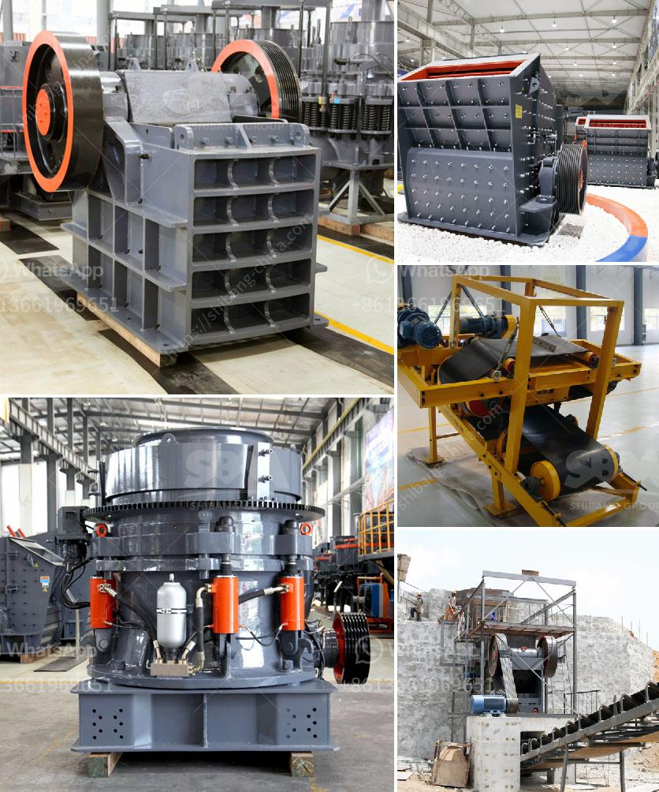

<h3>كسارة الحجر وشاشة الاهتزاز للبيع</h3>
تعتبر كسارة الحجر وشاشة الاهتزاز من أهم الأدوات المستخدمة في صناعة البناء والتعدين وتجهيز المعادن. تعمل كسارة الحجر على سحق الصخور الكبيرة وتحويلها إلى قطع صغيرة الحجم، وتلعب هذه الكسارة دورًا حاسمًا في عمليات البناء والبناء الخاصة بالتلال والطرق والجسور.

من ناحية أخرى، تعتبر شاشة الاهتزاز جزءًا أساسيًا من عملية فحص المواد الصلبة المصنوعة من الحجر المكسور. فهي تستخدم لفصل المواد المصنفة وتصنيفها حسب الحجم. وهذا يعني أنها تتحقق من تكوين معين للحصى أو الرمل أو المواد الأخرى المنتجة من كسارة الحجر.

عند البحث عن كسارة الحجر وشاشة الاهتزاز للشراء، يجب أولًا التأكد من أن الكسارة والشاشة مصممة وفقًا لاحتياجات العمل والتطبيق المحدد. على سبيل المثال، إذا كنت بحاجة إلى كسارة لسحق الصخور الكبيرة بشكل مستمر، فينبغي أن تكون الكسارة قوية ومتينة، وتمتلك أدوات قوية للتعامل مع الصخور الكبيرة بكفاءة. بالإضافة إلى ذلك، يجب التأكد من أن الشاشة الاهتزاز قادرة على فحص المواد المصنفة بشكل فعال وفقًا للمعايير المطلوبة وحجم الحصى المطلوب.

تعتمد أيضًا مدى الكفاءة والجودة على المواد المستخدمة في تصنيع الكسارة والشاشة الاهتزاز. يفضل استخدام المواد عالية الجودة لضمان عمر طويل وأداء متفوق. بالإضافة إلى ذلك، يجب التأكد من أن هناك قطع الغيار المتوفرة بسهولة وبأسعار معقولة في حالة الحاجة إلى إصلاح أو استبدال أي جزء من الكسارة أو الشاشة الاهتزاز.

مع التقدم التكنولوجي الذي يشهده قطاع البناء والتعدين، أصبحت الكسارة والشاشة الاهتزاز متعددة المهام وذات تقنيات متطورة. تحتوي بعض الكسارات حاليًا على أنظمة ذكية وأتمتة يمكن التحكم فيها عن بعد لضمان الكفاءة القصوى وسلامة العمل. بالإضافة إلى ذلك، يمكن أن تحتوي الشاشات الاهتزاز على طبقات متعددة لتحقيق فحص دقيق للمواد المصنفة وتوصيل المواد المناسبة إلى نقطة الإنتاج المقصودة.

بالنظر إلى الطلب المتزايد على البنية التحتية والمشاريع الكبيرة في العديد من دول العالم، يعد امتلاك كسارة الحجر وشاشة الاهتزاز فرصة استثمارية جيدة. وبما أن الأدوات هي الركيزة الأساسية في إنتاج المواد الخام، فإن الاختيار الصحيح للكسارة والشاشة يعني فرصة أكبر لتحقيق النجاح والربحية في الصناعة.
<h3>Contact us</h3><ul><li><strong>Whatsapp:&nbsp;<a href="https://wa.me/8613661969651">+8613661969651</a></strong></li><li><a href="https://swt.shibang-china.com/?git&amp;zhl&amp;كسارة الحجر وشاشة الاهتزاز للبيع"><strong>Online Service(chat now)</strong></a></li></ul><h3>Related</h3><ul><li><a href='كسارة مطرقية متعددة.md'>كسارة مطرقية متعددة</a></li><li><a href='أسعار مصنع الكسارة بوزولانا 50 طن في الساعة.md'>أسعار مصنع الكسارة بوزولانا 50 طن في الساعة</a></li><li><a href='كسارة فك محمولة مستعملة في إسبانيا.md'>كسارة فك محمولة مستعملة في إسبانيا</a></li><li><a href='تكلفة أعمال المحجر في الهند.md'>تكلفة أعمال المحجر في الهند</a></li><li><a href='تكلفة الكسارة المحمولة للساعة الواحدة.md'>تكلفة الكسارة المحمولة للساعة الواحدة</a></li></ul>