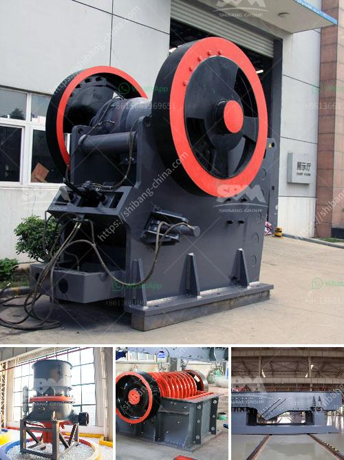

<h3>كسارة الحجر ومصنع المحجر في بنجلاديش</h3>
تعتبر كسارات الحجر ومصانع المحاجر من أهم الصناعات التي تعتمد عليها العديد من الدول في تطوير البنية التحتية وصناعة البناء. واحدة من الدول التي تعتمد بشكل كبير على هذه المنشآت هي بنجلاديش، حيث تعد صناعة الحجر والمحاجر من المصادر الرئيسية للدخل الوطني في البلاد.

تشتهر بنجلاديش بوجود عدد كبير من الكسارات ومصانع المحاجر، والتي تعمل على استخراج الحجارة الطبيعية وتكسيرها وتحويلها إلى مختلف المنتجات، مثل الركام والزلط والحصى والرمل. تعمل هذه المنشآت في إمداد السوق المحلية بالمواد اللازمة لصناعة البناء، بالإضافة إلى تصدير بعض المنتجات إلى دول أخرى.

تقدم كسارات الحجر في بنجلاديش العديد من المزايا. ففي المقام الأول، فإن هذه المنشآت تساهم في توفير فرص عمل للعديد من العمال، مما يسهم في الحد من البطالة وتحسين الحالة الاقتصادية للمواطنين. كما أنها تعزز النمو الاقتصادي للبلاد من خلال زيادة الإنتاجية وزيادة الصادرات.

علاوة على ذلك، فإن مصانع المحاجر في بنجلاديش تلعب دورًا هامًا في تطوير البنية التحتية للبلاد. حيث يتم استخدام منتجات المحاجر بشكل واسع في البناء وتعزيز البنية التحتية، مثل بناء الطرق والجسور والأبنية. بالإضافة إلى ذلك، فإن هذه المحاجر توفر المواد الأساسية لصناعة الأسمنت، الأمر الذي يسهم في توفير مصدر مستدام للطاقة البديلة وتعزيز صناعة البناء.

ومع ذلك، تواجه صناعة كسارات الحجر ومصانع المحاجر في بنجلاديش بعض التحديات والمشكلات. فمن أبرز هذه التحديات البيئية، حيث يترتب على عملية تكسير الحجارة إنتاج الكثير من الغبار والضوضاء والتلوث البيئي. لذا، تحتاج هذه الصناعة إلى اتخاذ التدابير اللازمة للحد من التأثير السلبي على البيئة وتعزيز الممارسات الصديقة للبيئة.

باختصار، تعد كسارات الحجر ومصانع المحاجر في بنجلاديش عناصر أساسية في تطوير البنية التحتية وصناعة البناء في البلاد. تلعب هذه الصناعة دورًا هامًا في توفير فرص عمل وزيادة الإنتاجية وتعزيز الصادرات. ومع ذلك، يجب أيضًا أن تعمل هذه الصناعة على تقليل التأثير البيئي وتنفيذ ممارسات الحفاظ على البيئة، لضمان استدامتها على المدى الطويل.
<h3>Contact us</h3><ul><li><strong>Whatsapp:&nbsp;<a href="https://wa.me/8613661969651">+8613661969651</a></strong></li><li><a href="https://swt.shibang-china.com/?git&amp;zhl&amp;كسارة الحجر ومصنع المحجر في بنجلاديش"><strong>Online Service(chat now)</strong></a></li></ul><h3>Related</h3><ul><li><a href='مصانع الكسارات للبيع.md'>مصانع الكسارات للبيع</a></li><li><a href='شركة تصنيع معدات التعدين في الصين.md'>شركة تصنيع معدات التعدين في الصين</a></li><li><a href='عملية تعدين الدولوميت.md'>عملية تعدين الدولوميت</a></li><li><a href='مطحنة عمودية للأسمنت.md'>مطحنة عمودية للأسمنت</a></li><li><a href='سعر مصنع كسارة الحجر في ألمانيا.md'>سعر مصنع كسارة الحجر في ألمانيا</a></li></ul>