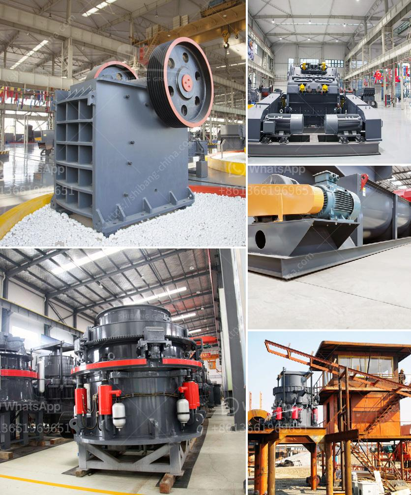

<h3>كسارة الحديد الخام الفاصلة</h3>
تعتبر كسارة الحديد الخام الفاصلة أحد الأدوات المهمة في صناعة الفولاذ وتنقية الحديد الخام. تستخدم هذه الكسارات في عملية تفتيت الصخور والتخلص من الشوائب الموجودة في الحجارة، وبالتالي، تحسن من جودة الحديد الناتج وتمنحه خواص ميكانيكية ممتازة.

تتكون كسارة الحديد الخام الفاصلة من مجموعة من الأسطوانات المثبتة على جهاز تحكم، حيث يتم رفع هذه الأسطوانات وإسقاطها على الحديد الخام. هذه الإجراءات تؤدي إلى تكسير وتفتيت الحجارة وفصل القطع الكبيرة عن القطع الصغيرة. وبوجود مرشح فعال، تعمل الكسارة على فصل الشوائب المختلفة، مثل الرمال والغبار، عن الحديد النقي.

تعد كسارة الحديد الخام الفاصلة أحد الأدوات الأكثر كفاءة في هذا الصناعة. فهي تتيح للمنتج تجنب تكرار العملية الثقيلة لتكسير الصخور يدويًا، مما يساهم في زيادة إنتاجية المصنع وتقليل التكاليف. كما أنها تمكن الشركات المصنعة من التحكم في جودة الحديد الناتج، مما يعزز سمعتها في السوق ويؤدي بدوره إلى زيادة المبيعات.

تعتبر صناعة الحديد والصلب من أكثر الصناعات استهلاكًا للطاقة في العالم. لذلك، تلعب كسارة الحديد الخام الفاصلة دورًا هامًا في تحسين كفاءة استهلاك الطاقة. فبفضل هذه الأداة، يتم استغلال أكبر قدر ممكن من الحديد الناتج، وبالتالي، يتم تقليل الفاقد واستهلاك الطاقة الزائد.

بالإضافة إلى ذلك، تعمل الكسارة على تنظيف المواد الخام من الشوائب والمواد غير المرغوب فيها، بحيث يتم تخفيض احتياج العملية اللاحقة لمعالجة المواد وتكريرها.

باختصار، فإن كسارة الحديد الخام الفاصلة هي أداة أساسية في صناعة الفولاذ وتحضير الحديد الخام. تساهم في تحسين جودة الحديد الناتج وزيادة الإنتاجية وتقليل التكاليف. كما تلعب دورًا مهمًا في تحسين استهلاك الطاقة وتقليل الفاقد. ومن المتوقع أن تستمر هذه الكسارات في الازدياد في الطلب مع تطور صناعة الحديد والصلب وازدياد الحاجة إلى منتجات فولاذية متطورة.
<h3>Contact us</h3><ul><li><strong>Whatsapp:&nbsp;<a href="https://wa.me/8613661969651">+8613661969651</a></strong></li><li><a href="https://swt.shibang-china.com/?git&amp;zhl&amp;كسارة الحديد الخام الفاصلة"><strong>Online Service(chat now)</strong></a></li></ul><h3>Related</h3><ul><li><a href='تكسير النبات بتنسيق PDF.md'>تكسير النبات بتنسيق PDF</a></li><li><a href='آلات سحق تعمل في بيرو.md'>آلات سحق تعمل في بيرو</a></li><li><a href='شاشة جريزلي للبيع نيوزيلندا.md'>شاشة جريزلي للبيع نيوزيلندا</a></li><li><a href='توازن المواد والطاقة لكسارة الفك.md'>توازن المواد والطاقة لكسارة الفك</a></li><li><a href='مطحنة الهامر في جوهانسبرغ.md'>مطحنة الهامر في جوهانسبرغ</a></li></ul>